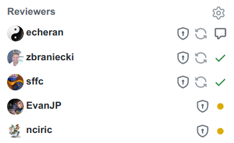
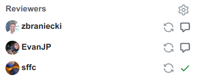
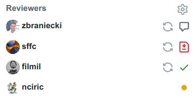

# Contributing to ICU4X Project

`ICU4X` is an open source project and welcomes everyone to participate.

The core team has identified good starter projects and gave them **[good first issue](https://github.com/unicode-org/icu4x/issues?q=is%3Aissue+no%3Aassignee+label%3A%22good+first+issue%22+-label%3A%22blocked%22+) label**.  This is a great place to start as a volunteer.

In order to provide meaningful contributions, it is important to familiarize yourself with a set of documents which describe the [structure](docs/process/charter.md) and [style guide][style_guide] used by the project.

Issues are open to everyone to discuss and can be used to jump-start Pull Requests intended for the project.

In most cases, the first step is to find or file a new issue related to your planned contribution, discuss it, and once you received a feedback indicating that the pull request would be welcomed you can start working on it.

## Installing dependencies

To build ICU4X, you will need the following dependencies:

 - Rust (and Cargo) installed [via `rustup`](https://doc.rust-lang.org/book/ch01-01-installation.html)
 - `cargo-make` installed via `cargo install cargo-make`
 - `cargo-readme` installed via `cargo install cargo-readme`

Certain tests may need further dependencies, these are documented below in the [Testing](#testing) section.

## Contributing a Pull Request

The first step is to fork the repository to your namespace and create a branch off of the `main` branch to work with.

That branch may end up containing one of more commits that are constituting the full scope of the pull request.

### Release Readiness

When considering a contribution, we use the following rule of thumb: **all code in `components/`, `ffi/`, `provider/`, and `utils/` on the `main` branch must be ready for release at any time.**

Practically, this means that new components or improvements to existing components should not be merged until they meet all requirements of code quality (see the checklist below).

If working on a new component, consider starting it in the `experimental/` directory. We allow contributions to that directory even if they don't yet meet all of our code quality requirements. Once finished, the code can be moved from `experimental/` into `components/` or `utils/` as a separate pull request.

If working on an improvement to an existing component that you wish to split into multiple smaller pieces, consider hiding it under the `"experimental"` feature in the crate. Doing so gives a signal to users and tooling that the code is not yet production-ready. Once finished, the `"experimental"` feature can be removed from the crate.

Note that the actual Cargo.toml version bumps will be done at release time, and crates under `utils/` may follow a different release cadence than those under other directory trees.

### Checklist

Each commit and pull request should follow the [style guide][style_guide] and be properly formatted with `cargo fmt`. If the PR is adding any public API changes, we'd also like to ensure that full coverage of `cargo doc` is preserved and code coverage is above `90%`.

Handy commands (run from the root directory):

- `cargo tidy` runs tidy-checks (license, fmt, readmes)
- `cargo quick` runs the fastest tests and lints.

See the [Testing](#testing) section below for more information on the various testsuites available.

There are various files that auto-generated across the ICU4X repository.  Here are some of the commands that you may
need to run in order to recreate them.  These files may be run in more comprehensive tests such as those included in `cargo make ci-job-test` or `cargo make ci-all`.

- `cargo make testdata` - regenerates all test data in the `provider/testdata` directory.
- `cargo make generate-readmes` - generates README files according to Rust docs. Output files must be committed in git for check to pass.
- `cargo make diplomat-gen` - recreates the Diplomat generated files in the `ffi/diplomat` directory.

### Testing

It's recommended to run `cargo test --all-features` in crates you're modifying to ensure that nothing is breaking, and `cargo quick` to get a reasonable check that everything still builds and lint checks pass.

Our wider testsuite is organized as `ci-job-foo` make tasks corresponding to each GitHub Actions CI job, and you can run any testsuites you consider relevant:

 - `cargo make ci-job-check`: Runs `cargo check` on all the crates. It's usually better to just use `cargo quick`.
 - `cargo make tidy`: A quick test that ensures that `cargo fmt` has been run, that code has the appropriate license headers and files and that READMEs are in sync. This is run as two separate tasks on CI (`ci-job-fmt` and `ci-job-tidy`) to ensure early results.
 - `cargo make ci-job-test`: Runs `cargo test` on all the crates. This takes a while but is the main way of ensuring that nothing has been broken.
 - `cargo make ci-job-clippy`: Runs `cargo clippy` on all the crates.
 - `cargo doc --no-deps --all-features`: Recreates API docs locally; any warning should be fixed since it will be treated as an error in CI.
 - `cargo make ci-job-ffi`: Runs all of the FFI tests; mostly important if you're changing the FFI interface. This has several additional dependencies:
     + [`Diplomat`](https://github.com/rust-diplomat/diplomat) installed at the appropriate version: `cargo make diplomat-install`
     + `clang-14` and `lld-14` with the `gold` plugin (APT packages `llvm-14` and `lld-14`)
 - `cargo make ci-job-wasm`: Runs Rust-to-WASM tests. This also has a couple additional dependencies:
     + Node.js version 16.18.0. This may not the one offered by the package manager; get it from the NodeJS website or `nvm`.
     + [`Twiggy`](https://github.com/rustwasm/twiggy) (at least 0.7.0: `cargo install twiggy`
     + [`emsdk`](https://github.com/emscripten-core/emsdk): Make sure to `./emsdk activate latest` it into your shell
 - `cargo make ci-job-features`: This is a pretty slow test that tries to build all ICU4X crates with all feature combinations. It has an additional dependency:
     + `cargo-all-features`: `cargo install cargo-all-features`
 - `cargo make ci-all`: This runs all of the tests above, and takes quite a while. It is usually preferred to run specific tests you think are relevant and let GitHub Actions run the full suite to uncover additional failures.


### Structure of commits in a Pull Request

Pull Request lifecycle is divided into two phases.

The first one is the work done to get the Pull Request ready for review.
The other is the review cycle.

#### Draft Phase

If the pull request is simple and short lived, it can be initialized with review request.
If the pull request is more complex and is being developed over time, it may be benefitial to start it in a `Draft` state.
This allows other contributors to monitor the progress and volunteer feedback while annotating that the pull request is not yet ready for review.

If a pull request is particularly large in scope and not release-ready, consider either (1) reducing the scope of the pull request, (2) moving work to the `experimental/` directory, or (3) hiding the work behind the `"experimental"` feature flag. See the section above, "Release Readiness", for more details.

By the end of this phase, and right before review is requested, it is helpful for the reviewers to have a clean list of commits in the pull request.

In most cases, a single commit per pull request is enough.

Multiple commits should be used when the commit is too large and the scope of changes can be reduced by separating it into multiple commits which are logically self-contained.
Such commits do not have to pass tests in isolation, and need only to be meaningfully complete for the reviewer to benefit from reading, compared to reviewing all the changes at once.

#### Review Phase

Once the pull request is ready for review and passes all tests, the author can switch from draft to regular pull request.

At this point, the pull request will be triaged during the next triage session and reviewers will be assigned to it. The pull request author may also request reviews from specific individuals. When doing so, it is encouraged to communicate the desired review focus to these reviewers.

In this phase, any changes applied to the pull request should result in additive commits to it. This allows reviewers to see what changes have been made in result of their feedback and evaluate them.

### Merging

Every PR requires at least one review to be merged.

If the author has the editing rights to the repository merging should be performed by the author of the pull request. If the author wants to grant another team member rights to merge, they can state so in the PR comment.

If the pull request modifies code in one of the recognized components, one of the component owners should be on the reviewers list for the pull request. For the list of components and their owners, see [CODEOWNERS](CODEOWNERS).

The author of the pull request should feel free to remove pending reviewers if they have at least one approving review and feel that the pull request is sufficiently reviewed.

If minor changes have been made after the approving review that it is clear that the reviewer will not care about (e.g. applying `cargo fmt`, or addressing minor leftover review comments), it is acceptable to ask other maintainers for a "rubber stamp" review on Slack or elsewhere, as a workaround to GitHub not allowing self-approvals from maintainers.

## Review Model

Every project has its own code authoring and review culture which grows organically as the project matures and is a subject to change.
Below is the description of the model we try to follow, with exceptions when the common sense dictates otherwise.

### Review Types

Review can be of either **architectural** or **technical** value, and often is of both.

The PR author can specify, when requesting review, what kind of review they are asking for, from each reviewer, or even which area they'd like the reviewer to focus on (useful when distributing reviews).

### Reviewer Role

The reviewer is responsible for accepting a pull request only once they feel the current PR is ready to be merged even if their comments were not to be applied.

The *approve* can be set with pending review comments, if those comments don't affect whether the patch is ready to be merged (for example, they're stylistic suggestions).

We try to use [Conventional Comments](https://conventionalcomments.org/) for review comments, explicitly marking the weight and blocking nature of each review comment.

### Social Contract

`ICU4X` project focuses on a fairly hermetic domain of software internationalization, which requires prior knowledge of the domain.
With that in mind, most engineers working on patch authoring and reviews are expected to be senior enough to be trusted with the quality of their additions to the code.

For those reasons, we are primarily placing **trust** in pull request authors to write high quality, readable, tested, maintainable and well documented code.

The role of the **reviewer** in such model is more conservative and is reduced to verification of the code from a particular angle with minimal impact on the pull request.
Examples of such angle may be:

* How the PR fits into the component's public API
* Alignment of the PR with the goals and scope of the project
* Memory management of the code in pull request
* Test coverage, and sanity checks
* Use of CLDR, Unicode, Rust and other best practices
* Consistency with the ICU4X [style guide][style_guide]
* Use of I/O, data management, etc.

The pull request author is expected to evaluate what kind of review(s) they need to ensure the quality of their pull request.

An important piece of the reviewer's role is to correctly employ the three types of review comments (required, suggestion, or optional).

Lastly, the reviewer's role is to evaluate the stakeholders group and ensure that the review coverage is complete - if they review only portion of the PR, or if they see the need for additional stakeholders to be involved, they should add additional reviewers, or CC them into the issue, depending on what kind of involvement they expect (inform vs verify).


#### Mentorship scenario

The approach listed above describes the culture we aspire to based on the assumptions about the composition of the contributors group, and should be adjusted when the pull request author is new to the field and doesn't have the domain expertise.
In such cases, *mentorship model* should be used where a more senior engineer takes a role of a mentor.

### Reviewer Selection

When the PR author creates a new PR, they should consider three sources of reviewers and informed stakeholders:

* Owners and peers of the component they work with
* People involved in the preceeding conversation
* Recognized experts in the domain the PR operates in

The goal of the PR author is to find the subset of stakeholders that represent those three groups well. Depending on the scope and priority of the PR, the reviewers group size can be adjusted, with small PRs being sufficent for review by just one stakeholder, and larger PRs, or first-of-a-kind using a larger pool of reviewers.

### PR author and reviewers workflow

When an author submits a PR for review, GitHub will automatically assign one or more code owners who can review it. It is the author's responsibility to select one or two reviewers from this list, and remove the other reviewers. More reviewers can be added if the PR is large, complicated, or controversial. It is generally preferable to keep the required reviewer list small. Reviewers who are removed from the PR may add themselves back if they are interested in reviewing.

After a round of review, if there are blocking issues, the author must update the PR and re-request review from all blocking reviewers. PRs must not be merged with pending reviews. If the PR author decides to make any substantial changes that go beyond of what the reviewers already approved, they can re-request an already accepted review after updating the PR.

#### Examples

The following PR has one non-blocking review, two approvals, and two pending reviews. The author should wait for reviews from *EvanJP* and *nciric* before merging.



The following PR has two non-blocking reviews and one approval. Since there are no pending reviews, the author may merge this PR.



The following PR has one non-blocking review, one blocking review, one approval, and one pending review. The author should wait for sffc to resolve their blocking review and for nciric to leave a review before merging.



*Note:* GitHub turns approvals into non-blocking reviews when new commits are pushed to a branch.

## Licenses

### Contributor License Agreement

In order to contribute to this project, the Unicode Consortium must have on file a Contributor License Agreement (CLA) covering your contributions, either an individual or a corporate CLA. Pull Requests will not be merged until the correct CLA is signed. Which version needs to be signed depends on who owns the contribution being made: you as the individual making the contribution or your employer. _It is your responsibility to determine whether your contribution is owned by your employer._ Please review [The Unicode Consortium Intellectual Property, Licensing, and Technical Contribution Policies][policies] for further guidance on which CLA to sign, as well as other information and guidelines regarding the Consortium’s licensing and technical contribution policies and procedures.

- **Individual CLA**: If you have determined that the Individual CLA is appropriate, just open a Pull Request and you will have the opportunity to click to accept the Individual CLA.

- **Corporate CLA**: If you have determined that a Corporate CLA is appropriate, please check the [public list of Corporate CLAs][unicode-corporate-clas] that the Consortium has on file. If your employer has already signed a CLA, then just open a Pull Request and you will have the opportunity to click that your employer has already signed a CLA. If your employer has not already signed a CLA, you will need to arrange for your employer to sign the Corporate CLA, as described in [How to Sign a Unicode CLA][signing].

Unless otherwise noted in the [LICENSE](./LICENSE) file, this project is released under the free and open-source [Unicode License][unicode-license], also known as Unicode, Inc. License Agreement - Data Files and Software.

SPDX-License-Identifier: Unicode-DFS-2016

### New files

When adding a new Rust file, please ensure that it starts with this precise text:

```
// This file is part of ICU4X. For terms of use, please see the file
// called LICENSE at the top level of the ICU4X source tree
// (online at: https://github.com/unicode-org/icu4x/blob/main/LICENSE ).
```

When adding a new TOML file, please ensure that it starts with this precise text:

```
# This file is part of ICU4X. For terms of use, please see the file
# called LICENSE at the top level of the ICU4X source tree
# (online at: https://github.com/unicode-org/icu4x/blob/main/LICENSE ).
```

For non-Rust/TOML files that support comments, please include a comment with the above content using the comment syntax of the applicable file format near the top of the file as practical for the file format and use case.

### Importing code

When importing pre-existing code, please observe the following:

#### Rust crates

When importing existing (Apache-2.0 OR MIT)-licensed code with pre-existing license header, please add the following above the pre-existing license header (replacing `CRATE_NAME` with the name of the original crate):

```
// The following code started as an import from CRATE_NAME which carried
// the following notice (the file locations have been superseded by the file
// called LICENSE at the top level of the ICU4X source tree):
```
_(followed by the original Apache-2.0 OR MIT license boilerplate of the Rust file)_

Also add the text from "New files" section at the very beginning of each Rust source file.

Copy incoming MIT license copyright notices from the imported code into the top-level LICENSE file.

Use the `license-file` key in `Cargo.toml` to refer to the LICENSE file.

#### Code from ICU4C/J

When porting code from ICU4C or ICU4J, indicate in source code comments that a piece of code is ported under its original license using the following comment (replacing `ICU4C` with `ICU4J` as applicable):

```
// The following code started as a port from ICU4C which carried the
// following notice:
```
_(followed the original boilerplate from the ICU4C/ICU4J source file)_

Also add the text from "New files" section at the very beginning of each Rust source file.

If you port code that is under a [third-party license](https://github.com/unicode-org/icu/blob/d95621c57f2becc1efd1be1d5c914624a715dac0/icu4c/LICENSE#L78-L414) in ICU4C/J as of the linked revision of the ICU4C LICENSE file and whose license isn't yet in the ICU4X LICENSE file, add a note about the part of code and the third-party license to the exception list in the LICENSE file, include the third-party license at the end of the LICENSE file with the title of the license, and in the code use comments to indicate that the code is under the particular third-party license.

### Tables generated from Unicode data

When tables included in Rust files are generated from Unicode data, please make the generator generate this comment above the tables:

```
// The following tables have been generated from Unicode data which carried
// the following notice:
```
_(followed by the original boilerplate from Unicode data)_

### Other cases

Please discuss first.

[style_guide]: docs/process/style_guide.md
[policies]: https://www.unicode.org/policies/licensing_policy.html
[unicode-corporate-clas]: https://www.unicode.org/policies/corporate-cla-list/
[signing]: https://www.unicode.org/policies/licensing_policy.html#signing
[unicode-license]: https://www.unicode.org/license.txt
