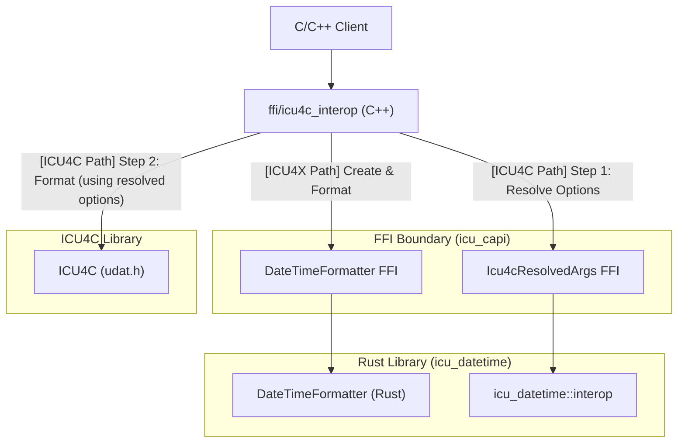

# Design Doc: Datetime Interop Layer (ICU4X / ICU4C / ECMA)

## Status: Draft
**Author:** AI Agent (Gemini) working with @sffc

> [!NOTE]
> All names, FFI paths, C++ class structures, and Rust module locations proposed in this document are tentative and subject to revision during implementation.

---

## 1. Background and Motivation

As internationalization requirements evolve, major projects are increasingly looking to adopt **ICU4X**, a modern, modular, and lightweight i18n library written in Rust. However, many existing codebases are deeply integrated with **ICU4C**, the industry-standard C/C++ library, or rely on system-provided ICU4C libraries to minimize binary size.

During this transition phase, clients require the flexibility to choose between ICU4X and ICU4C backends. This choice may need to be made at compile-time (to optimize binary size) or at runtime (to adapt to different environment capabilities).

Specifically, this interop layer is designed to support the needs of key clients:
*   **Chromium**: Requires a gradual ICU4C-to-ICU4X migration path for its **ECMA-402 (Intl.DateTimeFormat)** implementation and other i18n components.
*   **Firefox (Gecko/SpiderMonkey)**: Has similar migration requirements to Chromium, transitioning from ICU4C to ICU4X for its ECMA-402 implementation.
*   **Boa**: A JavaScript engine written in Rust that requires robust ECMA-402 options parsing and resolution to backends.

To support these clients, the proposed **Datetime Interop Layer** introduces a **unified catchall options bag** that explicitly includes ECMA-402 options alongside ICU4X and ICU4C options. All of these target clients require ECMA options. Furthermore, ECMA-402 options are conceptually classical-skeleton-like, meaning the business logic required to map ECMA-402 options to ICU4X semantic skeletons (fieldsets/lengths) is highly similar to the logic required to map ICU4C classical skeletons to ICU4X semantic skeletons. Housing them in a single unified bag allows us to reuse this complex "classical-to-semantic" mapping logic efficiently in Rust, ensuring identical behavior across backends.

This decoupled architecture allows C++ clients to switch between backends at the edge (via a lightweight C++ wrapper) without forcing a dependency on ICU4C within the core Rust codebase.

### 1.1. Target Use Cases

*   **Gradual Migration**: Allowing large C++ applications to gradually migrate from ICU4C to ICU4X by switching backends incrementally.
*   **Resource-Constrained Environments**: Enabling compile-time selection of ICU4C when a system ICU is available, or ICU4X when self-contained deployment is preferred.
*   **Web/JavaScript Runtimes**: Providing a consistent mapping from ECMA-402 options to whichever backend is active.

### 1.2. Design Goals

*   **Strict Dependency Isolation**: The Rust `icu_datetime` crate must remain 100% pure Rust. It must not (statically or dynamically) link against ICU4C (`libicu`). This keeps the Rust toolchain simple, avoids cross-compilation complications, and ensures that no system dependencies are introduced into the dependency tree (even optionally). Crucially, this avoids forcing the Rust toolchain to manage system-dependent ICU4C ABI compatibility, versioned namespaces (e.g., `icu77::` vs `icu::`), and architecture-specific linking, keeping the Rust side entirely portable.
*   **Single Source of Truth**: The complex resolution logic that maps the unified options to backend-specific targets (classical skeletons for ICU4C and fieldsets/lengths for ICU4X) is implemented solely in Rust. This ensures identical formatting behavior regardless of the active backend.
*   **Header-Only C++ Switching**: The logic to select and invoke the active backend is implemented as a header-only C++ library. This gives C++ clients maximum flexibility in how they link the libraries.
*   **Zero-Cost Abstraction**: When compile-time selection is used, the unused backend branch should be entirely optimized away by the C++ compiler, resulting in no code size or runtime overhead.

---

## 2. Proposed Architecture

The interop layer is split across three boundaries to maintain strict dependency separation:

### 2.1. Unified Options Bag and Backend Resolution

Instead of backend-specific configuration structures, the interop layer exposes a single, unified `DateTimeFormatterOptions` struct (the "catchall options bag"). This struct aggregates options from ECMA-402, ICU4X, and ICU4C. (See [Options and Resolution Config](options_config.md#1-the-catchall-options-bag) for details on supported fields).

To construct a formatter, this unified options bag must be resolved to backend-specific arguments:
*   **For ICU4X**: It is resolved to fieldsets with options (see [ICU4X Backend Mapping](options_config.md#3-icu4x-backend-mapping-fieldsets)).
*   **For ICU4C**: It is resolved to a skeleton or pre-defined styles (see [ICU4C Backend Mapping](options_config.md#2-icu4c-backend-mapping-skeletons--styles)).

The resolution logic follows a strict order of precedence (detailed in [Precedence Rules](options_config.md#22-precedence-rules)) to map these options to backend-specific targets.

### 2.2. Three Sections of Code

The implementation is divided into three distinct layers:

#### 2.2.1. Rust (`icu_datetime::interop`)

This module in the `icu_datetime` crate contains the core Rust structures and logic for the interop layer, serving as the bridge between the catchall configuration and the backend-specific formatters. It exposes:
*   **`DateTimeFormatterOptions`**: The catchall options bag.
*   **`Icu4cResolvedArgs`**: The resolved arguments for ICU4C.
*   **Resolution Logic**: Methods to resolve `DateTimeFormatterOptions` to either `Icu4cResolvedArgs` (for ICU4C) or `CompositeFieldSet` (for ICU4X).

#### 2.2.2. FFI (`icu_capi`)

Using **Diplomat** (ICU4X's FFI binding generation tool), the interop layer exposes C-compatible interfaces for the Rust components:
*   **`ffi::DateTimeFormatterOptions`**: C-compatible version of the options bag.
*   **`ffi::Icu4cResolvedArgs`**: Opaque wrapper around the resolved arguments. Exposes methods to extract the resolved skeleton (writing to `DiplomatWriteable`, a C-compatible string buffer) and styles.
*   **`ffi::DateTimeFormatter` Constructor**: A new constructor `create_from_interop_options` that accepts `ffi::DateTimeFormatterOptions` and returns a `Box<ffi::DateTimeFormatter>`.

> [!NOTE]
> To maintain strict dependency isolation, FFI interfaces cannot return native ICU4C types directly, as this would force the Rust FFI crate to depend on ICU4C headers at compile time. Instead, resolved arguments are returned as opaque types or C-compatible primitives, which the C++ wrapper then maps to ICU4C APIs.

#### 2.2.3. C++ Headers (Proposed path: `ffi/icu4c_interop`)

A C++ wrapper (e.g., `icu_interop::DateTimeFormatter`) is provided as a header-only library. This wrapper is planned to be distributed exclusively within the ICU4X repository (proposed at `ffi/icu4c_interop`) or perhaps as an artifact in the ICU4X release, rather than as a separate, independently distributed library. It manages the switching logic and calls the appropriate underlying library.
*   **Initialization**: Resolves options via FFI (if using ICU4C, it calls the Rust FFI to resolve options, then passes the resolved skeleton to the ICU4C C API) and constructs the appropriate backend formatter.
*   **Formatting**: Delegates the formatting call to either the ICU4X FFI or the ICU4C C API.

### 2.3. Input Types for Formatting

A key difference between ICU4C and ICU4X is how they handle time zones and input representation:
*   **ICU4C** historically accepts `UDate` (double, milliseconds since epoch) and performs time zone conversions internally using its own copy of the Time Zone Database (TZDB).
*   **ICU4X** defers time zone database conversions to third-party libraries. Its formatters expect pre-resolved, structured "Temporal-like" types (such as `Date`, `DateTime`, and `ZonedDateTime`) where calendar arithmetic and time zone offsets have already been applied.

To maintain backend symmetry and leverage ICU4X's modern design, the interop layer will **only accept self-contained ICU4X input types** (such as `Date` and `DateTime`) that do not require external timezone database dependencies.
*   **ICU4X Path**: Direct pass-through of ICU4X structured types to the ICU4X formatter.
*   **ICU4C Path**: The C++ interop layer must convert the structured ICU4X input types into ICU4C-compatible representations (e.g., extracting the fields to populate a `UCalendar` or calculating a local `UDate`) before calling `udat_format`.

Full timezone-aware formatting (accepting epoch timestamps and timezone IDs) is deferred to future work (see [Section 4.2](#42-time-zone-aware-formatting-and-epoch-inputs)).

### 2.4. Error Handling

To remain consistent with the rest of the ICU4X C++ SDK, the interop layer will follow **ICU4X FFI conventions** for error handling:
*   **No Exceptions**: The C++ interop layer will not throw exceptions, ensuring compatibility with systems where exceptions are disabled.
*   **Use of `diplomat::result`**: Fallible operations (such as formatter construction) will return `icu4x::diplomat::result<T, E>`, a variant-like type containing either `Ok<T>` or `Err<E>`.
*   **Error Types**: A new C++ enum `icu_interop::DateTimeFormatterError` will be defined to represent errors from both backends.

### 2.5. Backend Selection Mechanism

The mechanism for selecting the backend (ICU4X vs. ICU4C) in the C++ layer remains open. The following options are considered:
1.  **Compile-time Macro**: Selected via preprocessor definitions (e.g., `-DICU_INTEROP_BACKEND_ICU4X`). This guarantees zero overhead for the unused backend as the compiler can optimize it out. (Recommended for production).
2.  **Template Parameter**: The formatter class is templated on the backend (e.g., `DateTimeFormatter<Backend::ICU4X>`). This allows mixing backends in the same binary but increases template instantiation overhead.
3.  **Runtime Selection**: The constructor accepts a `Backend` enum. This allows dynamic switching but retains code size overhead for both backends in the binary.

---

## 3. Alternatives Considered

### 3.1. Defer to Third-Parties

Do not provide an interop layer in ICU; instead, let third-party wrapper libraries (such as those in browser engines or runtime environments) implement the options resolution and backend switching logic.

**Reasons for Rejection:**
1.  **Complexity of Mapping Logic**: Options resolution (especially mapping ECMA-402 options to ICU4X semantic skeletons/fieldsets) is non-trivial and involves complex mapping rules.
2.  **Library Responsibility**: This logic is best suited for an i18n library like ICU to ensure correctness and maintainability, rather than forcing every client environment to re-implement it.

### 3.2. Release as a Standalone C++ Project/Repository

Release the interop layer as a brand new, standalone C++ library in a separate repository (e.g., `github.com/unicode-org/libicu402`) with its own release cycle.

**Reasons for Rejection:**
1.  **Process Overhead**: Introducing a new standalone project/repository increases release, versioning, and distribution overhead. The proposed `icu4c_interop` is instead a new component *within* the existing ICU4X repository, leveraging its existing release infrastructure. It will be distributed only within the ICU4X repo or as a release artifact of ICU4X, not as a separate library.
2.  **Maintenance Cohesion**: It is easier for clients to consume and for maintainers to track this logic if it is distributed alongside the existing ICU4C or ICU4X codebases.

### 3.3. Offer Only ECMA-to-ICU4X Interop

Only implement the mapping from ECMA-402 to ICU4X, and defer the ICU4C mapping to a separate project (e.g., directly inside ICU4C).

**Reasons for Rejection:**
1.  **Shared Definitions**: The mapping logic for both backends is closely related and benefits from sharing the same options bag definitions.
2.  **Reusing Rust Implementations**: ICU4X already has a robust implementation of semantic skeletons in Rust. If we deferred ICU4C resolution to a C++ project (such as ICU4C itself), we would have to re-implement semantic skeleton support in C++ to achieve the same level of resolution detail. Keeping it in the Rust interop layer allows us to reuse the ICU4X Rust implementation.
3.  **Project Scope**: The primary motivation for this interop layer is to facilitate easy migration to ICU4X, which is firmly in scope for the ICU4X project.

### 3.4. Omit C++ Header Glue Code

Only implement the Rust library and FFI exports, leaving the C++ switching and integration code to the client.

**Reasons for Rejection:**
1.  **Testability**: Without the C++ header glue code, we cannot easily write integration tests to verify that the options resolution and backend switching function correctly in a C++ environment.
2.  **Out-of-the-Box Solution**: Providing the C++ layer ensures a complete, end-to-end verified solution for C++ clients.

### 3.5. Implement ICU4C Resolution in C++

Implement the options resolution logic (e.g., mapping unified options to classical skeletons for ICU4C) directly in C++ (either in the header-only wrapper or as a compiled C++ artifact), avoiding the Rust FFI for the ICU4C path.

**Reasons for Rejection:**
While this would allow C++ clients using only the ICU4C backend to avoid linking the ICU4X Rust FFI library entirely, it is rejected for the following reasons:
1.  **Code Reuse**: We already have a robust, tested implementation of the resolution logic (such as mapping semantic skeletons to classical skeletons) written in Rust within the ICU4X project. Implementing this in C++ would require a complete rewrite of this complex business logic. (Note: If ICU4C adds native support for semantic skeletons in the future, the interop layer can be updated to leverage that natively).
2.  **Minimal Header-Only Logic**: The C++ wrapper is designed to be a lightweight, header-only library to ensure easy integration. We want to avoid putting a significant amount of complex i18n business logic (like options mapping and precedence resolution) into header-only C++ code, as it is harder to maintain, test, and optimize.
3.  **Distribution and Binary Cohesion**: If this complex mapping logic were to be compiled into a binary (like a DLL or shared library) rather than being header-only, it makes far more sense to include it in the existing `icu_capi` Rust library. Creating a brand new, separate C++ DLL/shared library just to house the interop mapping logic would introduce significant packaging and distribution overhead for clients.
4.  **Consistent Option Interpretation**: Keeping both resolution paths (for ICU4C and ICU4X) in Rust ensures that input options, precedence rules, and defaults are interpreted identically, preventing semantic drift between the two backends.
5.  **Rust Safety and Maintainability**: Implementing complex i18n business logic in Rust leverages the language's safety guarantees and modern testing infrastructure, making it easier to maintain and verify than a C++ implementation.

### 3.6. Link ICU4C into Rust

Link ICU4C into the Rust `icu_datetime` crate and perform the backend switching entirely within Rust.

**Reasons for Rejection:**
1.  **Dependency Bloat**: It would force all Rust users of `icu_datetime` to link against ICU4C, significantly increasing build times and binary size.
2.  **Portability Restrictions**: Linking ICU4C increases complexity, especially for targets where ICU4C is not easily available or supported (e.g., WebAssembly, or certain iOS/macOS sandboxed environments where linking system libraries is restricted).
3.  **Dependency Tree Contamination**: Even if ICU4C were linked optionally behind a Cargo feature, it would still enter the dependency tree. Because ICU4X runs tests with `--all-features`, this would force ICU4C to be present during testing, and it would contaminate cargo lockfiles for all users.
4.  **ABI and Namespacing Complexity**: ICU4C installations are highly system-dependent and often use versioned namespaces (e.g., `icu77::`) to avoid conflicts. Linking ICU4C directly into Rust would force the Rust build system to resolve these complex ABI and namespacing variations. Keeping the ICU4C dependency strictly in the C++ wrapper allows the client's native C++ compiler to handle these system-specific details, as the C++ wrapper is compiled directly against the client's target ICU4C headers.

### 3.7. Support More Than Two Backends (Multi-Backend Extensibility)

Design the interop layer as a general-purpose, pluggable interface that can support arbitrary future backends (e.g., WebAssembly, native iOS/macOS platform formatters, or other i18n libraries).

**Reasons for Rejection:**
1.  **Scope Creep**: The primary, explicit goal of this interop layer is to facilitate a smooth migration from ICU4C to ICU4X for C++ clients. Designing for arbitrary future backends introduces significant upfront complexity and abstraction overhead. We are not intending this to scope-creep to support arbitrary backends as suggested during review.
2.  **Targeted Design**: A general-purpose interface would require a "least common denominator" design, which would prevent us from optimizing the interop layer specifically for the ICU4C-to-ICU4X transition (such as sharing the Rust-based options resolution logic and mapping structured ICU4X types to ICU4C).
3.  **No Immediate Need**: There are no immediate plans or requirements to support backends other than ICU4C and ICU4X in this layer. Supporting other environments (like WebAssembly or platform-specific APIs) is better handled by dedicated wrappers or direct integrations rather than overloading this migration tool.

---

## 4. Future Work

### 4.1. Raw Pattern Support

While ICU4X supports formatting with arbitrary raw patterns (e.g., via `DateTimePatternFormatter` in Rust), this capability is not currently exposed over FFI (`icu_capi`). To maintain symmetry across backends in this interop layer, and because there are no plans to add FFI support for raw patterns at this time, raw pattern support (e.g., `pattern: Option<String>`) has been excluded from the unified `DateTimeFormatterOptions` bag.

Future work will investigate how to support raw patterns. The following options will be evaluated:
1.  **On-the-fly Pattern Compilation**: Allow ICU4X to compile raw patterns at runtime. This would involve parsing the pattern string into a `Pattern` struct and then converting it to a `PackedPattern`, which requires memory allocation.
2.  **Polymorphic Formatter API**: Modify the interop API to return an enum or interface that can represent either a `DateTimeFormatter` (skeleton-based) or a `DateTimePatternFormatter` (pattern-based).
3.  **Segregated Pattern Interop**: Keep the skeleton-based interop and pattern-based interop separate, possibly in a separate header/module.

### 4.2. Time Zone-Aware Formatting and Epoch Inputs

A major difference between the backends is timezone handling: ICU4C accepts epoch milliseconds (`UDate`) and performs timezone offset resolution internally using its own TZDB, while ICU4X expects pre-resolved structured types (like `ZonedDateTime`) and delegates timezone database lookups to the caller. This is straightforward for Rust clients who can easily pull in libraries like **`jiff`**, but it is highly complex for C++ clients working over FFI.

To maintain dependency isolation and avoid linking a timezone database (TZDB) provider into the FFI by default, the interop layer will **initially only support minimal, self-contained input types** that work in both ICU4C and ICU4X without external dependencies (such as local `DateTime` or pre-resolved offsets).

Future work will investigate how to support full timezone-aware formatting and epoch-based inputs. The following options will be evaluated:
1.  **C++ Side Resolution**: Leverage C++ platform APIs or C++ i18n libraries to resolve epoch time and timezone ID to fields before passing them to the interop layer.
2.  **Optional Timezone Provider FFI**: Expose helper APIs in `icu_capi` that perform timezone resolution on the Rust side (potentially leveraging Rust libraries like **`jiff`** for timezone offset resolution and TZDB access), but keep them behind an optional cargo feature or separate module to avoid forcing a TZDB dependency on all clients.
3.  **C++ Wrapper Helpers**: Implement timezone resolution helpers directly in the C++ wrapper, using ICU4C's timezone engine when the ICU4C backend is active, and a pluggable C++ timezone provider when the ICU4X backend is active.
