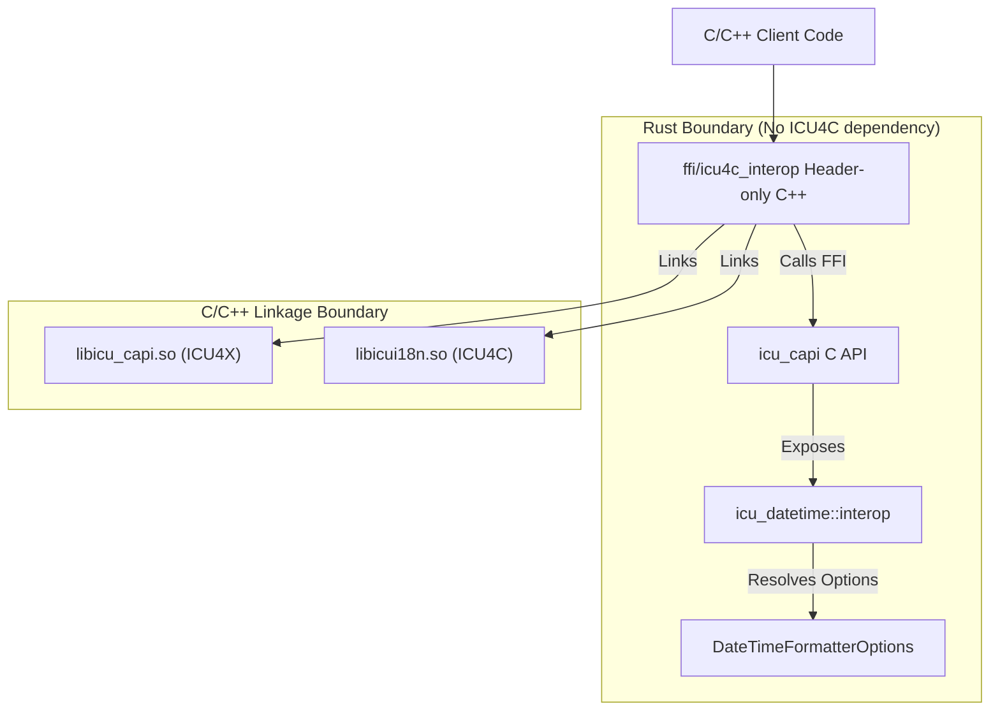

# Design Doc: Datetime Interop Layer (ICU4X / ICU4C / ECMA)

## Status: Draft (Names and locations are subject to bikeshedding)
**Author:** AI Agent (Gemini) working with @sffc

> [!NOTE]
> All names, FFI paths, C++ class structures, and Rust module locations proposed in this document are tentative and subject to revision (bikeshedding) during implementation.

---

## 1. Background and Motivation

ICU4X provides a modern, modular, and lightweight internationalization library in Rust. However, during transition phases or in environments where system-provided libraries are preferred, clients may want to choose between ICU4X and ICU4C at compile-time or runtime.

Furthermore, clients targeting web environments often need to align with **ECMA-402 (Intl.DateTimeFormat)** options.

This document specifies a **Datetime Interop Layer** based on a **catchall options bag** and a **decoupled architecture** that avoids linking ICU4C into the Rust codebase.

The design aims to:
- Define a unified options bag covering ICU4X, ICU4C, and ECMA-402 options.
- Keep the Rust codebase (`icu_datetime`) free of ICU4C dependencies.
- Perform argument resolving (mapping options to ICU4C skeletons/styles) in Rust.
- Export these helpers via `icu_capi` (using Diplomat).
- Implement the actual switching and ICU4C calls in a header-only C/C++ layer (`ffi/icu4c_interop`).

### 1.1. Key Benefits

*   **Dependency Isolation**: The Rust `icu_datetime` crate remains 100% pure Rust and does not need to link with `libicui18n.so`. This keeps Rust builds fast and simple.
*   **Single Source of Truth for Options**: The complex logic of mapping ECMA-402 and ICU4X options to skeletons is written once in Rust, ensuring consistent behavior.
*   **Flexible Linkage**: C++ clients can choose to link only ICU4X, only ICU4C, or both, as the switching logic is header-only and resolved at the C++ compile/link stage.
*   **Zero-Cost Switching**: In production, if a client decides to compile only with ICU4X, the C++ compiler can optimize away the ICU4C branches.

---

## 2. Architecture Overview

The interop layer is split across three boundaries to maintain strict dependency separation:

1.  **`icu_datetime::interop` (Rust)**: Contains `DateTimeFormatterOptions` (the catchall options bag) and the resolution logic to map these options to ICU4C-compatible arguments (skeletons or styles), without calling ICU4C.
2.  **`icu_capi` (Rust/FFI)**: Exposes the options bag and the resolution function to C/C++ using Diplomat.
3.  **`ffi/icu4c_interop` (C/C++ Header-only)**: The integration point for clients. It includes `icu_capi` headers and system ICU4C headers (`unicode/udat.h`). It contains the logic to switch between backends and call `libicui18n.so` or `libicu_capi.so` accordingly.

---

## 3. Main Rust Crate Components (`icu_datetime::interop`)

This module in the `icu_datetime` crate contains the core Rust structures and logic for the interop layer, serving as the bridge between the catchall configuration and the backend-specific formatters.

### 3.1. Module Layout and Types

The module exposes the following key components:

-   **`DateTimeFormatterOptions` (Struct)**:
    *   The unified catchall options bag that aggregates options from ECMA-402, ICU4X, and ICU4C. All fields are optional.
    *   *Details of fields are documented in [Options and Resolution Config](options_config.md#1-the-catchall-options-bag).*
-   **`Icu4cResolvedArgs` (Struct)**:
    *   An intermediate structure that holds the resolved arguments required to initialize an ICU4C formatter (skeleton, date style, and time style) after precedence rules have been applied.
    *   *Details are documented in [Options and Resolution Config](options_config.md#21-resolved-output-rust-struct).*
-   **`resolve_icu4c_args` (Function/Method)**:
    *   The logic that maps the raw `DateTimeFormatterOptions` into the `Icu4cResolvedArgs` structure, applying the precedence rules. This may be implemented as a standalone function or as a method on `DateTimeFormatterOptions` or `Icu4cResolvedArgs`.
    *   *Algorithm details are documented in [Options and Resolution Config](options_config.md#22-precedence-rules).*
-   **`map_to_fieldset` (Function/Method)**:
    *   The logic that maps the `DateTimeFormatterOptions` to the ICU4X `CompositeFieldSet`, selecting the correct pre-compiled data representation. This may be implemented as a standalone function or as a method on `DateTimeFormatterOptions`.
    *   *Algorithm details are documented in [Options and Resolution Config](options_config.md#3-icu4x-backend-mapping-fieldsets).*

---

## 4. FFI Export Crate (`icu_capi`)

Using Diplomat, the interop layer exposes the following C-compatible interface:

-   **`ffi::DateTimeFormatterOptions` Struct**: A C-compatible version of the catchall options bag, mapping to Rust's `icu_datetime::interop::DateTimeFormatterOptions`.
-   **`ffi::Icu4cResolvedArgs` Opaque Type**: A thin wrapper around Rust's `icu_datetime::interop::Icu4cResolvedArgs`.
    *   Exposes a constructor `resolve` that accepts `ffi::DateTimeFormatterOptions`, calls the Rust resolution logic, and returns the wrapped `ffi::Icu4cResolvedArgs`.
    *   Exposes a method to write the resolved `skeleton` into a `DiplomatWriteable`.
    *   Exposes methods to get the resolved `date_style` and `time_style` as integers.
-   **`ffi::DateTimeFormatter` Constructor**: A new constructor `create_from_interop_options` is added to the existing `ffi::DateTimeFormatter` in `icu_capi`. It accepts `ffi::DateTimeFormatterOptions`, resolves it to a `CompositeFieldSet` internally, and returns a `Box<ffi::DateTimeFormatter>`.

---

## 5. Header-only C++ Integration Layer (`ffi/icu4c_interop`)

A C++ wrapper (e.g., `icu_interop::DateTimeFormatter`) is provided as a header-only library. It manages the switching logic and calls the appropriate underlying library.

### 5.1. Initialization Flow

1.  **Switch Backend**: The mechanism for selecting the backend (ICU4X vs. ICU4C) is an open question. Possible approaches include:
    *   **Runtime Selection**: The constructor accepts a `Backend` enum. This allows dynamic switching but may retain code size overhead for both backends.
    *   **Compile-time Macro**: Selected via preprocessor definitions (e.g., `-DICU_INTEROP_BACKEND_ICU4X`), guaranteeing zero overhead for the unused backend.
    *   **Template Parameter**: The class is templated on the backend (e.g., `DateTimeFormatter<Backend::ICU4X>`).
2.  **ICU4X Path**:
    *   Calls `ffi::DateTimeFormatter::create_from_interop_options` using the provided options bag to obtain a `ffi::DateTimeFormatter`.
3.  **ICU4C Path**:
    *   Calls `ffi::Icu4cResolvedArgs::resolve` using the provided options bag to get the resolved skeleton or styles, which are then used to construct the ICU4C `UDateFormat` formatter.

### 5.2. Formatting Flow

1.  **ICU4X Path**:
    *   Calls the formatting function on `ffi::DateTimeFormatter` with the input.
2.  **ICU4C Path**:
    *   Converts the FFI input object (e.g., `ffi::DateTime`) to the appropriate ICU4C type (e.g., `UDate` or `UCalendar`) and formats it using the ICU4C formatter.

---

## 6. Future Work: Raw Pattern Support

Currently, the ICU4X `DateTimeFormatter` is designed around semantic skeletons and pre-compiled data, and does not support formatting arbitrary raw pattern strings at runtime. To maintain symmetry across backends in the interop layer, raw pattern support (e.g., `pattern: Option<String>`) has been excluded from the unified `DateTimeFormatterOptions` bag.

Future work will investigate how to support raw patterns. This is challenging because it requires ICU4X to support arbitrary patterns. The following options will be evaluated:

1.  **On-the-fly Pattern Compilation**: Allow ICU4X to compile raw patterns at runtime. This would involve parsing the pattern string into a `Pattern` struct and then converting it to a `PackedPattern`, which requires memory allocation.
2.  **Polymorphic Formatter API**: Modify the interop API to return an enum or interface that can represent either a `DateTimeFormatter` (skeleton-based) or a `DateTimePatternFormatter` (pattern-based, if a separate pattern formatter is introduced in ICU4X).
3.  **Segregated Pattern Interop**: Keep the skeleton-based interop and pattern-based interop separate. Pattern-based interop could be moved to a separate header/module entirely, allowing clients who don't need raw patterns to avoid the overhead of pattern parsing code.
