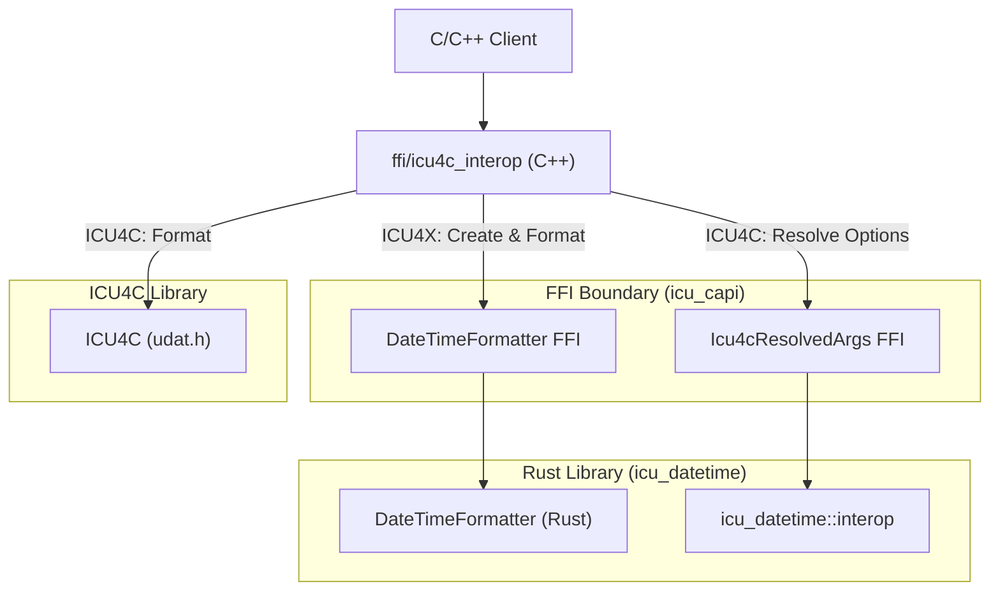

# Design Doc: Datetime Interop Layer (ICU4X / ICU4C / ECMA)

## Status: Draft
**Author:** AI Agent (Gemini) working with @sffc

> [!NOTE]
> All names, FFI paths, C++ class structures, and Rust module locations proposed in this document are tentative and subject to revision during implementation.

---

## 1. Background and Motivation

As internationalization requirements evolve, projects are increasingly looking to adopt **ICU4X**, a modern, modular, and lightweight i18n library written in Rust. However, many existing codebases are deeply integrated with **ICU4C**, the industry-standard C/C++ library, or rely on system-provided ICU4C libraries to minimize binary size.

During this transition phase, clients require the flexibility to choose between ICU4X and ICU4C backends. This choice may need to be made at compile-time (to optimize binary size) or at runtime (to adapt to different environment capabilities).

Furthermore, applications targeting web platforms must align their formatting options with the **ECMA-402 (Intl.DateTimeFormat)** standard. Mapping these high-level ECMA-402 options to the low-level inputs required by ICU4X and ICU4C is complex and error-prone.

To address these challenges, this document proposes a **Datetime Interop Layer**. This layer introduces a **unified catchall options bag** and a **decoupled architecture** that allows clients to switch between backends without forcing a dependency on ICU4C within the Rust codebase.

### 1.1. Target Use Cases

*   **Gradual Migration**: Allowing large C++ applications to gradually migrate from ICU4C to ICU4X by switching backends incrementally.
*   **Resource-Constrained Environments**: Enabling compile-time selection of ICU4C when a system ICU is available, or ICU4X when self-contained deployment is preferred.
*   **Web/JavaScript Runtimes**: Providing a consistent mapping from ECMA-402 options to whichever backend is active.

### 1.2. Design Goals and Benefits

*   **Strict Dependency Isolation**: The Rust `icu_datetime` crate must remain 100% pure Rust. It must not link against or depend on ICU4C (`libicu`). This keeps the Rust toolchain simple and avoids cross-compilation complications.
*   **Single Source of Truth**: The complex resolution logic that maps the unified options to backend-specific targets (classical skeletons for ICU4C and fieldsets/lengths for ICU4X) is implemented solely in Rust. This ensures identical formatting behavior regardless of the active backend.
*   **Header-Only C++ Switching**: The logic to select and invoke the active backend is implemented as a header-only C++ library. This gives C++ clients maximum flexibility in how they link the libraries.
*   **Zero-Cost Abstraction**: When compile-time selection is used, the unused backend branch should be entirely optimized away by the C++ compiler, resulting in no code size or runtime overhead.

---

## 2. Proposed Architecture

The interop layer is split across three boundaries to maintain strict dependency separation:

### 2.1. Unified Options Bag and Backend Resolution

Instead of backend-specific configuration structures, the interop layer exposes a single, unified `DateTimeFormatterOptions` struct (the "catchall options bag"). This struct aggregates options from ECMA-402, ICU4X, and ICU4C. (See [Options and Resolution Config](options_config.md#1-the-catchall-options-bag) for details on supported fields).

To construct a formatter, this unified options bag must be resolved to backend-specific arguments:
*   **For ICU4X**: It is resolved to fieldsets with options (see [ICU4X Backend Mapping](options_config.md#3-icu4x-backend-mapping-fieldsets)).
*   **For ICU4C**: It is resolved to a skeleton or pre-defined styles (see [ICU4C Backend Mapping](options_config.md#2-icu4c-backend-mapping-skeletons--styles)).

The resolution logic follows a strict order of precedence (detailed in [Precedence Rules](options_config.md#22-precedence-rules)) to map these options to backend-specific targets.

### 2.2. Three Sections of Code

The implementation is divided into three distinct layers:

#### 2.2.1. Rust (`icu_datetime::interop`)

This module in the `icu_datetime` crate contains the core Rust structures and logic for the interop layer, serving as the bridge between the catchall configuration and the backend-specific formatters. It exposes:
*   **`DateTimeFormatterOptions`**: The catchall options bag.
*   **`Icu4cResolvedArgs`**: The resolved arguments for ICU4C.
*   **Resolution Logic**: Methods to resolve `DateTimeFormatterOptions` to either `Icu4cResolvedArgs` (for ICU4C) or `CompositeFieldSet` (for ICU4X).

#### 2.2.2. FFI (`icu_capi`)

Using **Diplomat** (ICU4X's FFI binding generation tool), the interop layer exposes C-compatible interfaces for the Rust components:
*   **`ffi::DateTimeFormatterOptions`**: C-compatible version of the options bag.
*   **`ffi::Icu4cResolvedArgs`**: Opaque wrapper around the resolved arguments. Exposes methods to extract the resolved skeleton (writing to `DiplomatWriteable`, a C-compatible string buffer) and styles.
*   **`ffi::DateTimeFormatter` Constructor**: A new constructor `create_from_interop_options` that accepts `ffi::DateTimeFormatterOptions` and returns a `Box<ffi::DateTimeFormatter>`.

#### 2.2.3. C++ Headers (`ffi/icu4c_interop`)

A C++ wrapper (e.g., `icu_interop::DateTimeFormatter`) is provided as a header-only library. It manages the switching logic and calls the appropriate underlying library.
*   **Initialization**: Resolves options via FFI (if using ICU4C) and constructs the appropriate backend formatter.
*   **Formatting**: Delegates the formatting call to either the ICU4X FFI or the ICU4C C API.

### 2.3. Input Types for Formatting

A key difference between ICU4C and ICU4X is how they handle time zones and input representation:
*   **ICU4C** historically accepts `UDate` (double, milliseconds since epoch) and performs time zone conversions internally using its own copy of the Time Zone Database (TZDB).
*   **ICU4X** defers time zone database conversions to third-party libraries. Its formatters expect pre-resolved, structured "Temporal-like" types (such as `Date`, `DateTime`, and `ZonedDateTime`) where calendar arithmetic and time zone offsets have already been applied.

To maintain backend symmetry and leverage ICU4X's modern design, the interop layer will **only accept ICU4X input types** (or thin C++ wrappers around them).
*   **ICU4X Path**: Direct pass-through of ICU4X structured types to the ICU4X formatter.
*   **ICU4C Path**: The C++ interop layer must convert the structured ICU4X input types into ICU4C-compatible representations (e.g., extracting the fields to populate a `UCalendar`, or calculating a local `UDate` if necessary) before calling `udat_format`.

### 2.4. Error Handling

To remain consistent with the rest of the ICU4X C++ SDK, the interop layer will follow **ICU4X FFI conventions** for error handling:
*   **No Exceptions**: The C++ interop layer will not throw exceptions, ensuring compatibility with systems where exceptions are disabled.
*   **Use of `diplomat::result`**: Fallible operations (such as formatter construction) will return `icu4x::diplomat::result<T, E>`, a variant-like type containing either `Ok<T>` or `Err<E>`.
*   **Error Types**: The error type `E` will be aligned with ICU4X error types (e.g., `icu4x::DateTimeFormatterLoadError`), mapping both ICU4X and ICU4C internal errors into this common enum where possible.

### 2.5. Backend Selection Mechanism

The mechanism for selecting the backend (ICU4X vs. ICU4C) in the C++ layer remains open. The following options are considered:
1.  **Compile-time Macro**: Selected via preprocessor definitions (e.g., `-DICU_INTEROP_BACKEND_ICU4X`). This guarantees zero overhead for the unused backend as the compiler can optimize it out. (Recommended for production).
2.  **Template Parameter**: The formatter class is templated on the backend (e.g., `DateTimeFormatter<Backend::ICU4X>`). This allows mixing backends in the same binary but increases template instantiation overhead.
3.  **Runtime Selection**: The constructor accepts a `Backend` enum. This allows dynamic switching but retains code size overhead for both backends in the binary.

---

## 3. Alternatives Considered

### 3.1. Defer to Third-Parties

Do not provide an interop layer in ICU; instead, let third-party wrapper libraries (such as those in browser engines or runtime environments) implement the options resolution and backend switching logic.

**Reasons for Rejection:**
1.  **Complexity of Mapping Logic**: Options resolution (especially mapping ECMA-402 options to ICU4X semantic skeletons/fieldsets) is non-trivial and involves complex mapping rules.
2.  **Library Responsibility**: This logic is best suited for an i18n library like ICU to ensure correctness and maintainability, rather than forcing every client environment to re-implement it.

### 3.2. Release as a Standalone C++ Library

Release the interop layer as a brand new, standalone C++ library (e.g., `libicu402`).

**Reasons for Rejection:**
1.  **Process Overhead**: Introducing a new library increases release, versioning, and distribution overhead.
2.  **Maintenance Cohesion**: It is easier for clients to consume and for maintainers to track this logic if it is distributed alongside the existing ICU4C or ICU4X codebases.

### 3.3. Offer Only ECMA-to-ICU4X Interop

Only implement the mapping from ECMA-402 to ICU4X, and defer the ICU4C mapping to a separate project (e.g., directly inside ICU4C).

**Reasons for Rejection:**
1.  **Shared Definitions**: The mapping logic for both backends is closely related and benefits from sharing the same options bag definitions.
2.  **Reusing Rust Implementations**: ICU4X already has a robust implementation of semantic skeletons in Rust. If we deferred ICU4C resolution to a C++ project (such as ICU4C itself), we would have to re-implement semantic skeleton support in C++ to achieve the same level of resolution detail. Keeping it in the Rust interop layer allows us to reuse the ICU4X Rust implementation.
3.  **Project Scope**: The primary motivation for this interop layer is to facilitate easy migration to ICU4X, which is firmly in scope for the ICU4X project.

### 3.4. Omit C++ Header Glue Code

Only implement the Rust library and FFI exports, leaving the C++ switching and integration code to the client.

**Reasons for Rejection:**
1.  **Testability**: Without the C++ header glue code, we cannot easily write integration tests to verify that the options resolution and backend switching function correctly in a C++ environment.
2.  **Out-of-the-Box Solution**: Providing the C++ layer ensures a complete, end-to-end verified solution for C++ clients.

### 3.5. Implement ICU4C Resolution in C++

Implement the ECMA-to-ICU4C resolution logic directly in C++ (using ICU4C APIs if possible), while only implementing the ECMA-to-ICU4X resolution in Rust.

**Reasons for Rejection:**
While this would allow C++ clients using only the ICU4C backend to avoid linking the ICU4X FFI library entirely, it goes against the core design philosophy of the ICU4X project:
1.  **Rust-First Business Logic**: We want to implement as much logic as possible in Rust, where it is safer, more maintainable, and easier to test. Resolving high-level options to backend-specific targets (even to ICU4C skeletons) is complex i18n business logic that belongs in Rust. C++ should be treated strictly as an integration/FFI layer without such logic.
2.  **Consistent Option Interpretation**: Although the target outputs are different (skeletons for ICU4C, fieldsets for ICU4X), they process the same input options. Keeping both resolution paths in Rust makes it easier to ensure that input options, precedence rules, and defaults are interpreted consistently across both backends, avoiding semantic drift in how options are resolved.

### 3.6. Link ICU4C into Rust

Link ICU4C into the Rust `icu_datetime` crate and perform the backend switching entirely within Rust.

**Reasons for Rejection:**
1.  **Dependency Bloat**: It would force all Rust users of `icu_datetime` to link against ICU4C, significantly increasing build times and binary size.
2.  **Portability Restrictions**: Linking ICU4C increases complexity, especially for targets where ICU4C is not easily available or supported (e.g., WebAssembly).

---

## 4. Future Work: Raw Pattern Support

Currently, the ICU4X `DateTimeFormatter` is designed around semantic skeletons and pre-compiled data, and does not support formatting arbitrary raw pattern strings at runtime. To maintain symmetry across backends in the interop layer, raw pattern support (e.g., `pattern: Option<String>`) has been excluded from the unified `DateTimeFormatterOptions` bag.

Future work will investigate how to support raw patterns. The following options will be evaluated:
1.  **On-the-fly Pattern Compilation**: Allow ICU4X to compile raw patterns at runtime. This would involve parsing the pattern string into a `Pattern` struct and then converting it to a `PackedPattern`, which requires memory allocation.
2.  **Polymorphic Formatter API**: Modify the interop API to return an enum or interface that can represent either a `DateTimeFormatter` (skeleton-based) or a `DateTimePatternFormatter` (pattern-based).
3.  **Segregated Pattern Interop**: Keep the skeleton-based interop and pattern-based interop separate, possibly in a separate header/module.
