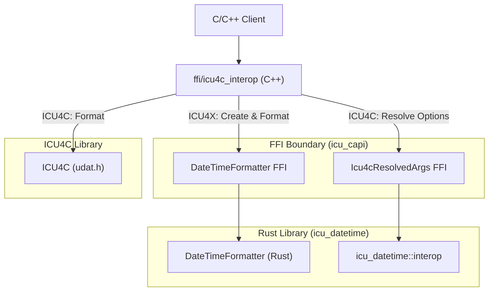

# Design Doc: Datetime Interop Layer (ICU4X / ICU4C / ECMA)

## Status: Draft
**Author:** AI Agent (Gemini) working with @sffc

> [!NOTE]
> All names, FFI paths, C++ class structures, and Rust module locations proposed in this document are tentative and subject to revision during implementation.

---

## 1. Background and Motivation

ICU4X provides a modern, modular, and lightweight internationalization library in Rust. ICU4C is the established C/C++ internationalization library. During transition phases, or in environments where system-provided libraries are preferred, clients may want to choose between ICU4X (Rust) and ICU4C (C/C++) at compile-time or runtime.

Furthermore, clients targeting web environments often need to align with **ECMA-402 (Intl.DateTimeFormat)** options.

This document specifies a **Datetime Interop Layer** based on a **catchall options bag** and a **decoupled architecture** that avoids linking ICU4C into the Rust codebase.

### 1.1. Key Benefits

*   **Dependency Isolation**: The Rust `icu_datetime` crate remains 100% pure Rust and does not need to link with `libicui18n.so`. This keeps Rust builds fast and simple.
*   **Single Source of Truth for Options**: The complex logic of mapping ECMA-402 and ICU4X options to skeletons is written once in Rust, ensuring consistent behavior.
*   **Flexible Linkage**: C++ clients can choose to link only ICU4X, only ICU4C, or both, as the switching logic is header-only and resolved at the C++ compile/link stage.
*   **Zero-Cost Switching**: In production, if a client decides to compile only with ICU4X, the C++ compiler can optimize away the ICU4C branches.

---

## 2. Proposed Architecture

The interop layer is split across three boundaries to maintain strict dependency separation:

### 2.1. Unified Options Bag and Backend Resolution

Instead of backend-specific configuration structures, the interop layer exposes a single, unified `DateTimeFormatterOptions` struct (the "catchall options bag"). This struct aggregates options from ECMA-402, ICU4X, and ICU4C. (See [Options and Resolution Config](options_config.md#1-the-catchall-options-bag) for details on supported fields).

To construct a formatter, this unified options bag must be resolved to backend-specific arguments:
*   **For ICU4X**: It is resolved to fieldsets with options (see [ICU4X Backend Mapping](options_config.md#3-icu4x-backend-mapping-fieldsets)).
*   **For ICU4C**: It is resolved to a skeleton or pre-defined styles (see [ICU4C Backend Mapping](options_config.md#2-icu4c-backend-mapping-skeletons--styles)).

The resolution logic follows a strict order of precedence (detailed in [Precedence Rules](options_config.md#22-precedence-rules)) to map these options to backend-specific targets.

### 2.2. Three Sections of Code

The implementation is divided into three distinct layers:

#### 2.2.1. Rust (`icu_datetime::interop`)

This module in the `icu_datetime` crate contains the core Rust structures and logic for the interop layer, serving as the bridge between the catchall configuration and the backend-specific formatters. It exposes:
*   **`DateTimeFormatterOptions`**: The catchall options bag.
*   **`Icu4cResolvedArgs`**: The resolved arguments for ICU4C.
*   **Resolution Logic**: Methods to resolve `DateTimeFormatterOptions` to either `Icu4cResolvedArgs` (for ICU4C) or `CompositeFieldSet` (for ICU4X).

#### 2.2.2. FFI (`icu_capi`)

Using **Diplomat** (ICU4X's FFI binding generation tool), the interop layer exposes C-compatible interfaces for the Rust components:
*   **`ffi::DateTimeFormatterOptions`**: C-compatible version of the options bag.
*   **`ffi::Icu4cResolvedArgs`**: Opaque wrapper around the resolved arguments. Exposes methods to extract the resolved skeleton (writing to `DiplomatWriteable`, a C-compatible string buffer) and styles.
*   **`ffi::DateTimeFormatter` Constructor**: A new constructor `create_from_interop_options` that accepts `ffi::DateTimeFormatterOptions` and returns a formatted helper.

#### 2.2.3. C++ Headers (`ffi/icu4c_interop`)

A C++ wrapper (e.g., `icu_interop::DateTimeFormatter`) is provided as a header-only library. It manages the switching logic and calls the appropriate underlying library.
*   **Initialization**: Resolves options via FFI (if using ICU4C) and constructs the appropriate backend formatter.
*   **Formatting**: Delegates the formatting call to either the ICU4X FFI or the ICU4C C API.

### 2.3. Input Types for Formatting

A key difference between ICU4C and ICU4X is how they handle time zones and input representation:
*   **ICU4C** historically accepts `UDate` (double, milliseconds since epoch) and performs time zone conversions internally using its own copy of the Time Zone Database (TZDB).
*   **ICU4X** defers time zone database conversions to third-party libraries. Its formatters expect pre-resolved, structured "Temporal-like" types (such as `Date`, `DateTime`, and `ZonedDateTime`) where calendar arithmetic and time zone offsets have already been applied.

To maintain backend symmetry and leverage ICU4X's modern design, the interop layer will **only accept ICU4X input types** (or thin C++ wrappers around them).
*   **ICU4X Path**: Direct pass-through of ICU4X structured types to the ICU4X formatter.
*   **ICU4C Path**: The C++ interop layer must convert the structured ICU4X input types into ICU4C-compatible representations (e.g., extracting the fields to populate a `UCalendar`, or calculating a local `UDate` if necessary) before calling `udat_format`.

### 2.4. Error Handling

To remain consistent with the rest of the ICU4X C++ SDK, the interop layer will follow **ICU4X FFI conventions** for error handling:
*   **No Exceptions**: The C++ interop layer will not throw exceptions, ensuring compatibility with systems where exceptions are disabled.
*   **Use of `diplomat::result`**: Fallible operations (such as formatter construction) will return `icu4x::diplomat::result<T, E>`, a variant-like type containing either `Ok<T>` or `Err<E>`.
*   **Error Types**: The error type `E` will be aligned with ICU4X error types (e.g., `icu4x::DateTimeFormatterLoadError`), mapping both ICU4X and ICU4C internal errors into this common enum where possible.

### 2.5. Backend Selection Mechanism

The mechanism for selecting the backend (ICU4X vs. ICU4C) in the C++ layer remains open. The following options are considered:
1.  **Compile-time Macro**: Selected via preprocessor definitions (e.g., `-DICU_INTEROP_BACKEND_ICU4X`). This guarantees zero overhead for the unused backend as the compiler can optimize it out. (Recommended for production).
2.  **Template Parameter**: The formatter class is templated on the backend (e.g., `DateTimeFormatter<Backend::ICU4X>`). This allows mixing backends in the same binary but increases template instantiation overhead.
3.  **Runtime Selection**: The constructor accepts a `Backend` enum. This allows dynamic switching but retains code size overhead for both backends in the binary.

---

## 3. Future Work: Raw Pattern Support

Currently, the ICU4X `DateTimeFormatter` is designed around semantic skeletons and pre-compiled data, and does not support formatting arbitrary raw pattern strings at runtime. To maintain symmetry across backends in the interop layer, raw pattern support (e.g., `pattern: Option<String>`) has been excluded from the unified `DateTimeFormatterOptions` bag.

Future work will investigate how to support raw patterns. The following options will be evaluated:
1.  **On-the-fly Pattern Compilation**: Allow ICU4X to compile raw patterns at runtime. This would involve parsing the pattern string into a `Pattern` struct and then converting it to a `PackedPattern`, which requires memory allocation.
2.  **Polymorphic Formatter API**: Modify the interop API to return an enum or interface that can represent either a `DateTimeFormatter` (skeleton-based) or a `DateTimePatternFormatter` (pattern-based).
3.  **Segregated Pattern Interop**: Keep the skeleton-based interop and pattern-based interop separate, possibly in a separate header/module.
