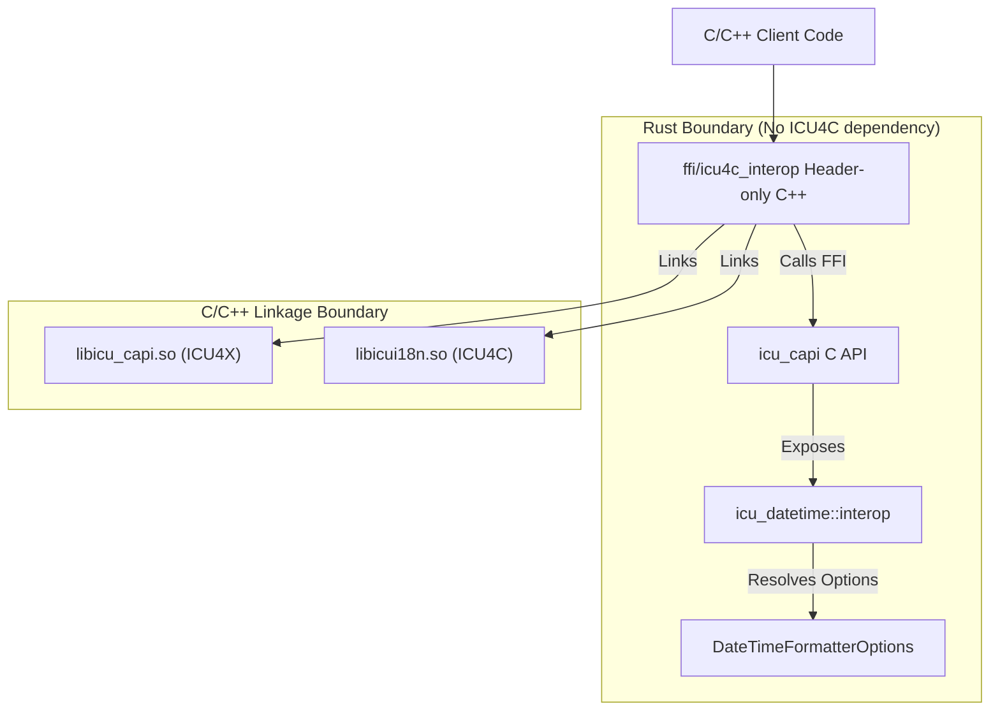

# Design Doc: Datetime Interop Layer (ICU4X / ICU4C / ECMA)

## Status: Draft
**Author:** AI Agent (Gemini) working with @sffc

---

## 1. Background and Motivation

ICU4X provides a modern, modular, and lightweight internationalization library in Rust. However, during transition phases or in environments where system-provided libraries are preferred, clients may want to choose between ICU4X and ICU4C at compile-time or runtime.

Furthermore, clients targeting web environments often need to align with **ECMA-402 (Intl.DateTimeFormat)** options.

This document specifies a **Datetime Interop Layer** based on a **catchall options bag** and a **decoupled architecture** that avoids linking ICU4C into the Rust codebase.

The design aims to:
- Define a unified options bag covering ICU4X, ICU4C, and ECMA-402 options.
- Keep the Rust codebase (`icu_datetime`) free of ICU4C dependencies.
- Perform argument resolving (mapping options to ICU4C skeletons/styles) in Rust.
- Export these helpers via `icu_capi` (using Diplomat).
- Implement the actual switching and ICU4C calls in a header-only C/C++ layer (`ffi/icu4c_interop`).

---

## 2. Architecture Overview

The interop layer is split across three boundaries to maintain strict dependency separation:

1.  **`icu_datetime::interop` (Rust)**: Contains `DateTimeFormatterOptions` (the catchall options bag) and the resolution logic to map these options to ICU4C-compatible arguments (skeletons or styles), without calling ICU4C.
2.  **`icu_capi` (Rust/FFI)**: Exposes the options bag and the resolution function to C/C++ using Diplomat.
3.  **`ffi/icu4c_interop` (C/C++ Header-only)**: The integration point for clients. It includes `icu_capi` headers and system ICU4C headers (`unicode/udat.h`). It contains the logic to switch between backends and call `libicui18n.so` or `libicu_capi.so` accordingly.

---

## 3. The Catchall Options Bag

Instead of separate option structures, a single unified `DateTimeFormatterOptions` struct is exposed. Note that raw LDML patterns are excluded from this options bag to maintain backend symmetry (as ICU4X does not support arbitrary patterns at runtime; see Section 9).

### 3.1. Options Table

The options bag supports the following fields:

| Option Name | Type / Values | Description |
|---|---|---|
| `skeleton` | String | **ICU4C Override**: Classical skeleton (e.g., `yMdHms`). If set, individual fields are ignored. |
| `date_style` | `Full`, `Long`, `Medium`, `Short` | **High-level Style**: Pre-defined style for the date part (ECMA/ICU4C). |
| `time_style` | `Full`, `Long`, `Medium`, `Short` | **High-level Style**: Pre-defined style for the time part (ECMA/ICU4C). |
| `date_fields` | [`DateFields`](https://docs.rs/icu_datetime/latest/icu_datetime/fieldsets/builder/enum.DateFields.html) | **ICU4X Field**: Pre-defined date field combinations (YMD, MD, etc.). |
| `time_precision`| [`TimePrecision`](https://docs.rs/icu_datetime/latest/icu_datetime/options/enum.TimePrecision.html) | **ICU4X Field**: Time precision (Hour, Minute, Second, Subsecond, etc.). |
| `zone_style` | [`ZoneStyle`](https://docs.rs/icu_datetime/latest/icu_datetime/fieldsets/builder/enum.ZoneStyle.html) | **ICU4X Field**: Timezone style (SpecificLong, LocalizedOffset, etc.). |
| `alignment` | [`Alignment`](https://docs.rs/icu_datetime/latest/icu_datetime/options/enum.Alignment.html) | **ICU4X Option**: Column/Auto alignment. |
| `year_style` | [`YearStyle`](https://docs.rs/icu_datetime/latest/icu_datetime/options/enum.YearStyle.html) | **ICU4X Option**: Year style (WithEra, NoEra, etc.). |
| `weekday` | `Narrow`, `Short`, `Long` | **ECMA Field Style**: Weekday display style. |
| `era` | `Narrow`, `Short`, `Long` | **ECMA Field Style**: Era display style. |
| `year` | `Numeric`, `TwoDigit` | **ECMA Field Style**: Year display style. |
| `month` | `Numeric`, `TwoDigit`, `Narrow`, `Short`, `Long` | **ECMA Field Style**: Month display style. |
| `day` | `Numeric`, `TwoDigit` | **ECMA Field Style**: Day display style. |
| `day_period` | `Narrow`, `Short`, `Long` | **ECMA Field Style**: AM/PM display style. |
| `hour` | `Numeric`, `TwoDigit` | **ECMA Field Style**: Hour display style. |
| `minute` | `Numeric`, `TwoDigit` | **ECMA Field Style**: Minute display style. |
| `second` | `Numeric`, `TwoDigit` | **ECMA Field Style**: Second display style. |
| `fractional_second_digits` | 1..9 | **ECMA Field Style**: Number of fractional second digits. |
| `time_zone_name` | `Short`, `Long`, `ShortOffset`, `LongOffset`, `ShortGeneric`, `LongGeneric` | **ECMA Field Style**: Timezone display style. |
| `hour_cycle` | [`HourCycle`](https://docs.rs/icu_datetime/latest/icu_datetime/preferences/enum.HourCycle.html) | **Preference**: Hour cycle override (H11, H12, H23, H24). |

---

## 4. ICU4C Backend Mapping (Skeletons & Styles)

To support ICU4C, the unified `DateTimeFormatterOptions` must be resolved to ICU4C-compatible arguments (skeletons or styles). This resolution logic runs in Rust (in the `icu_datetime::interop` module) and does not invoke ICU4C directly.

### 4.1. Resolved Output

The resolution function outputs the following parameters:
-   **Skeleton**: A resolved classical skeleton string (e.g., `yMdHms`), or `None`.
-   **Date Style**: A resolved date style enum (`Full`, `Long`, `Medium`, `Short`, or `None`).
-   **Time Style**: A resolved time style enum (`Full`, `Long`, `Medium`, `Short`, or `None`).

### 4.2. Precedence Rules

The resolution logic follows this order of precedence:

1.  **Skeleton**: If `skeleton` is set in the options, it is returned as the resolved skeleton. Styles are set to `None`.
2.  **Styles**: If `date_style` or `time_style` is set, they are returned. The skeleton is set to `None`. Individual field options are ignored.
3.  **Individual Fields**: If neither skeletons nor styles are set:
    *   **ECMA-style Fields**: If ECMA options (`year`, `month`, `day`, etc.) are present, they are mapped to standard UTS 35 skeleton symbols. This is a direct **one-to-one mapping** (e.g., `year: Numeric` -> `y`, `month: Long` -> `MMMM`, `day: TwoDigit` -> `dd`). These mapped symbols are concatenated in UTS 35 canonical order to form the resolved classical skeleton.
    *   **ICU4X-style Fields**: If no ECMA options are present, but ICU4X builder-style options (`date_fields`, `time_precision`, `zone_style`, etc.) are present, they are treated as an ICU4X semantic skeleton. This semantic skeleton is mapped to standard skeleton symbols according to the UTS 35 rules cited below.
    *   **Conflict Resolution**: If both ECMA-style and ICU4X-style options are present, the ECMA-style options take precedence.
    *   Styles are set to `None`.

### 4.3. UTS 35 Mapping Details

When mapping semantic options to classical skeletons, the interop layer strictly follows the [UTS 35: Unicode Technical Standard #35 (Part 4: Dates)](https://unicode.org/reports/tr35/tr35-dates.html) specification:

-   **Basic Field Mapping**: Follows [UTS 35: Mapping to Standard Skeletons](https://unicode.org/reports/tr35/tr35-dates.html#Mapping_to_Standard_Skeletons) (handles standalone vs. formatting contexts like `LLLL` vs. `MMMM` for month).
-   **Time Precision Variations**: Follows [UTS 35: Time Precision Skeleton Variations](https://unicode.org/reports/tr35/tr35-dates.html#Semantic_Time_Precision_Skeleton_Variations).
-   **Year Style Variations**: Follows [UTS 35: Year Style Skeleton Variations](https://unicode.org/reports/tr35/tr35-dates.html#Semantic_Year_Style_Skeleton_Variations).

The resolved standard symbols are concatenated in UTS 35 canonical order to form the final classical skeleton.

---

## 5. ICU4X Backend Mapping (FieldSets)

ICU4X is static/data-efficient. To construct an ICU4X formatter, the unified `DateTimeFormatterOptions` must be resolved to a `CompositeFieldSet`.

### 5.1. Target Output

The mapping resolves the options bag to a `CompositeFieldSet`, which is a dynamic enum covering all supported combinations of date, time, and timezone fieldsets in ICU4X.

### 5.2. Resolution Algorithm

Due to the static nature of ICU4X, this mapping involves a non-trivial resolution algorithm to find the "best fit" static fieldset and options (e.g., merging individual field styles into a single global `Length`). This algorithm is detailed in [ICU4X Backend Mapping Algorithm](icu4x_mapping.md).

---

## 6. FFI Export Layer (`icu_capi`)

Using Diplomat, the interop layer exposes the following C-compatible interface:

-   **`ICU4XDateTimeFormatterOptions` Struct**: A C-compatible version of the catchall options bag.
-   **`ICU4CIteropResolvedArgs` Opaque Type**: Wraps the resolved ICU4C arguments.
    *   Exposes a method to write the resolved `skeleton` into a `DiplomatWriteable`.
    *   Exposes methods to get the resolved `date_style` and `time_style` as integers.
-   **`resolve_icu4c_args` Function**: Accepts `ICU4XDateTimeFormatterOptions` and returns `Box<ICU4CIteropResolvedArgs>`.

---

## 7. C/C++ Header-only Interop Layer (`ffi/icu4c_interop`)

A C++ wrapper (e.g., `icu_interop::DateTimeFormatter`) is provided as a header-only library. It manages the switching logic and calls the appropriate underlying library.

### 7.1. Initialization Flow

1.  **Switch Backend**: The class constructor accepts a `Backend` enum (`ICU4X` or `ICU4C`).
2.  **ICU4X Path**:
    *   Directly calls `icu_capi`'s `icu4x_datetime_formatter_create` using the provided options bag.
3.  **ICU4C Path**:
    *   Calls FFI `resolve_icu4c_args` to get resolved skeleton and styles.
    *   If a resolved `skeleton` is present:
        *   Opens a pattern generator using `udatpg_open`.
        *   Retrieves the best pattern for the skeleton using `udatpg_getBestPattern`.
        *   Opens the formatter using `udat_open` with the resolved pattern.
        *   Closes the generator using `udatpg_close`.
    *   Else (styles are present):
        *   Opens the formatter using `udat_open` with the resolved date and time styles.

### 7.2. Formatting Flow

1.  **ICU4X Path**:
    *   Calls `icu_capi`'s formatting function with the ICU4X formatter and input.
2.  **ICU4C Path**:
    *   Extracts datetime fields (year, month, day, hour, minute, second) from the ICU4X input object using `icu_capi` getters.
    *   Converts the fields to a `UDate` (epoch milliseconds) or sets them on a `UCalendar`.
    *   Calls ICU4C's `udat_format` with the `UDate` or `UCalendar`.
    *   Converts the resulting `UChar` buffer to a C++ `std::string`.

---

## 8. Key Benefits of this Architecture

1.  **Dependency Isolation**: The Rust `icu_datetime` crate remains 100% pure Rust and does not need to link with `libicui18n.so`. This keeps Rust builds fast and simple.
2.  **Single Source of Truth for Options**: The complex logic of mapping ECMA-402 and ICU4X options to skeletons is written once in Rust, ensuring consistent behavior.
3.  **Flexible Linkage**: C++ clients can choose to link only ICU4X, only ICU4C, or both, as the switching logic is header-only and resolved at the C++ compile/link stage.
4.  **Zero-Cost Switching**: In production, if a client decides to compile only with ICU4X, the C++ compiler can optimize away the ICU4C branches.

---

## 9. Future Work: Raw Pattern Support

Currently, the ICU4X `DateTimeFormatter` is designed around semantic skeletons and pre-compiled data, and does not support formatting arbitrary raw pattern strings at runtime. To maintain symmetry across backends in the interop layer, raw pattern support (e.g., `pattern: Option<String>`) has been excluded from the unified `DateTimeFormatterOptions` bag.

Future work will investigate how to support raw patterns. This is challenging because it requires ICU4X to support arbitrary patterns. The following options will be evaluated:

1.  **On-the-fly Pattern Compilation**: Allow ICU4X to compile raw patterns at runtime. This would involve parsing the pattern string into a `Pattern` struct and then converting it to a `PackedPattern`, which requires memory allocation.
2.  **Polymorphic Formatter API**: Modify the interop API to return an enum or interface that can represent either a `DateTimeFormatter` (skeleton-based) or a `DateTimePatternFormatter` (pattern-based, if a separate pattern formatter is introduced in ICU4X).
3.  **Segregated Pattern Interop**: Keep the skeleton-based interop and pattern-based interop separate. Pattern-based interop could be moved to a separate header/module entirely, allowing clients who don't need raw patterns to avoid the overhead of pattern parsing code.
