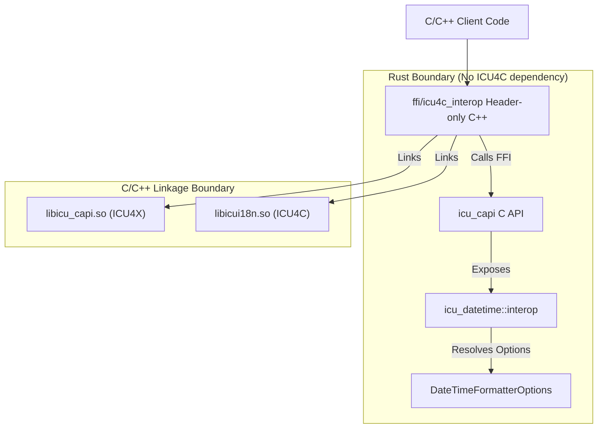

# Design Doc: Datetime Interop Layer (ICU4X / ICU4C / ECMA)

## Status: Draft
**Author:** AI Agent (Gemini) working with @sffc

---

## 1. Background and Motivation

ICU4X provides a modern, modular, and lightweight internationalization library in Rust. However, during transition phases or in environments where system-provided libraries are preferred, clients may want to choose between ICU4X and ICU4C at compile-time or runtime.

Furthermore, clients targeting web environments often need to align with **ECMA-402 (Intl.DateTimeFormat)** options.

This document specifies a **Datetime Interop Layer** based on a **catchall options bag** and a **decoupled architecture** that avoids linking ICU4C into the Rust codebase.

The design aims to:
- Define a unified options bag covering ICU4X, ICU4C, and ECMA-402 options.
- Keep the Rust codebase (`icu_datetime`) free of ICU4C dependencies.
- Perform argument resolving (mapping options to ICU4C skeletons/styles) in Rust.
- Export these helpers via `icu_capi` (using Diplomat).
- Implement the actual switching and ICU4C calls in a header-only C/C++ layer (`ffi/icu4c_interop`).

---

## 2. Architecture Overview

The interop layer is split across three boundaries to maintain strict dependency separation:



1.  **`icu_datetime::interop` (Rust)**: Contains `DateTimeFormatterOptions` (the catchall options bag) and the resolution logic to map these options to ICU4C-compatible arguments (skeletons, patterns, or styles), without calling ICU4C.
2.  **`icu_capi` (Rust/FFI)**: Exposes the options bag and the resolution function to C/C++ using Diplomat.
3.  **`ffi/icu4c_interop` (C/C++ Header-only)**: The integration point for clients. It includes `icu_capi` headers and system ICU4C headers (`unicode/udat.h`). It contains the logic to switch between backends and call `libicui18n.so` or `libicu_capi.so` accordingly.

---

## 3. The Catchall Options Bag

We define a single, comprehensive options struct in `icu_datetime::interop`:

```rust
#[derive(Debug, Clone, Default, PartialEq, Eq)]
pub struct DateTimeFormatterOptions {
    // ==========================================
    // 1. Classical / ICU4C Overrides
    // ==========================================
    /// A raw LDML pattern (e.g., "yyyy-MM-dd HH:mm:ss").
    pub pattern: Option<String>,

    /// A classical skeleton string (e.g., "yMdHms").
    pub skeleton: Option<String>,

    // ==========================================
    // 2. High-level Styles (ECMA & ICU4X)
    // ==========================================
    pub date_style: Option<DateTimeStyle>,
    pub time_style: Option<DateTimeStyle>,

    // ==========================================
    // 3. ICU4X Builder-style Fields
    // ==========================================
    pub date_fields: Option<DateFields>,
    pub time_precision: Option<TimePrecision>,
    pub zone_style: Option<ZoneStyle>,
    pub alignment: Option<Alignment>,
    pub year_style: Option<YearStyle>,

    // ==========================================
    // 4. ECMA-402 Fine-Grained Field Options
    // ==========================================
    pub weekday: Option<WeekdayStyle>,
    pub era: Option<EraStyle>,
    pub year: Option<YearStyleOption>,
    pub month: Option<MonthStyle>,
    pub day: Option<DayStyle>,
    pub day_period: Option<DayPeriodStyle>,
    pub hour: Option<HourStyle>,
    pub minute: Option<MinuteStyle>,
    pub second: Option<SecondStyle>,
    pub fractional_second_digits: Option<u8>, // 1..9
    pub time_zone_name: Option<TimeZoneNameStyle>,

    // ==========================================
    // 5. Global Preferences
    // ==========================================
    pub hour_cycle: Option<HourCycle>,
}
```

### 3.1. Supporting Enums

```rust
#[derive(Debug, Copy, Clone, PartialEq, Eq)]
pub enum DateTimeStyle {
    Full,
    Long,
    Medium,
    Short,
}

#[derive(Debug, Copy, Clone, PartialEq, Eq)]
pub enum WeekdayStyle { Narrow, Short, Long }

#[derive(Debug, Copy, Clone, PartialEq, Eq)]
pub enum EraStyle { Narrow, Short, Long }

#[derive(Debug, Copy, Clone, PartialEq, Eq)]
pub enum YearStyleOption { Numeric, TwoDigit }

#[derive(Debug, Copy, Clone, PartialEq, Eq)]
pub enum MonthStyle { Numeric, TwoDigit, Narrow, Short, Long }

#[derive(Debug, Copy, Clone, PartialEq, Eq)]
pub enum DayStyle { Numeric, TwoDigit }

#[derive(Debug, Copy, Clone, PartialEq, Eq)]
pub enum DayPeriodStyle { Narrow, Short, Long }

#[derive(Debug, Copy, Clone, PartialEq, Eq)]
pub enum HourStyle { Numeric, TwoDigit }

#[derive(Debug, Copy, Clone, PartialEq, Eq)]
pub enum MinuteStyle { Numeric, TwoDigit }

#[derive(Debug, Copy, Clone, PartialEq, Eq)]
pub enum SecondStyle { Numeric, TwoDigit }

#[derive(Debug, Copy, Clone, PartialEq, Eq)]
pub enum TimeZoneNameStyle {
    Short,
    Long,
    ShortOffset,
    LongOffset,
    ShortGeneric,
    LongGeneric,
}
```

---

## 4. Rust Resolution Layer (`icu_datetime::interop`)

This module is responsible for translating the options bag into concrete arguments that ICU4C can understand.

```rust
#[repr(i32)]
pub enum InteropDateFormatStyle {
    None = -1,
    Full = 0,
    Long = 1,
    Medium = 2,
    Short = 3,
}

pub struct Icu4cResolvedArgs {
    pub skeleton: Option<String>,
    pub pattern: Option<String>,
    pub date_style: InteropDateFormatStyle,
    pub time_style: InteropDateFormatStyle,
}

/// Resolves the catchall options bag into ICU4C arguments.
/// Does NOT call ICU4C.
pub fn resolve_icu4c_args(options: &DateTimeFormatterOptions) -> Icu4cResolvedArgs {
    // Resolution logic following precedence:
    // 1. If pattern is set -> return pattern, styles = None
    // 2. If skeleton is set -> return skeleton, styles = None
    // 3. If styles are set -> return styles, skeleton/pattern = None
    // 4. If individual fields are set -> construct skeleton, return skeleton, styles = None
}
```

---

## 5. Backend Mapping Specifications

To handle overlap and ensure consistent output across backends, the interop layer defines strict mapping rules.

### 5.1. ICU4C Backend Mapping

ICU4C is dynamic and maps naturally to skeletons and styles.

#### Individual Fields (ECMA/ICU4X) to Skeleton:
When individual fields are used, a skeleton string is constructed using the following symbol mapping:

| Field Option | Value | Skeleton Symbol |
|---|---|---|
| `weekday` | `Narrow` / `Short` / `Long` | `EEEEE` / `E` / `EEEE` |
| `era` | `Narrow` / `Short` / `Long` | `GGGGG` / `G` / `GGGG` |
| `year` | `Numeric` / `TwoDigit` | `y` / `yy` |
| `month` | `Numeric` / `TwoDigit` / `Narrow` / `Short` / `Long` | `M` / `MM` / `MMMMM` / `MMM` / `MMMM` |
| `day` | `Numeric` / `TwoDigit` | `d` / `dd` |
| `hour` | `Numeric` / `TwoDigit` | `j` / `jj` (or `h`/`H` based on `hour_cycle`) |
| `minute` | `Numeric` / `TwoDigit` | `m` / `mm` |
| `second` | `Numeric` / `TwoDigit` | `s` / `ss` |
| `fractional_second_digits` | `N` (1..9) | `S` repeated `N` times |
| `time_zone_name` | `Short` / `Long` | `z` / `zzzz` |
| | `ShortOffset` / `LongOffset` | `O` / `OOOO` |
| | `ShortGeneric` / `LongGeneric` | `v` / `vvvv` |

Symbols are concatenated in UTS 35 canonical order.

### 5.2. ICU4X Backend Mapping

ICU4X is static/data-efficient. Mapping arbitrary options to ICU4X requires resolving them to a `CompositeFieldSet`.

#### Styles:
- `date_style` / `time_style` -> Map to `Length` and `DateFields::YMD` / `TimePrecision::Second` or similar default fieldsets.
  - e.g., `date_style: Long` -> `DateFieldSet::YMD(YMD::long())`.

#### Individual Fields (ECMA) to `CompositeFieldSet`:
1.  **Determine `DateFields`**:
    *   If `year`, `month`, `day` are present -> `DateFields::YMD`
    *   If `month`, `day` are present -> `DateFields::MD`
    *   If only `year` -> `DateFields::Y`
    *   If only `month` -> `DateFields::M`
    *   If `weekday` is present with date -> `DateFields::YMDE` or `DateFields::MDE` or `DateFields::DE` (depending on other fields).
2.  **Determine `TimePrecision`**:
    *   If `hour`, `minute`, `second` -> `TimePrecision::Second` (or `Subsecond` if fractional seconds are set).
    *   If `hour`, `minute` -> `TimePrecision::Minute`.
    *   If only `hour` -> `TimePrecision::Hour`.
3.  **Determine `Length` / Field Styles**:
    Since ICU4X applies a single `Length` to the entire fieldset, mixed styles (e.g., short year, long month) must be resolved to a single "best fit" `Length`:
    *   If any field uses `Long` (wide), use `Length::Long`.
    *   Else if any field uses `Short` (abbreviated) or `Medium`, use `Length::Medium`.
    *   Else if all fields are `Numeric` / `TwoDigit`, use `Length::Short`.
4.  **Determine `YearStyle`**:
    *   If `era` is requested -> `YearStyle::WithEra`.
    *   Else -> `YearStyle::Auto`.

---

## 6. FFI Export Layer (`icu_capi`)

Using Diplomat, we expose the options bag and the resolution function.

```rust
// ffi/capi/src/interop.rs (conceptual Diplomat bridge)
#[diplomat::bridge]
pub mod ffi {
    use crate::locale::ffi::ICU4XLocale;
    
    // Diplomat-compatible version of DateTimeFormatterOptions
    pub struct ICU4XDateTimeFormatterOptions { ... }

    #[diplomat::opaque]
    pub struct ICU4CIteropResolvedArgs {
        pub(crate) inner: icu_datetime::interop::Icu4cResolvedArgs,
    }

    impl ICU4CIteropResolvedArgs {
        pub fn skeleton(&self, writeable: &mut diplomat_runtime::DiplomatWriteable) -> DiplomatResult<(), ()> {
             // writes self.inner.skeleton to writeable
        }
        pub fn pattern(&self, writeable: &mut diplomat_runtime::DiplomatWriteable) -> DiplomatResult<(), ()> {
             // writes self.inner.pattern to writeable
        }
        pub fn date_style(&self) -> i32 { self.inner.date_style as i32 }
        pub fn time_style(&self) -> i32 { self.inner.time_style as i32 }
    }

    pub fn resolve_icu4c_args(options: &ICU4XDateTimeFormatterOptions) -> Box<ICU4CIteropResolvedArgs> {
        Box::new(ICU4CIteropResolvedArgs {
            inner: icu_datetime::interop::resolve_icu4c_args(&options.into())
        })
    }
}
```

---

## 7. C/C++ Header-only Interop Layer (`ffi/icu4c_interop`)

This layer is distributed as C++ headers that clients include. It handles the dynamic switching and calls the respective libraries.

### Conceptual C++ API:

```cpp
#pragma once
#include "icu_capi.h" // ICU4X C API
#include <unicode/udat.h> // ICU4C C API
#include <string>

namespace icu_interop {

enum class Backend {
    ICU4X,
    ICU4C
};

class DateTimeFormatter {
public:
    DateTimeFormatter(const std::string& locale, const ICU4XDateTimeFormatterOptions& options, Backend backend) 
        : backend_(backend) {
        if (backend_ == Backend::ICU4X) {
            // Initialize ICU4X formatter using icu_capi
            icu4x_formatter_ = icu4x_datetime_formatter_create(locale.c_str(), &options);
        } else {
            // 1. Call ICU4X CAPI to resolve arguments
            auto resolved = icu4x_interop_resolve_icu4c_args(&options);
            
            // 2. Extract resolved args
            std::string skeleton = get_skeleton(resolved);
            std::string pattern = get_pattern(resolved);
            UDateFormatStyle date_style = (UDateFormatStyle)icu4x_interop_resolved_args_date_style(resolved);
            UDateFormatStyle time_style = (UDateFormatStyle)icu4x_interop_resolved_args_time_style(resolved);
            
            // 3. Initialize ICU4C
            UErrorCode status = U_ZERO_ERROR;
            if (!pattern.empty()) {
                icu4c_formatter_ = udat_open(UDAT_PATTERN, UDAT_PATTERN, locale.c_str(), nullptr, 0, (const UChar*)pattern.c_str(), pattern.length(), &status);
            } else if (!skeleton.empty()) {
                // Use udatpg to get best pattern, then udat_open
                UDateTimePatternGenerator* pg = udatpg_open(locale.c_str(), &status);
                // ... udatpg_getBestPattern ...
                // ... udat_open ...
                udatpg_close(pg);
            } else {
                icu4c_formatter_ = udat_open(time_style, date_style, locale.c_str(), nullptr, 0, nullptr, 0, &status);
            }
            icu4x_interop_resolved_args_destroy(resolved);
        }
    }

    ~DateTimeFormatter() {
        if (icu4x_formatter_) icu4x_datetime_formatter_destroy(icu4x_formatter_);
        if (icu4c_formatter_) udat_close(icu4c_formatter_);
    }

    std::string format(const ICU4XDateTime& datetime) {
        if (backend_ == Backend::ICU4X) {
            // Format using ICU4X CAPI
            return icu4x_datetime_formatter_format(icu4x_formatter_, &datetime);
        } else {
            // 1. Convert ICU4X datetime input to UDate (milliseconds)
            UDate udate = convert_to_udate(datetime);
            // 2. Format using ICU4C
            UErrorCode status = U_ZERO_ERROR;
            UChar result[64];
            udat_format(icu4c_formatter_, udate, result, 64, nullptr, &status);
            return convert_to_std_string(result);
        }
    }

private:
    Backend backend_;
    ICU4XDateTimeFormatter* icu4x_formatter_ = nullptr;
    UDateFormat* icu4c_formatter_ = nullptr;
    
    UDate convert_to_udate(const ICU4XDateTime& datetime) {
        // Implementation uses icu_capi getters to extract year, month, day, etc.
        // and calculates epoch milliseconds.
    }
};

} // namespace icu_interop
```

---

## 8. Key Benefits of this Architecture

1.  **Dependency Isolation**: The Rust `icu_datetime` crate remains 100% pure Rust and does not need to link with `libicui18n.so`. This keeps Rust builds fast and simple.
2.  **Single Source of Truth for Options**: The complex logic of mapping ECMA-402 and ICU4X options to skeletons is written once in Rust, ensuring consistent behavior.
3.  **Flexible Linkage**: C++ clients can choose to link only ICU4X, only ICU4C, or both, as the switching logic is header-only and resolved at the C++ compile/link stage.
4.  **Zero-Cost Switching**: In production, if a client decides to compile only with ICU4X, the C++ compiler can optimize away the ICU4C branches.

---

## 9. Future Work: Raw Pattern Support in ICU4X

Currently, the ICU4X `DateTimeFormatter` is designed around semantic skeletons and pre-compiled data, and does not support formatting arbitrary raw pattern strings at runtime. Supporting raw patterns in the ICU4X backend of the interop layer is a known challenge and is deferred to future work.

The following options will be investigated:

1.  **On-the-fly Pattern Compilation**: Allow ICU4X to compile raw patterns at runtime. This would involve parsing the pattern string into a `Pattern` struct and then converting it to a `PackedPattern`, which requires memory allocation.
2.  **Polymorphic Formatter API**: Modify the interop API to return an enum or interface that can represent either a `DateTimeFormatter` (skeleton-based) or a `DateTimePatternFormatter` (pattern-based, if a separate pattern formatter is introduced in ICU4X).
3.  **Segregated Pattern Interop**: Keep the skeleton-based interop and pattern-based interop separate. Pattern-based interop could be moved to a separate header/module entirely, allowing clients who don't need raw patterns to avoid the overhead of pattern parsing code.
