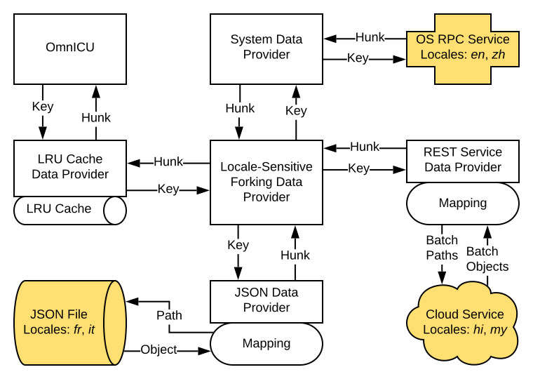

ICU4X Locale Data Pipeline
==========================

One of the key design principles of ICU4X is to make locale data small and portable, allowing it to be pulled from multiple sources depending on the needs of the application.  This document explains how that goal can be achieved.

_Note: The exact language and implementation choices outlined in this doc have changed since this doc was written, but the high-level architecture remains the same._

## Definitions

The following terms are used throughout this document.

- **Data Provider:** An object that returns machine-readable data in a well-specified way.  A data provider provides a link between ICU4X and the raw data.
- **Data Version:** A version reflecting the data itself, abstracted away from the format version and schema version.  For example, CLDR 37 may be a data version.
- **Format Version:** A version of the file format, abstracted away from the schema version and data version.  For example, Protobuf 2 and Protobuf 3 are format versions.
- **Format:** How the data is stored on disk or provided from a service.  Examples of data formats: JSON, YAML, Memory-Mapped, Protobuf.  The format is internal to the data provider.
- **Hunk:** A small piece of locale data relating to a specific task.  For example, the name of January might be a hunk, and a list of all month names could also be considered a hunk.  A data piece is expected to reflect a specific type.
- **LangID:** A UTS 35 Language Identifier.  LangID is a request variable.  Unicode Locale Extensions should be handled by the ICU4X code rather than the data provider.
- **Key:** An identifier corresponding to a specific hunk.
- **Request Variables:** Metadata that is sent along with a key when requesting data from a data provider.
- **Response Variables:** Metadata that is sent along with a hunk when a data provider responds to a request.
- **Schema Version:** A version of the schema, tied to a hunk and abstracted away from the format version and data version.  For example, data may be reorganied within the JSON file between schema versions.
- **Schema:** The structure of locale data, abstracted away from the hunk types.  Data is stored in a particular format according to the schema.
- **Type:** The structure of a hunk.  The type may be, for example, a number, string, list of numbers or strings, or another data type discussed in detail later in the document.

## Design

### Data Provider Architecture

The most central piece of the data pipeline architecture is the data provider.  A data provider is an object that can read data from a JSON file, a service, a memory blob, etc.

A JSON data provider might look something like this:


In the above diagram, ICU4X requests a specific key from the data provider.  The data provider uses the string components of the request figure out what path to load from the JSON file corresponding to the key.  It then loads the JSON sends the hunk back to the ICU4X implementation.

Requests to the data provider consist not only of a key, but also additional request variables, such as a requested LangID and possibly other metadata. Responses consist not only of a hunk, but also additional response variables, such as a data version, actual LangID, and possibly other metadata.

Data providers can delegate to other data providers for specific tasks.  For example, one might have a data provider that performs caching, or a data provider that delegates to one of several other data providers.  A complex setup might look something like:



In this example, data requests from ICU4X first go through an LRU cache, before going to a locale-sensitive provider, which forks to one of three other providers depending on the requested locale.

The system data provider pulls data for *en* and *zh* from an OS RPC service.  The interaction between the data provider and that service are internal to the data provider.

The REST data provider may wait a certain amount of time for several requests to come in, and then perform a batch request to a cloud service that provides data for *hi* and *my*.  It uses a mapping to figure out how to translate from keys to paths that it can send in batch to the cloud service.  This interaction also is internal to the REST data provider.

The JSON data provider works like the simpler one shown earlier: it has a mapping that translates from keys to JSON schema paths, then from JSON objects to hunks.

### Keys

A key is an integer from an enumeration.  Each key has a corresponding type, which is the type of hunks returned for that specific key.  The type corresponding to a key is stable and never changes; by convention, a version number is built into the key name.  For example:

| Key Name | Key Integer | Type | Comments |
|---|---|---|---|
| NUM_SYM_DECIMAL_V1 | 0x1000 | string |
| NUM_SYM_GROUP_V1 | 0x1001 | i32 | Code point, used in older ICU4Xs |
| NUM_GRP_SIZES_V1 | 0x1002 | tuple(i8, i8) |
| NUM_SYM_GROUP_V2 | 0x1003 | string | String, used in newer ICU4Xs |
| DATE_SYM_JAN_V1 | 0x2000 | string |
| DATE_SYM_FEB_V1 | 0x2001 | string |
| DATE_SYM_MONTHS_V1 | 0x2002 | string list | Same data, different key/type |
| CURR_SYM_V1 | 0x3000 | string | Currency code is a request variable |
| CURR_LOCAL_CODE_V1 | 0x3001 | string | The locale's currency code |
| CURR_LOCAL_SYM_V1 | 0x3002 | string | The symbol for that currency |

*Note:* Above, `i8` and `i32` signify an 8-bit or 32-bit signed integer.  The exact types might differ based on the host language.

*Note:* The keys above are for illustrative purposes only.  The actual data hunks will likely be on the larger side, such as "all number symbols for this locale and numbering system".

*Open Question:* How do you map from an enum/integer to a type in a type-safe way in Rust?  In C++/Java, this would entail some sort of cast, which I imagine is possible in Rust but might require an unsafe block.  Main issue: [#8](https://github.com/unicode-org/omnicu/issues/8)

*Open Question:* Due to ongoing developments in [wrapper-layer.md](wrapper-layer.md), the above list of example keys may be more fine-grained than we will need in the final product.  It may be better to have more coarse-grained hunks, like "all decimal format symbols" instead of "grouping separator" and "decimal separator".  Main issue: [#26](https://github.com/unicode-org/omnicu/issues/26)

### Resource Key Struct Definitions

The actual resource keys and the structs to which they correspond should be defined in the `provider` module of the component in which they are used. For example, structs for DateTimeFormat should be defined in `icu_datetime::provider`. This file should also contain a submodule `keys` containing const-declared data key definitions.

Data provider structs should implement `Default`, returning generic, invariant data. This fallback data may be used for testing purposes or if the ICU4X environment does not have access to a locale data source. Note that `#[derive(Default)]` is not generally what you want here.

The name of the data provider struct should include its schema version; for example, `SampleDataStructV1` has schema version 1. Data provider structs should *not* use `#[non_exhaustive]`. If new fields are to be added, a new schema version must be introduced, like `SampleDataStructV2`.

The `"datagen"` feature flag is relevant to data struct construction: it should be used to enable Serde on the data provider structs.

Here is an example of a `provider.rs` boilerplate for a component:

```rust
use std::borrow::Cow;

/// This is a sample data struct.
#[icu_provider::data_struct(SampleDataStructV1Marker = "foo/example@1")]
#[derive(Debug, PartialEq, Clone)]
#[cfg_attr(feature = "serde", derive(Deserialize))]
#[cfg_attr(feature = "datagen", derive(Serialize))]
pub struct SampleDataStructV1<'data> {
    /// This field is always present, and it may be borrowed or owned.
    pub normal_value: Cow<'data, str>,

    /// This field may or may not be present in the data struct.
    ///
    /// Do _not_ use skip_serializing_if, see
    /// https://github.com/serde-rs/serde/issues/1732
    pub option_value: Option<i32>,
}
```

### Pre-Processing of Data

Data represented by the ICU4X data schema and passed through the data provider pipeline as a hunk should be ready to use with minimal processing at runtime.

For example, it is not recommended for ICU4X to request a pattern string such as `#,##0.00` for number formatting; instead, it should request a struct corresponding to the parsed version of that pattern string, such that ICU4X doesn't need to parse it at runtime.

### Explicit Data Caching

Caching of locale data is important for achieving optimal performance. For example, loading a locale data hunk may require expensive I/O operations such as reading from a filesystem or making a network request.

However, different clients may have different needs when it comes to data caching:

1. Resource-constrained environments may want a small cache with a naive eviction algorithm, whereas server environments may want a large cache with a more sophisticated eviction algorithm.
2. Data coming from different sources may need different caching strategies. For example, data loaded over HTTP may wish to conform to the HTTP `Expires` header, whereas data loaded from the filesystem may be invalidated based on file modification time.
3. Clients may wish to invalidate the entire cache if updated data becomes available during the lifecycle of the app.

Since there is no "one size fits all" solution to data caching, ICU4X abstracts the operation into a separate component of the data pipeline. *ICU4X is stateless by design*; all caching is intended to be an explicit choice by the client of ICU4X.

### Cache Invalidation

Given the one centralized data cache explained above, it is possible to architect an app sitting on top of ICU4X with a standard reactivity framework to re-compute UI components when a locale data update is available. Best practices include:

1. All UI elements that contain localizable data should subscribe to ICU4X data updates.
2. When a locale data update is available, the data cache should be emptied, and all UI component subscribers should be re-rendered.
3. UI components should create fresh ICU4X formatter objects, use them throughout the duration of rendering the component, and throw them away when done.

Note that it is a *design goal* of ICU4X that clients should not need to create any other caches. There should be no reason to store a formatter object for longer than the time it takes to render the component.

We have experience from ICU4C that there are two main reasons that object creation can be slow: (1) locale data lookup, including language negotiation + fallbacks, and (2) massaging of that locale data into a useful runtime form. ICU4X solves (1) by splitting the locale data provider into its own explicit component that caches data after language negotiation and fallbacking is completed; see "Explicit Data Caching". ICU4X solves (2) by having an ICU4X data model that requires as little processing of data at runtime as possible; see "Pre-Processing of Data".

### Request Variables

Requests made to data providers consist of a key and additional *request variables*.  The variables are:

1. Requested LangID
2. Optional String Identifier (explained below)

The optional string identifier should be a string corresponding to the key, such as the currency code when requesting `CURR_SYM_V1`.  Most keys will not require an optional string identifier.

### Static Data Slicing

Static analysis of ICU4X code can determine which keys are required for a particular build.  This information can be used to automatically generate a minimal JSON file, for example.

The examples `CURR_SYM_V1` and `CURR_LOCAL_SYM_V1` illustrate an important aspect of data slicing.  If the ICU4X code only ever formats the locale's preferred currency symbol, it can use `CURR_LOCAL_SYM_V1`, and the static data slicer can include only that small piece of data.  However, if ICU4X is compiled to accept any arbitrary currency code, then it should use `CURR_SYM_V1`, and the static data slicer knows that it must include symbols for all currencies.

*Note: For the currency example specifically, this may also involve making ICU4X configurable for whether or not it accepts the `-u-cu-` Unicode extension in the locale string, since supporting that extension may require loading full currency data.*

### Mappings

The data on disk may not reflect exactly the types required for a particular key.  For example, imagine we have the following data file:

```json
{
    "gregorian_months": [
        "January", "February", "March", "April", "May", "June",
        "July", "August", "September", "October", "November", "December"
    ]
}
```

Mappings are a way that a DataProvider could support many hunk schema versions without increasing locale data size. For example, the pseudocode of a mapping might be:

```
switch (key) {
    case DATE_SYM_JAN_V1:
        return json["gregorian_months"][0];
    case DATE_SYM_FEB_V1:
        return json["gregorian_months"][1];
    case DATE_SYM_MONTHS_V1:
        return json["gregorian_months"];
}
```

### Supported Keys

A data provider need not implement a mapping for all keys.  For example, if ICU4X migrates from `NUM_SYM_GROUP_V1` to `NUM_SYM_GROUP_V2`, a data provider might choose to support both keys for a few releases, and at some point drop support for the older key.  This allows the same data provider to be used across multiple ICU4X versions.

### Schema Version

A data file (such as JSON) should represent data conforming to a certain schema.  The data file can be rebuilt with different data versions so long as it conforms to the same schema version.

The crate `provider_cldr` contains a DataProvider implementation that reads from CLDR JSON files and transforms them into ICU4X JSON at the latest schema version. At runtime, a different DataProvider implementation such as the one in `provider_fs` should be used for improved efficiency.

### Types

The set of supported types is limited so that ICU4X implementations can be written to support them in a consistent way.  The supported types include:

- i8
- i32 (includes code points)
- double
- string
- byte array
- tuple of one of these types (fixed-length)
- list of one of these types (variable-length)
- struct with fixed keys and values of one of these types

An open-ended map with string keys is discouraged, because in most cases, a struct with fixed keys can be used. If a map with variable keys is required, a LiteMap should be used in the Rust data struct definition.

### Response Variables

Along with the hunk, the data provider sends multiple *response variables*.  The variables are:

1. Supported LangID (explained below)
2. Data Version (explained below)

The supported LangID is expected to be the most specific LangID that had any data whatsoever, even if it is just an alias.  For example, if en_GB is present but empty, and the data is actually loaded from en_001, the Supported LangID should still be en_GB.  In other words, the fallback mechanism is considered an internal detail.

If the data provider is unable to return data based on a certain request, it may return an error in a form corresponding to the host language's convention.

### Data Version

The data version is expected to be a well-defined, namespaced identifier for the origin of the data.  For example, when represented as a string, the following might be data versions:

- `CLDR_37_alpha1` → Vanilla CLDR 37 alpha1
- `CLDR_37_alpha1_goog2020a` → Google patch 2020a on top of CLDR 37 alpha1
- `FOO_1_1` → Version 1.1 of data from a hypothetical data source named Foo

The first data version subtag, or namespace, defines the syntax for the remainder of the identifier.  For example, the `CLDR` namespace might accept two or three subtags: major version (`37`), minor version (`alpha1`), and optional patch version (`goog2020a`).

*Note:* The syntax for the data version is undefined at this time.  What is shown above is merely a strawman example.
