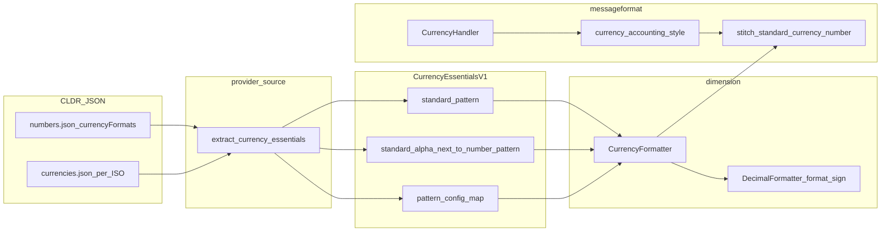

# MessageFormat `:currency` and CLDR accounting / negative patterns

This document traces how **LDML MessageFormat 2** `:currency` with `currencySign=accounting` is implemented in ICU4X, how **CLDR** `currencyFormats` data flows into [`CurrencyEssentials`](../../components/experimental/src/dimension/provider/currency/essentials.rs), and what remains for **full** parity (long name, compact, scientific paths, numbering-system–aware datagen).

**Implemented:** CLDR `standard` / `accounting` / `standard-alphaNextToNumber` / `accounting-alphaNextToNumber` patterns (including optional `;` negative subpatterns) are baked into `CurrencyEssentials`; [`CurrencyFormatter`](../../components/experimental/src/dimension/currency/formatter.rs) selects them via [`CurrencyDisplaySign`](../../components/experimental/src/dimension/currency/options.rs); MessageFormat `:currency` uses this path for **`notation=standard`** with **`currencyDisplay`** symbol or narrow symbol (short/narrow width).

Normative MF2 behavior: [LDML Part 9 — MessageFormat](https://www.unicode.org/reports/tr35/tr35-76/tr35-messageFormat.html) (`:currency` default function). Cross-repo tracking: [icu4x#4677](https://github.com/unicode-org/icu4x/issues/4677).

---

## 1. User-visible behavior

### 1.1 Spec options

- **`currencySign=standard`** (default): formatting follows the locale’s usual presentation for negative monetary amounts (sign placement, spacing, etc., as implemented).
- **`currencySign=accounting`**: presentation intended for accounting contexts (often parentheses around the amount, or other locale-specific conventions). Exact rules are defined in TR35 / ECMA-402 alignment; ICU4X aims to match **CLDR** and common engine behavior once data is complete.

### 1.2 What ICU4X does today (summary)

In [`CurrencyHandler::format`](../../components/experimental/src/messageformat/function.rs):

1. **`notation=standard`** and **`currencyDisplay`** symbol or narrow symbol: [`CurrencyFormatter`](../../components/experimental/src/dimension/currency/formatter.rs) is built with [`CurrencyFormatterOptions`](../../components/experimental/src/dimension/currency/options.rs) (`currency_display_sign` = standard vs accounting from MF2 `currencySign`). CLDR negative / accounting subpatterns are applied via [`CurrencyEssentials::resolve_currency_pattern`](../../components/experimental/src/dimension/provider/currency/essentials.rs) (no outer ASCII parenthesis wrap for this path).
2. **Other combinations** (long currency name, compact notation, scientific/engineering, ISO code, hidden): [`currency_accounting_style`](../../components/experimental/src/messageformat/function.rs) and **stitch** helpers may still approximate accounting where CLDR is not wired through those formatters yet.

Regression expectations are locked in ICU4X-only rows under [`components/experimental/tests/messageformat/fixtures/tests/functions/currency.json`](../../components/experimental/tests/messageformat/fixtures/tests/functions/currency.json) (e.g. `en-US` vs `nl-NL` accounting paths).

---

## 2. End-to-end data flow (current)

**Note:** `LongCurrencyFormatter`, `CompactCurrencyFormatter`, and `LongCompactCurrencyFormatter` use **additional** data markers (`CurrencyExtendedDataV1`, `CurrencyPatternsDataV1`, compact payloads). MessageFormat’s `CurrencyHandler` branches into those formatters for some `currencyDisplay` / `notation` combinations; any future accounting work must keep **all** branches consistent (see section 5).

---

## 3. CLDR representation (available in serde, underused in currency essentials)

### 3.1 `NumberPattern` positive / negative

In [`provider/source/src/cldr_serde/numbers.rs`](../../provider/source/src/cldr_serde/numbers.rs), [`NumberPattern`](../../provider/source/src/cldr_serde/numbers.rs) stores:

- **`positive`**: required subpattern (vector of `NumberPatternItem`).
- **`negative`**: optional second subpattern parsed from the substring after **`;`** in the CLDR pattern string (UTS #35 style).

So a single CLDR currency format string like `¤#,##0.00;(¤#,##0.00)` becomes one `NumberPattern` with both arms once deserialized.

### 3.2 `CurrencyFormattingPatterns`

[`CurrencyFormattingPatterns`](../../provider/source/src/cldr_serde/numbers.rs) includes at least:

- `standard: NumberPattern`
- optional `standard-alphaNextToNumber` (`standard-alphaNextToNumber` in JSON)

Both are **`NumberPattern`** values and therefore **may carry `negative`** when CLDR supplies it.

---

## 4. Datagen today (where negatives are ignored)

| Topic | Location | Behavior |
| --- | --- | --- |
| Build `DoublePlaceholderPattern` from **positive only** | [`provider/source/src/currency/essentials.rs`](../../provider/source/src/currency/essentials.rs) — `create_pattern` (~271–294) | Comment `TODO(#4677)`: maps `pattern.positive` items only; **`pattern.negative` is ignored**. |
| `PatternSelection` (standard vs alpha-next-to-number) | Same file — `currency_pattern_selection` (~41–51) | Comment `TODO(#6064)`: uses **`let pattern = &pattern.positive`** only when inspecting currency vs digit placement. |
| Currency format numbering system | `extract_currency_essentials` (~140–148) | Comment `TODO(#3838)`: reads `currency_patterns` under **`"latn"`** only (`currency_formats.get("latn")`). |
| Compact short currency patterns | [`provider/source/src/currency/compact.rs`](../../provider/source/src/currency/compact.rs) (~76–84) | If `pattern.negative.is_some()`, logs a **warning** and still builds the compact pattern from **`positive`** only. |

**Consequence:** `CurrencyEssentialsV1` baked today encodes **one** `DoublePlaceholderPattern` per of `standard_pattern` and `standard_alpha_next_to_number_pattern`, plus per-currency placeholder metadata in `pattern_config_map`. There is **no** serialized slot for CLDR’s currency **negative** or **accounting** subpattern as distinct patterns.

---

## 5. Runtime payload and formatters

### 5.1 `CurrencyEssentials` and `name_and_pattern`

[`CurrencyEssentials`](../../components/experimental/src/dimension/provider/currency/essentials.rs) holds `standard_pattern`, `standard_alpha_next_to_number_pattern`, `pattern_config_map`, `placeholders`, and `default_pattern_config`. Struct-level comments reference **#4677** for adding CLDR negative / accounting pattern slots.

[`CurrencyEssentials::name_and_pattern`](../../components/experimental/src/dimension/provider/currency/essentials.rs) chooses which of the two locale-level patterns to use based on per-currency `CurrencyPatternConfig` (`PatternSelection::Standard` vs `StandardAlphaNextToNumber`). It does **not** take sign or accounting mode; those are not in the data model.

### 5.2 `CurrencyFormatter::format_fixed_decimal`

[`CurrencyFormatter::format_fixed_decimal`](../../components/experimental/src/dimension/currency/formatter.rs) (~148–165):

1. Resolves `(currency_str, pattern, _pattern_selection)` via `essential.get().name_and_pattern(...)`.
2. Calls `self.decimal_formatter.format_sign(value.sign, pattern.interpolate((formatted_unsigned_digits, currency_str)))`.

So the **sign** is applied by [`DecimalFormatter::format_sign`](../../components/decimal/src/decimal_formatter.rs) (~135–151), which attaches the locale’s **decimal** minus/plus **prefix/suffix** around the already-interpolated currency body.

**Important distinction:** CLDR **currency** negative subpatterns often encode structure around **both** the numeric placeholder and the currency symbol (e.g. parentheses around the full `symbol + amount`). That is **not** the same as “format unsigned amount, then let `format_sign` add a generic decimal minus,” nor the same as MessageFormat’s outer `(...)` wrap. Hence the gap for faithful CLDR accounting.

### 5.3 Other formatters used by MessageFormat `:currency`

[`CurrencyHandler`](../../components/experimental/src/messageformat/function.rs) (~1536–1638) also uses:

| Formatter | Data markers (simplified) | `format_sign` usage |
| --- | --- | --- |
| [`LongCurrencyFormatter`](../../components/experimental/src/dimension/currency/long_formatter.rs) | `CurrencyExtendedDataV1`, `CurrencyPatternsDataV1` | Yes (~175–181) |
| [`CompactCurrencyFormatter`](../../components/experimental/src/dimension/currency/compact_formatter.rs) | Short compact currency payload | Yes |
| [`LongCompactCurrencyFormatter`](../../components/experimental/src/dimension/currency/long_compact_formatter.rs) | Long compact payload | Yes |

Any design that adds **pattern choice by sign / accounting** to `CurrencyEssentials` should explicitly list whether **long / compact** paths get new patterns in **their** markers too, or whether `:currency` with compact notation continues to use a documented subset / fallback.

---

## 6. MessageFormat layer — heuristic algorithm (reference)

Implemented in [`CurrencyHandler::format`](../../components/experimental/src/messageformat/function.rs):

1. **`currencySign` → `CurrencyAccountingStyle`**: `Some("accounting")` → `currency_accounting_style(ctx.locale())` (~1482–1490).
2. **Adjust formatted decimal sign**: for non-`Standard` accounting and negative `value`, `fmt_value` uses absolute magnitude (~1523–1530).
3. **Standard width + standard notation**: either direct `CurrencyFormatter::format_fixed_decimal` when accounting style is `Standard`, else `format_decimal_styled` + `stitch_standard_currency_number` (~1536–1555). Similar branching for long name, compact, scientific paths with `stitch_*` (~1557–1638).
4. **Outer parentheses**: if style is `Parentheses` or `ArabicParentheses` and `value` is negative, wrap `formatted` in `"({formatted})"` (~1647–1653).

### 6.1 Why “stitch” exists

Helpers such as [`stitch_standard_currency_number`](../../components/experimental/src/messageformat/function.rs) format a **large probe magnitude** [`CURRENCY_STITCH_SAMPLE_ABS`](../../components/experimental/src/messageformat/function.rs), split the sample full string around the plain decimal rendering ([`split_currency_sample_by_plain_decimal`](../../components/experimental/src/messageformat/function.rs)), then reuse the discovered **prefix/suffix** around the **actual** styled inner number. That recovers **currency symbol placement** (and related literals) for notations where `CurrencyFormatter` alone does not produce the desired composed shape.

This is a **layout workaround**, not a substitute for CLDR’s negative/accounting subpatterns in data.

---

## 7. Target state (design directions only — not implemented here)

These are **options** for implementers; pick one in #4677 / a dedicated RFC before coding.

### Option A — Full pattern slots in dimension data

- Extend [`CurrencyEssentials`](../../components/experimental/src/dimension/provider/currency/essentials.rs) (and any sibling markers used for compact/long) with additional `DoublePlaceholderPattern` fields (names TBD: e.g. negative standard, accounting standard, mirrored for `standard_alpha_next_to_number`).
- Extend [`extract_currency_essentials`](../../provider/source/src/currency/essentials.rs) / `create_pattern` to serialize **`NumberPattern::negative`** (and any CLDR fields required for accounting) into those patterns, resolving **#6064** / **#4677** together where they overlap.
- Teach [`CurrencyFormatter`](../../components/experimental/src/dimension/currency/formatter.rs) (and siblings) to select the pattern based on **`Sign`** and an explicit **accounting** flag (from API or internal options), instead of relying on `format_sign` when the CLDR pattern already encodes sign/parentheses.
- Simplify or remove [`currency_accounting_style`](../../components/experimental/src/messageformat/function.rs) and stitch paths in [`CurrencyHandler`](../../components/experimental/src/messageformat/function.rs) once dimension output matches CLDR for the covered matrix.

### Option B — Phased: negative first

- Persist and use **negative** currency standard pattern only (smaller schema step), align `currency_pattern_selection` and tests under **#6064**, then add **accounting**-specific patterns in a follow-up.

### Validation targets

- Compare against **ICU4C / ICU4J** and **ECMA-402** `Intl.NumberFormat` / `Intl.DisplayNames` currency behavior for the same locale + currency + options where applicable.
- Expand [`currency.json`](../../components/experimental/tests/messageformat/fixtures/tests/functions/currency.json) with more locales as data lands.

---

## 8. Testing and verification matrix

| Layer | What to run / extend |
| --- | --- |
| MessageFormat | `cargo test -p icu_experimental --test messageformat_conformance --all-features`; ICU4X-only [`currency.json`](../../components/experimental/tests/messageformat/fixtures/tests/functions/currency.json) |
| Datagen | Unit tests in [`provider/source/src/currency/essentials.rs`](../../provider/source/src/currency/essentials.rs) (`test_basic` ~305+); today includes `TODO(#6064)` expectations for placeholders (e.g. EGP) — **expect these to evolve** when negative subpatterns affect selection |
| Dimension | Formatter tests under `components/experimental/src/dimension/currency/` and any provider JSON snapshots |

---

## 9. Issue cross-reference

| Tracker | Role |
| --- | --- |
| [icu4x#4677](https://github.com/unicode-org/icu4x/issues/4677) | Umbrella: add CLDR negative / accounting pattern payloads to dimension data; consume in `CurrencyFormatter` family; remove MessageFormat heuristic. |
| **#6064** (see TODOs in source) | Negative **subpattern** in currency pattern parsing / `PatternSelection` and tests ([`provider/source/src/currency/essentials.rs`](../../provider/source/src/currency/essentials.rs), [`components/experimental/src/dimension/currency/format.rs`](../../components/experimental/src/dimension/currency/format.rs), compact format). |
| **#3838** (see TODOs in source) | Currency patterns should follow **resolved numbering system**, not hard-coded `"latn"` in datagen ([`provider/source/src/currency/essentials.rs`](../../provider/source/src/currency/essentials.rs)). |

---

## Related documents

- [`messageformat-tr35-spec-tracking.md`](../../messageformat-tr35-spec-tracking.md) §3 — high-level gap summary and plan bullets.
- [`documents/design/data_pipeline.md`](data_pipeline.md) — general ICU4X locale data concepts.
