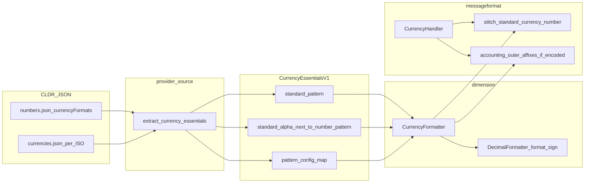

# MessageFormat `:currency` and CLDR accounting / negative patterns

This document traces how **LDML MessageFormat 2** `:currency` with `currencySign=accounting` is implemented in ICU4X, how **CLDR** `currencyFormats` data flows into [`CurrencyEssentials`](../../components/experimental/src/dimension/provider/currency/essentials.rs), and what remains for **full** parity (long name, compact, scientific paths, numbering-system–aware datagen).

**Implemented:** CLDR `standard` / `accounting` / `standard-alphaNextToNumber` / `accounting-alphaNextToNumber` patterns (including optional `;` negative subpatterns) are baked into `CurrencyEssentials`; the dimension currency formatters select them via [`CurrencyDisplaySign`](../../components/experimental/src/dimension/currency/options.rs). MessageFormat `:currency` routes **CLDR-native** accounting on every shipped branch (dimension formatters, stitch helpers, and **`currencyDisplay=code`** / **`never`** via [`CurrencyFormatter::accounting_outer_affixes_if_encoded`](../../components/experimental/src/dimension/currency/formatter.rs)); the previous ASCII-only outer **`(...)`** fallback in [`CurrencyHandler`](../../components/experimental/src/messageformat/function.rs) was removed.

Normative MF2 behavior: [LDML Part 9 — MessageFormat](https://www.unicode.org/reports/tr35/tr35-76/tr35-messageFormat.html) (`:currency` default function). Cross-repo tracking: [icu4x#4677](https://github.com/unicode-org/icu4x/issues/4677).

---

## 1. User-visible behavior

### 1.1 Spec options

- **`currencySign=standard`** (default): formatting follows the locale’s usual presentation for negative monetary amounts (sign placement, spacing, etc., as implemented).
- **`currencySign=accounting`**: presentation intended for accounting contexts (often parentheses around the amount, or other locale-specific conventions). Exact rules are defined in TR35 / ECMA-402 alignment; ICU4X aims to match **CLDR** and common engine behavior once data is complete.

### 1.2 What ICU4X does today (summary)

In [`CurrencyHandler::format`](../../components/experimental/src/messageformat/function.rs):

1. CLDR **standard** / **accounting** patterns from [`CurrencyEssentials`](../../components/experimental/src/dimension/provider/currency/essentials.rs) are applied via the dimension formatters (`CurrencyFormatter`, `CompactCurrencyFormatter`, `LongCurrencyFormatter`, or `LongCompactCurrencyFormatter`) with [`CurrencyFormatterOptions`](../../components/experimental/src/dimension/currency/options.rs) / long / compact options carrying `currency_display_sign` from MF2 `currencySign` wherever those formatters render the full monetary string.
2. For **`currencyDisplay=code`** / **`never`**, scientific/engineering, and some compact + display pairings, the handler composes a styled or plain-decimal inner amount and applies the same CLDR **outer literal** accounting framing as short currency formatting via [`CurrencyFormatter::accounting_outer_affixes_if_encoded`](../../components/experimental/src/dimension/currency/formatter.rs) when the short-currency resolver reports that the negative sign is encoded in the pattern.

Regression expectations include ICU4X-only rows under [`components/experimental/tests/messageformat/fixtures/tests/functions/currency.json`](../../components/experimental/tests/messageformat/fixtures/tests/functions/currency.json) (e.g. `en-US` parentheses vs `de-DE` minus presentation).

---

## 2. End-to-end data flow (current)

**Note:** `LongCurrencyFormatter`, `CompactCurrencyFormatter`, and `LongCompactCurrencyFormatter` use **additional** data markers (`CurrencyExtendedDataV1`, `CurrencyPatternsDataV1`, compact payloads). MessageFormat’s `CurrencyHandler` branches into those formatters for some `currencyDisplay` / `notation` combinations; any future accounting work must keep **all** branches consistent (see section 5).

---

## 3. CLDR representation (available in serde, underused in currency essentials)

### 3.1 `NumberPattern` positive / negative

In [`provider/source/src/cldr_serde/numbers.rs`](../../provider/source/src/cldr_serde/numbers.rs), [`NumberPattern`](../../provider/source/src/cldr_serde/numbers.rs) stores:

- **`positive`**: required subpattern (vector of `NumberPatternItem`).
- **`negative`**: optional second subpattern parsed from the substring after **`;`** in the CLDR pattern string (UTS #35 style).

So a single CLDR currency format string like `¤#,##0.00;(¤#,##0.00)` becomes one `NumberPattern` with both arms once deserialized.

### 3.2 `CurrencyFormattingPatterns`

[`CurrencyFormattingPatterns`](../../provider/source/src/cldr_serde/numbers.rs) includes at least:

- `standard: NumberPattern`
- optional `standard-alphaNextToNumber` (`standard-alphaNextToNumber` in JSON)

Both are **`NumberPattern`** values and therefore **may carry `negative`** when CLDR supplies it.

---

## 4. Datagen today (still rough edges)

[`CurrencyEssentials`](../../components/experimental/src/dimension/provider/currency/essentials.rs) **does** serialize CLDR **standard** / **accounting** / **standard-alphaNextToNumber** / **accounting-alphaNextToNumber** patterns and optional **`;` negative** subpatterns from [`provider/source/src/currency/essentials.rs`](../../provider/source/src/currency/essentials.rs) (`create_pattern` on `pattern.positive`, `create_optional_negative_subpattern` on `pattern.negative`).

Remaining datagen limitations called out in source (see **#4677**, **#6064**); **#3838** is addressed for locale-default numbering systems in `extract_currency_essentials` (see table below).

| Topic | Location | Behavior |
| --- | --- | --- |
| Primary pattern body | `create_pattern` | Still maps **`pattern.positive`** only into each main `DoublePlaceholderPattern` (correct for the positive arm; negative is a sibling field today). |
| `PatternSelection` (standard vs alpha-next-to-number) | `currency_pattern_selection` | Classifies **positive** and optional **`;` negative** subpatterns; when they disagree, uses **StandardAlphaNextToNumber** if either arm needs it (heuristic; **#6064** tracks finer per-polarity handling if CLDR requires it). |
| Currency format numbering system | `extract_currency_essentials` | Reads `currencyFormats` for **`numbers.json` `defaultNumberingSystem`**, with the Sindhi→`latn` override ([#5374](https://github.com/unicode-org/icu4x/issues/5374)) and a **`latn` map fallback** if the default key is absent ([#3838](https://github.com/unicode-org/icu4x/issues/3838)). |
| Compact short currency patterns | [`provider/source/src/currency/compact.rs`](../../provider/source/src/currency/compact.rs) | Builds from **positive** only; logs when optional **`negative`** is present **and** parses differently from positive (same digit/currency rules) or cannot be parsed the same way (**#6064**). |

---

## 5. Runtime payload and formatters

[`CurrencyEssentials`](../../components/experimental/src/dimension/provider/currency/essentials.rs) holds the pattern fields above plus `pattern_config_map`, `placeholders`, and `default_pattern_config`. [`CurrencyFormatter`](../../components/experimental/src/dimension/currency/formatter.rs) resolves the correct pattern (including accounting vs standard) via [`CurrencyDisplaySign`](../../components/experimental/src/dimension/currency/options.rs) and applies CLDR structure where the interpolated pattern encodes sign/parentheses.

[`CurrencyHandler`](../../components/experimental/src/messageformat/function.rs) also uses [`LongCurrencyFormatter`](../../components/experimental/src/dimension/currency/long_formatter.rs), [`CompactCurrencyFormatter`](../../components/experimental/src/dimension/currency/compact_formatter.rs), and [`LongCompactCurrencyFormatter`](../../components/experimental/src/dimension/currency/long_compact_formatter.rs) with the same `currency_display_sign` option for branches where CLDR is wired through.

---

## 6. MessageFormat layer — current algorithm (reference)

Implemented in [`CurrencyHandler::format`](../../components/experimental/src/messageformat/function.rs):

1. Parse **`currencySign`** into [`CurrencyDisplaySign`](../../components/experimental/src/dimension/currency/options.rs) (**standard** vs **accounting**).
2. For **accounting** + negative amounts, optionally rewrite the numeric operand to **absolute** magnitude when the short `CurrencyFormatter` reports that the **negative sign is encoded inside the CLDR pattern** (`negative_sign_encoded_in_pattern`), so the formatter does not double-apply a decimal minus.
3. Dispatch to the dimension formatters per `currencyDisplay` / `notation` / `compactDisplay`.
4. For **`currencyDisplay=code`** / **`never`**, or when composing scientific / compact-long amounts via stitch helpers, apply CLDR outer affixes from **`accounting_outer_affixes_if_encoded`** when step 2 applies, matching the short-currency negative subpattern framing.

### 6.1 Why “stitch” exists

Helpers such as [`stitch_standard_currency_number`](../../components/experimental/src/messageformat/function.rs) probe a sample magnitude and split around the plain decimal to recover **prefix/suffix** around styled inner numbers when composing **scientific** / **engineering** / some **compact** shapes with currency literals. That is a **layout** tool; CLDR accounting **outer literals** for negative amounts that encode the sign in the pattern are supplied separately via **`accounting_outer_affixes_if_encoded`** when the stitched inner does not carry the full currency pattern body.

---

## 7. Target state (design directions — #4677)

Pick one approach in **#4677** / an RFC before large changes.

### Option A — Full CLDR parity on every branch

- Tighten **compact** datagen when CLDR supplies negative subpatterns, and align **pattern selection** with optional negative arms (**#6064**).
- **#3838 (locale default):** `extract_currency_essentials` keys `currencyFormats` off `defaultNumberingSystem`; keep validating end-to-end where explicit `-u-nu-*` differs from the locale default.

### Option B — Phased

- Land compact / long-marker accounting field-by-field, shrinking the MessageFormat fallback matrix after each milestone.

### Validation targets

- Compare against **ICU4C / ICU4J** and **ECMA-402** where applicable.
- Expand ICU4X-only [`currency.json`](../../components/experimental/tests/messageformat/fixtures/tests/functions/currency.json) rows as branches become data-driven.

---

## 8. Testing and verification matrix

| Layer | What to run / extend |
| --- | --- |
| MessageFormat | `cargo test -p icu_experimental --test messageformat_conformance --all-features`; ICU4X-only [`currency.json`](../../components/experimental/tests/messageformat/fixtures/tests/functions/currency.json) |
| Datagen | Unit tests in [`provider/source/src/currency/essentials.rs`](../../provider/source/src/currency/essentials.rs) (`test_basic` ~305+); golden expectations for placeholders (e.g. EGP) **may still evolve** under **#6064** when negative subpatterns affect selection |
| Dimension | Formatter tests under `components/experimental/src/dimension/currency/` and any provider JSON snapshots |

---

## 9. Issue cross-reference

| Tracker | Role |
| --- | --- |
| [icu4x#4677](https://github.com/unicode-org/icu4x/issues/4677) | MessageFormat **scope done:** ISO / hidden / stitch paths use CLDR outer literals; ASCII-only wrap removed. **Remaining:** compact datagen / pattern-selection follow-ups (see **#6064**); locale-default numbering system for `CurrencyEssentials` datagen is wired (**#3838**). |
| **#6064** | Negative **subpattern** parity: `currency_pattern_selection` now reads both arms; compact datagen and per-polarity selection may remain ([`provider/source/src/currency/essentials.rs`](../../provider/source/src/currency/essentials.rs), [`components/experimental/src/dimension/currency/format.rs`](../../components/experimental/src/dimension/currency/format.rs), compact format). |
| **#3838** | `extract_currency_essentials` now keys `currencyFormats` off **`defaultNumberingSystem`** (see §4). Remaining scope on the issue, if any, is for **marker- or option-scoped** numbering systems beyond the locale default. |

---

## Related documents

- [`messageformat-tr35-spec-tracking.md`](../../messageformat-tr35-spec-tracking.md) §3 — high-level gap summary and plan bullets.
- [`documents/design/data_pipeline.md`](data_pipeline.md) — general ICU4X locale data concepts.
