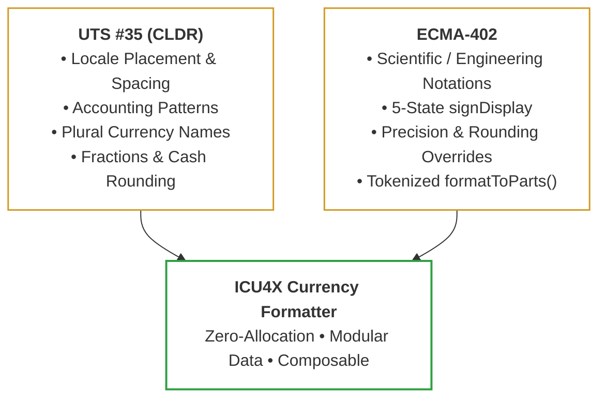
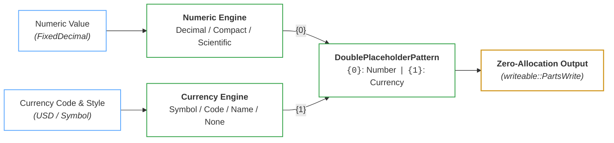
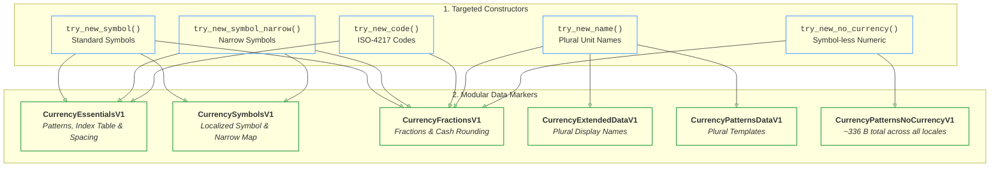
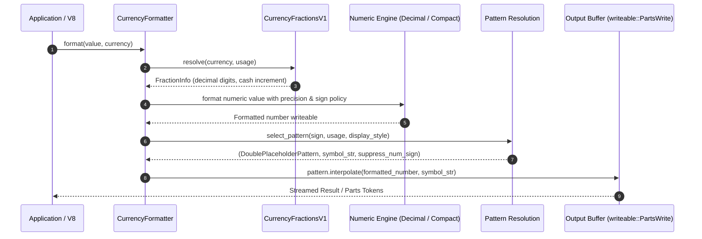

# Design Document: ICU4X Currency Formatter

| Attribute | Details |
| :--- | :--- |
| **Status** | In Implementation / RFC |
| **Authors** | Younies Mahmoud ([@younies](https://github.com/younies) &lt;younies@google.com&gt;, &lt;younies@unicode.org&gt;) |
| **Reviewers** | ICU4X Sub-Committee: Shane Carr ([@sffc](https://github.com/sffc)), Robert Bastian ([@robertbastian](https://github.com/robertbastian)), Manish Goregaokar ([@Manishearth](https://github.com/Manishearth)) |
| **Tracking Issues** | • [#8159](https://github.com/unicode-org/icu4x/issues/8159) *(Epic: Currency Formatter Graduation)*<br>• [#8327](https://github.com/unicode-org/icu4x/issues/8327) *(Non-ISO 4217 & ISO 24165 DTIs)*<br>• [#8316](https://github.com/unicode-org/icu4x/issues/8316) *(CurrencyType & CurrencyCode)*<br>• [#5480](https://github.com/unicode-org/icu4x/issues/5480), [#8314](https://github.com/unicode-org/icu4x/pull/8314), [#8290](https://github.com/unicode-org/icu4x/pull/8290), [#8291](https://github.com/unicode-org/icu4x/pull/8291) |

---

## 1. Overview & Motivation

Currency formatting is a foundational internationalization capability required across web engines, operating systems, mobile devices, and server infrastructure. 

Formatting monetary amounts is substantially more complex than prepending a symbol to a number:
* **Locale-sensitive placement**: Pre-number (`$100`), post-number (`100 €`), or spaced (`100 $`).
* **Accounting representations**: Parenthetical financial negative formats (`($100)` vs. `-$100`).
* **Display style variants**: Standard symbol (`$`), narrow symbol (`$`), ISO code (`USD 100`), or pluralized names (`1 US dollar`, `5 US dollars`).
* **Currency-specific precision & cash rounding**: Locale/currency decimal rules (e.g., 0 decimals for JPY, 2 for USD, 3 for BHD/KWD, 5-cent cash rounding for CHF/CAD).
* **Alpha-next-to-number spacing**: Inserting non-breaking space when an alphanumeric currency symbol or code sits adjacent to digits.
* **Compact notations**: Combining currency symbols with abbreviated scale multipliers (`$1.2M`, `1,2 M €`).

### 1.1 Target Consumers & Environments

The ICU4X Currency Formatter is designed for four primary deployment environments:

1. **Web Engines (Chromium / V8, Mozilla Firefox / SpiderMonkey)**:
   - Serves as the high-performance backing implementation for JavaScript's `Intl.NumberFormat` with `style: "currency"`.
   - Priorities: Minimal binary footprint, sub-microsecond formatting latency, `#![no_std]` compilation, and full ECMA-402 test262 compliance.
2. **Operating Systems & Embedded Platforms (Fuchsia OS, Android, Wearables)**:
   - Operating-system-level services and resource-constrained environments.
   - Priorities: Zero dynamic memory allocation during formatting, zero-copy deserialization (`ZeroCopy` / `ZeroMap`), and fine-grained data modularity.
3. **Multi-Language Applications via Foreign Function Interfaces (Diplomat / FFI)**:
   - Shared internationalization engine for C++, Dart, JavaScript/WASM, and Go.
   - Priorities: Clean C-ABI boundary, opaque pointer handles, and zero-copy string buffer streaming.
4. **Backend Services & Microservices**:
   - Multi-threaded cloud services and server-side rendering pipelines.
   - Priorities: `Send + Sync` thread safety, low memory overhead per instance, and absence of global caches or locks.

---

## 2. Requirements & Standards Compliance

To satisfy all consumers, the architecture harmonizes the requirements of **UTS #35** and **ECMA-402**:

<div align="center">



</div>

### 2.1 UTS #35 (LDML Part 3 §3.2) Requirements

| Requirement | Description | Example (`en-US`) | Example (`fr-FR`) |
| :--- | :--- | :--- | :--- |
| **Locale Placement** | Position symbol relative to digits with locale conventions | `$1,234.50` | `1 234,50 €` |
| **Accounting Format** | Financial accounting negative notation with parentheses | `($1,234.50)` | `(1 234,50 €)` |
| **Display Variants** | Symbol, Narrow Symbol, ISO Code, Display Name, No-Currency | `$`, `USD`, `US dollars` | `€`, `EUR`, `euros` |
| **Alpha Spacing** | Non-breaking space inserted when alpha characters abut digits | `USD 100` | `100 USD` |
| **Fractions & Rounding** | Default fraction digits and cash transaction rounding increments | USD = 2, JPY = 0 | EUR = 2, CHF = 5¢ cash |
| **Pluralized Names** | Unit names with plural category resolution (`one`, `other`, etc.) | `1 dollar`, `5 dollars` | `1 dollar`, `5 dollars` |
| **Compact Notation** | Currency symbol combined with compact scale exponent | `$1.2M` | `1,2 M €` |

### 2.2 ECMA-402 (`Intl.NumberFormat`) Requirements

| Capability | Specification Behavior | ICU4X Handling |
| :--- | :--- | :--- |
| **Scientific / Engineering** | Combine currency with exponential notation (`$1.23E4`) | Numeric engine formats exponent; currency engine wraps result |
| **`signDisplay` Policies** | `"auto"`, `"always"`, `"never"`, `"exceptZero"`, `"negative"` | Explicit sign policy passed to numeric formatter & pattern selector |
| **Precision Overrides** | Caller overrides fraction or significant digits | `FixedDecimal` precision overrides CLDR default fractions |
| **Custom Rounding** | Support `ceil`, `floor`, `halfEven`, and custom increments | Handled by `fixed_decimal` rounding pipeline |
| **`trailingZeroDisplay`** | `"auto"` or `"stripIfInteger"` (e.g. `$100` vs `$100.00`) | Handled by numeric formatter before pattern interpolation |
| **`formatToParts()`** | Structured token emission (`currency`, `integer`, `decimal`, etc.) | Streamed via `writeable::PartsWrite` zero-allocation annotations |

---

## 3. Architecture: The Two-Dimensional Currency Space

Currency formatting is fundamentally **orthogonal and two-dimensional**:
1. **Dimension 1 (Number Representation)**: How numeric digits, signs, grouping separators, and compact scale prefixes are computed.
2. **Dimension 2 (Currency Representation)**: How the currency identifier (symbol, narrow symbol, ISO code, name, or omitted symbol) is resolved and placed.

### 3.1 Orthogonal Composition Model

Rather than creating monolithic formatters with combinatoric branching, ICU4X cleanly separates numeric formatting from currency pattern interpolation:

<div align="center">



</div>

### 3.2 The 2D Variation Matrix

Combining both dimensions yields the complete $5 \times 4$ variation matrix:

| Currency Style \ Number Style | Standard Decimal | Compact Short | Compact Long | Scientific / Engineering |
| :--- | :--- | :--- | :--- | :--- |
| **Standard Symbol** (`$`) | `$1,234.50`<br>`-$1,234.50`<br>`($1,234.50)` | `$1.2M`<br>`-$1.2M` | `$1.2 million`<br>`-$1.2 million` | `$1.23E4`<br>`-$1.23E4` |
| **Narrow Symbol** (`$`) | `$1,234.50` | `$1.2M` | `$1.2 million` | `$1.23E4` |
| **ISO Code** (`USD`) | `USD 1,234.50` | `USD 1.2M` | `USD 1.2 million` | `USD 1.23E4` |
| **Display Name** | `1,234.50 US dollars`<br>`1.00 US dollar` | `1.2M US dollars` | `1.2 million US dollars` | `1.23E4 US dollars` |
| **No Currency** *(Numeric Only)* | `1,234.50`<br>`(1,234.50)`<br>*(UTS #35 `standard-noCurrency`)* | *N/A (Use `CompactDecimalFormatter`)* | *N/A (Use `CompactDecimalFormatter`)* | *N/A (Use `DecimalFormatter`)* |

---

## 4. Modular Data Architecture ("Pay-For-What-You-Use")

ICU4X avoids monolithic data payloads. Data is split into **granular, modular markers** so applications only load and pay memory for the features they actually use:

<div align="center">



</div>

### 4.1 Data Marker Definitions

#### 1. `CurrencyEssentialsV1` (Standard & Accounting Patterns)
```rust
#[icu_provider::data_struct(marker(CurrencyEssentialsV1Marker, "currency/essentials@1"))]
#[derive(Debug, Clone, PartialEq)]
pub struct CurrencyEssentialsV1<'data> {
    /// Deduplicated pattern templates for the locale.
    pub patterns: VarZeroVec<'data, DoublePlaceholderPattern>,
    /// 1-byte indices mapping usage modes to patterns.
    pub indices: PatternIndices,
    /// Spacing rules for alpha characters next to digits.
    pub spacing: CurrencySpacingRules,
}

#[derive(Copy, Clone, Debug, PartialEq, Eq)]
pub struct PatternIndices {
    pub standard_positive: u8,
    pub standard_negative: Option<u8>,
    pub accounting_positive: u8,
    pub accounting_negative: Option<u8>,
}
```

#### 2. `CurrencyPatternsNoCurrencyV1` (Symbol-less Patterns)
```rust
#[icu_provider::data_struct(marker(CurrencyPatternsNoCurrencyV1Marker, "currency/patterns_no_currency@1"))]
#[derive(Debug, Clone, PartialEq)]
pub struct CurrencyPatternsNoCurrencyV1<'data> {
    /// Deduplicated symbol-less patterns (e.g. "{0}", "({0})").
    pub patterns: VarZeroVec<'data, DoublePlaceholderPattern>,
    pub indices: PatternIndices,
}
```
> [!NOTE]
> `CurrencyPatternsNoCurrencyV1` requires only **~336 bytes total** across all 160+ CLDR locales in baked data, providing ultra-lightweight symbol-less and accounting formatting.

#### 3. `CurrencySymbolsV1` (Localized Symbols)
```rust
#[icu_provider::data_struct(marker(CurrencySymbolsV1Marker, "currency/symbols@1"))]
#[derive(Debug, Clone, PartialEq)]
pub struct CurrencySymbolsV1<'data> {
    /// Localized symbols keyed by ISO-4217 3-letter code.
    pub symbols: ZeroMap<'data, UnvalidatedCurrency, str>,
    /// Narrow symbol overrides (e.g. "$" instead of "US$").
    pub narrow_symbols: ZeroMap<'data, UnvalidatedCurrency, str>,
}
```

#### 4. `CurrencyExtendedDataV1` & `CurrencyPatternsDataV1` (Plural Display Names)
```rust
#[icu_provider::data_struct(marker(CurrencyExtendedDataV1Marker, "currency/extended@1"))]
#[derive(Debug, Clone, PartialEq)]
pub struct CurrencyExtendedDataV1<'data> {
    /// Pluralized display names (e.g. "US dollar", "US dollars").
    pub display_names: ZeroMap2d<'data, UnvalidatedCurrency, PluralCategory, str>,
}

#[icu_provider::data_struct(marker(CurrencyPatternsDataV1Marker, "currency/patterns@1"))]
#[derive(Debug, Clone, PartialEq)]
pub struct CurrencyPatternsDataV1<'data> {
    /// Patterns keyed by plural category for currency name formatting.
    pub patterns: ZeroMap<'data, PluralCategory, DoublePlaceholderPattern>,
}
```

#### 5. `CurrencyFractionsV1` (Fractions & Cash Rounding)
```rust
#[icu_provider::data_struct(marker(CurrencyFractionsV1Marker, "currency/fractions@1"))]
#[derive(Debug, Clone, PartialEq)]
pub struct CurrencyFractionsV1<'data> {
    /// Fraction digits and cash rounding increments per currency.
    pub fractions: ZeroMap<'data, UnvalidatedCurrency, CurrencyFractionData>,
}

#[derive(Copy, Clone, Debug, PartialEq, Eq)]
pub struct CurrencyFractionData {
    pub digits: u8,
    pub cash_digits: u8,
    pub cash_rounding_increment: u8,
}
```

---

## 5. Public Rust API Specification

### 5.1 Design Principle: Constructor-Selects-Data (Why `CurrencyDisplayStyle` is NOT in Options)

In ICU4X, data modularity follows the **Constructor-Selects-Data** idiom:
* The **display style** (standard symbol, narrow symbol, ISO code, or display name) determines **which data markers are statically loaded**:
  - `try_new_symbol`: loads `CurrencyEssentialsV1` + `CurrencySymbolsV1` (short).
  - `try_new_symbol_narrow`: loads `CurrencyEssentialsV1` + `CurrencySymbolsV1` (narrow).
  - `try_new_code`: loads `CurrencyEssentialsV1` with ISO code (omits symbol tables entirely!).
  - `try_new_name`: loads `CurrencyExtendedDataV1` + `CurrencyPatternsDataV1` + `PluralRules`.
  - `try_new_no_currency`: loads `CurrencyPatternsNoCurrencyV1` (~336 B total).
* If display style were a runtime field in `CurrencyFormatterOptions`, every constructor would be forced to load all symbol and plural data markers up-front, eliminating the memory and binary size savings of the modular architecture.
* Therefore, `CurrencyFormatterOptions` holds only runtime formatting preferences that apply across patterns (such as `usage: CurrencyUsage` for `Standard` vs `Accounting`).

### 5.2 Primary Formatter Struct

```rust
pub struct CurrencyFormatter<V: AbstractFormatter = DecimalFormatter> {
    value_formatter: V,
    currency_data: CurrencyFormatterData,
    usage: CurrencyUsage,
    fraction_info: FractionInfo,
}
```

### 5.3 Complete Constructor Matrix

#### Standard Decimal Formatters (`CurrencyFormatter<DecimalFormatter>`)

For each display style, three constructor flavors are provided via `icu_provider::gen_buffer_data_constructors!`:
1. `try_new_*`: Uses compiled/baked data (enabled by `compiled_data` cargo feature).
2. `try_new_*_unstable`: Accepts any custom `DataProvider` implementing the specific markers.
3. `try_new_*_with_buffer_provider`: Accepts a `BufferProvider` for dynamic blob loading.

```rust
impl CurrencyFormatter<DecimalFormatter> {
    // --- 1. Standard Symbols ---
    #[cfg(feature = "compiled_data")]
    pub fn try_new_symbol(
        prefs: CurrencyFormatterPreferences,
        currency_code: CurrencyCode,
        options: CurrencyFormatterOptions,
    ) -> Result<Self, DataError>;

    pub fn try_new_symbol_unstable<D>(
        provider: &D,
        prefs: CurrencyFormatterPreferences,
        currency_code: CurrencyCode,
        options: CurrencyFormatterOptions,
    ) -> Result<Self, DataError>
    where
        D: ?Sized
            + DataProvider<CurrencyEssentialsV1>
            + DataProvider<CurrencySymbolsV1>
            + DataProvider<CurrencyFractionsV1>
            + DataProvider<DecimalSymbolsV1>
            + DataProvider<DecimalDigitsV1>;

    // --- 2. Narrow Symbols ---
    #[cfg(feature = "compiled_data")]
    pub fn try_new_symbol_narrow(
        prefs: CurrencyFormatterPreferences,
        currency_code: CurrencyCode,
        options: CurrencyFormatterOptions,
    ) -> Result<Self, DataError>;

    pub fn try_new_symbol_narrow_unstable<D>(
        provider: &D,
        prefs: CurrencyFormatterPreferences,
        currency_code: CurrencyCode,
        options: CurrencyFormatterOptions,
    ) -> Result<Self, DataError>
    where
        D: ?Sized
            + DataProvider<CurrencyEssentialsV1>
            + DataProvider<CurrencySymbolsV1>
            + DataProvider<CurrencyFractionsV1>
            + DataProvider<DecimalSymbolsV1>
            + DataProvider<DecimalDigitsV1>;

    // --- 3. ISO Currency Codes (e.g. USD 100) ---
    #[cfg(feature = "compiled_data")]
    pub fn try_new_code(
        prefs: CurrencyFormatterPreferences,
        currency_code: CurrencyCode,
        options: CurrencyFormatterOptions,
    ) -> Result<Self, DataError>;

    pub fn try_new_code_unstable<D>(
        provider: &D,
        prefs: CurrencyFormatterPreferences,
        currency_code: CurrencyCode,
        options: CurrencyFormatterOptions,
    ) -> Result<Self, DataError>
    where
        D: ?Sized
            + DataProvider<CurrencyEssentialsV1>
            + DataProvider<CurrencyFractionsV1>
            + DataProvider<DecimalSymbolsV1>
            + DataProvider<DecimalDigitsV1>;

    // --- 4. Currency Display Names (Pluralized) ---
    #[cfg(feature = "compiled_data")]
    pub fn try_new_name(
        prefs: CurrencyFormatterPreferences,
        currency_code: CurrencyCode,
    ) -> Result<Self, DataError>;

    pub fn try_new_name_unstable<D>(
        provider: &D,
        prefs: CurrencyFormatterPreferences,
        currency_code: CurrencyCode,
    ) -> Result<Self, DataError>
    where
        D: ?Sized
            + DataProvider<CurrencyExtendedDataV1>
            + DataProvider<CurrencyPatternsDataV1>
            + DataProvider<CurrencyFractionsV1>
            + DataProvider<DecimalSymbolsV1>
            + DataProvider<DecimalDigitsV1>
            + DataProvider<PluralsCardinalV1>;

    // --- 5. No-Currency Numeric Formatting (~336 B Footprint) ---
    #[cfg(feature = "compiled_data")]
    pub fn try_new_no_currency(
        prefs: CurrencyFormatterPreferences,
        currency_code: CurrencyCode,
        options: CurrencyFormatterOptions,
    ) -> Result<Self, DataError>;

    pub fn try_new_no_currency_unstable<D>(
        provider: &D,
        prefs: CurrencyFormatterPreferences,
        currency_code: CurrencyCode,
        options: CurrencyFormatterOptions,
    ) -> Result<Self, DataError>
    where
        D: ?Sized
            + DataProvider<CurrencyPatternsNoCurrencyV1>
            + DataProvider<CurrencyFractionsV1>
            + DataProvider<DecimalSymbolsV1>
            + DataProvider<DecimalDigitsV1>;
}
```

#### Compact Decimal Formatters (`CurrencyFormatter<CompactDecimalFormatter>`)

```rust
impl CurrencyFormatter<CompactDecimalFormatter> {
    #[cfg(feature = "compiled_data")]
    pub fn try_new_compact_symbol(
        prefs: CurrencyFormatterPreferences,
        currency_code: CurrencyCode,
        options: CurrencyFormatterOptions,
    ) -> Result<Self, DataError>;

    #[cfg(feature = "compiled_data")]
    pub fn try_new_compact_symbol_narrow(
        prefs: CurrencyFormatterPreferences,
        currency_code: CurrencyCode,
        options: CurrencyFormatterOptions,
    ) -> Result<Self, DataError>;

    #[cfg(feature = "compiled_data")]
    pub fn try_new_compact_code(
        prefs: CurrencyFormatterPreferences,
        currency_code: CurrencyCode,
        options: CurrencyFormatterOptions,
    ) -> Result<Self, DataError>;

    #[cfg(feature = "compiled_data")]
    pub fn try_new_compact_name(
        prefs: CurrencyFormatterPreferences,
        currency_code: CurrencyCode,
    ) -> Result<Self, DataError>;
}
```

### 5.4 Configuration Types & Preferences

```rust
/// Options for configuring currency formatting behavior.
#[derive(Copy, Clone, Debug, PartialEq, Eq, Default, Hash)]
#[non_exhaustive]
pub struct CurrencyFormatterOptions {
    /// Whether to use standard or accounting currency patterns.
    pub usage: CurrencyUsage,
}

/// Controls whether currency formatting uses standard or accounting patterns.
///
/// Corresponds to ECMA-402 `currencySign`.
#[derive(Copy, Clone, Debug, PartialEq, Eq, Default, Hash)]
#[non_exhaustive]
pub enum CurrencyUsage {
    /// Standard currency formatting (default), e.g. `-$1,234.56`.
    #[default]
    Standard,
    /// Accounting currency formatting, e.g. `($1,234.56)`.
    Accounting,
}

/// User preferences for currency formatting (e.g. numbering system).
#[derive(Copy, Clone, Debug, PartialEq, Eq, Default)]
pub struct CurrencyFormatterPreferences {
    /// Preferred numbering system override (`-u-nu`).
    pub numbering_system: Option<NumberingSystem>,
}
```

### 5.5 Formatted Output & `writeable` Tokenization

The formatter implements `writeable::Writeable`, writing directly into any string buffer or token stream without intermediate heap allocations:

```rust
pub struct FormattedCurrency<'a> {
    // Zero-allocation borrowing wrapper
}

impl<'a> writeable::Writeable for FormattedCurrency<'a> {
    fn write_to<W: core::fmt::Write + ?Sized>(&self, sink: &mut W) -> core::fmt::Result;
    fn write_to_parts<W: writeable::PartsWrite + ?Sized>(&self, sink: &mut W) -> Result<(), writeable::PartError>;
}
```

Token annotations emitted via `write_to_parts`:
* `writeable::Part::Currency`
* `writeable::Part::Integer`
* `writeable::Part::DecimalSeparator`
* `writeable::Part::Fraction`
* `writeable::Part::GroupSeparator`
* `writeable::Part::MinusSign` / `PlusSign`
* `writeable::Part::Literal`

### 5.6 Usage Examples

```rust
use icu::experimental::dimension::currency::{
    formatter::CurrencyFormatter,
    options::{CurrencyFormatterOptions, CurrencyUsage},
    CurrencyCode,
};
use icu::locale::locale;
use fixed_decimal::FixedDecimal;
use tinystr::tinystr;

// 1. Standard Symbol Formatting ($1,234.50)
let prefs = locale!("en-US").into();
let usd = CurrencyCode(tinystr!(3, "USD"));
let fmt = CurrencyFormatter::try_new_symbol(prefs, usd, Default::default())?;

let val = FixedDecimal::from(123450).multiplied_pow10(-2);
assert_eq!(fmt.format_fixed_decimal(&val).to_string(), "$1,234.50");

// 2. Accounting Parenthetical Formatting (($1,234.50))
let acct_fmt = CurrencyFormatter::try_new_symbol(
    prefs,
    usd,
    CurrencyFormatterOptions { usage: CurrencyUsage::Accounting },
)?;

let neg_val = FixedDecimal::from(-123450).multiplied_pow10(-2);
assert_eq!(acct_fmt.format_fixed_decimal(&neg_val).to_string(), "($1,234.50)");

// 3. ISO Code Formatting (USD 1,234.50)
let code_fmt = CurrencyFormatter::try_new_code(prefs, usd, Default::default())?;
assert_eq!(code_fmt.format_fixed_decimal(&val).to_string(), "USD\u{a0}1,234.50");

// 4. Full Pluralized Display Name (1,234.50 US dollars)
let name_fmt = CurrencyFormatter::try_new_name(prefs, usd)?;
assert_eq!(name_fmt.format_fixed_decimal(&val).to_string(), "1,234.50 US dollars");
```

---

## 6. Runtime Formatting Flow & Zero-Allocation Interpolation

<div align="center">



</div>

### 6.1 Sign Suppression & Negative Formats
When an accounting pattern contains literal parentheses or signs (e.g. `({1}{0})`), the inner numeric engine suppresses its negative sign to prevent double negatives such as `(-$1,234.50)`.

---

## 7. ECMA-402 & JavaScript Engine Integration

| ECMA-402 `Intl.NumberFormat` Option | ICU4X Rust Constructor / Type |
| :--- | :--- |
| `currencyDisplay: "symbol"` | `CurrencyFormatter::try_new_symbol(...)` |
| `currencyDisplay: "narrowSymbol"` | `CurrencyFormatter::try_new_symbol_narrow(...)` |
| `currencyDisplay: "code"` | `CurrencyFormatter::try_new_code(...)` |
| `currencyDisplay: "name"` | `CurrencyFormatter::try_new_name(...)` |
| `currencySign: "standard"` | `CurrencyUsage::Standard` |
| `currencySign: "accounting"` | `CurrencyUsage::Accounting` |
| `currency: "USD"` | `CurrencyCode(tinystr!(3, "USD"))` |
| `notation: "standard"` | `CurrencyFormatter<DecimalFormatter>` |
| `notation: "compact"` | `CurrencyFormatter<CompactDecimalFormatter>` |
| `formatToParts()` | `writeable::Writeable::write_to_parts()` |

---

## 8. FFI & Diplomat Bindings Architecture

For integration into Chromium/V8, Mozilla Firefox/SpiderMonkey, and C++ platforms, the API is exposed via [Diplomat](https://github.com/rust-diplomat/diplomat):

```rust
#[diplomat::bridge]
pub mod ffi {
    use super::*;

    #[diplomat::opaque]
    pub struct ICU4XCurrencyFormatter(pub CurrencyFormatter<DecimalFormatter>);

    impl ICU4XCurrencyFormatter {
        pub fn create_symbol(
            locale: &ICU4XLocale,
            currency_code: &DiplomatStr,
            options: ICU4XCurrencyFormatterOptions,
        ) -> Result<Box<ICU4XCurrencyFormatter>, ICU4XError>;

        pub fn create_code(
            locale: &ICU4XLocale,
            currency_code: &DiplomatStr,
            options: ICU4XCurrencyFormatterOptions,
        ) -> Result<Box<ICU4XCurrencyFormatter>, ICU4XError>;

        pub fn create_name(
            locale: &ICU4XLocale,
            currency_code: &DiplomatStr,
        ) -> Result<Box<ICU4XCurrencyFormatter>, ICU4XError>;

        pub fn format(
            &self,
            value: &ICU4XFixedDecimal,
            write: &mut DiplomatWrite,
        ) -> Result<(), ICU4XError>;
    }
}
```

---

## 9. CLDR Data Generation Pipeline

1. **Ingested Sources**:
   - `cldr-numbers-full/main/<locale>/currencies.json` (Symbols, display names)
   - `cldr-numbers-full/main/<locale>/numbers.json` (Currency format patterns, accounting patterns, spacing)
   - `cldr-core/supplemental/currencyData.json` (Fraction digits, cash rounding increments)
2. **Defensive Validation & Sanitization**:
   - **Multi-character override filtering**: If CLDR specifies a multi-character decimal separator override for a currency, the datagen logs a warning and safely falls back to standard locale decimal separators.
   - **Unvalidated currency codes**: Arbitrary 3-letter codes not in ISO 4217 gracefully format using the literal 3-letter code and default 2-digit fraction precision.
3. **Datagen Invocation**:
   ```bash
   cargo run -p icu4x-datagen --features unstable -- \
     -m CurrencyEssentialsV1 \
     -m CurrencyPatternsNoCurrencyV1 \
     -m CurrencySymbolsV1 \
     -m CurrencyFractionsV1 \
     -l full --format baked -o provider/data/
   ```

---

## 10. Performance Targets & Stack Size Bounds

| Quality Attribute | Target Requirement | Measured / Status |
| :--- | :--- | :--- |
| **Heap Allocations** | Exactly 0 heap allocations during `format()` | Verified via `writeable` streaming |
| **Latency** | Sub-microsecond formatting latency per item | Verified (< 1 µs on x86_64 & ARM64) |
| **No-Currency Footprint** | < 1 KB across all CLDR locales | ~336 bytes total in baked data |
| **Stack Size Bounds** | Guarded by compile-time `size_test!` | `Option<char>` niche-optimized (4 bytes) |
| **Defensive Fallback** | `#![no_std]` compatible, safe fallback | `PASS_THROUGH` (`{0}`) on malformed data |


