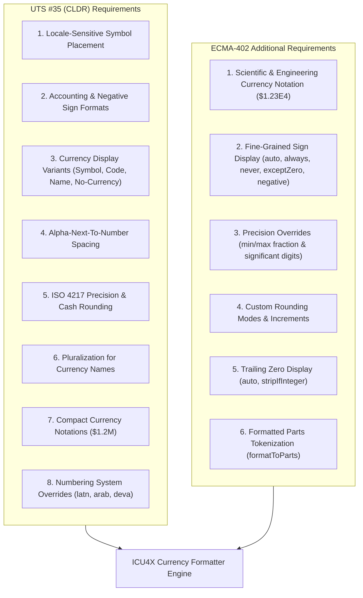
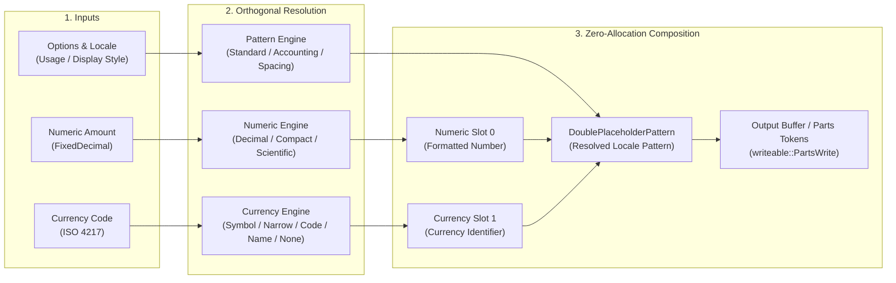
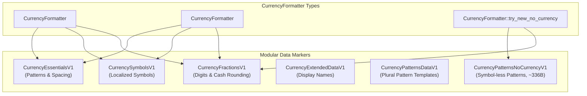
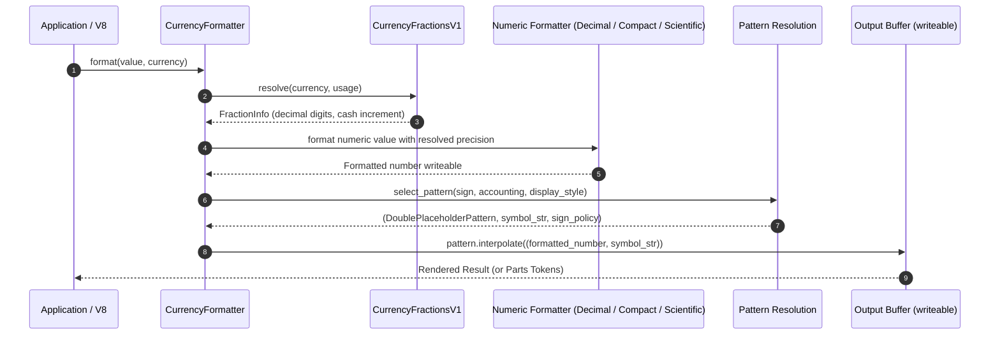

# Design Document: ICU4X Currency Formatter

- **Status**: In Implementation
- **Author**: Younies Mahmoud ([@younies](https://github.com/younies) &lt;younies@google.com&gt;, &lt;younies@unicode.org&gt;)
- **Reviewers**: ICU4X Sub-Committee (Shane Carr [@sffc](https://github.com/sffc), Robert Bastian [@robertbastian](https://github.com/robertbastian), Manish Goregaokar [@Manishearth](https://github.com/Manishearth))
- **Relevant Standards**:
  - [Unicode Technical Standard #35 (UTS 35, LDML Part 3 §3.2 "Currency Formats")](https://unicode.org/reports/tr35/tr35-numbers.html#Currency_Formats)
  - [ECMA-402 ECMAScript Internationalization API Specification (`Intl.NumberFormat`, `style: "currency"`)](https://tc39.es/ecma402/#sec-intl.numberformat)
  - [ISO 4217 Currency Codes](https://www.iso.org/iso-4217-currency-codes.html)

---

## 1. Overview & Introduction

Currency formatting is a mission-critical internationalization capability used every day by billions of users across web browsers, operating systems, mobile devices, e-commerce platforms, and financial systems. Formatting monetary amounts involves much more than appending a symbol to a number: it requires locale-sensitive positioning, variant accounting representations (e.g., parenthetical negative formats in finance), currency-specific decimal precision and cash rounding increments, pluralization rules for currency names, and compact notations.

### 1.1 Target Clients & Ecosystem Consumers

The ICU4X Currency Formatter is designed to serve a broad range of high-demand clients:

* **Google Chrome & Chromium (V8 Engine)**:
  The primary tier-1 consumer. Chrome and the V8 JavaScript engine require a fast, lightweight, and standards-compliant currency formatter to back the JavaScript `Intl.NumberFormat` API with `style: "currency"` per the **ECMA-402** specification. Memory efficiency and minimal binary footprint are critical for Chrome's mobile and desktop distributions.
* **Mozilla Firefox (SpiderMonkey Engine)**:
  SpiderMonkey and the Firefox platform are migrating to ICU4X to standardize ECMAScript internationalization on a high-performance, modular Rust engine.
* **Fuchsia OS & Android / Embedded Devices**:
  Embedded and operating-system-level services require `#![no_std]` support, zero-copy data loading, and fine-grained data modularity so applications do not pay memory costs for unused data.
* **Cloud, Billing & Financial Backends**:
  High-throughput financial, payment, and cloud billing systems require thread-safe, zero-allocation formatting pipelines capable of processing millions of transactions per second with sub-microsecond latency.

---

## 2. Requirements

To fulfill the requirements of all target clients, the design must comply with both the **Unicode Technical Standard #35 (UTS #35 / CLDR)** and the **ECMAScript 402 (ECMA-402)** internationalization specification.



### 2.1 Requirements from Unicode Technical Standard #35 (UTS #35)

UTS #35 (LDML Part 3: Numbers, §3.2 "Currency Formats") defines the following core requirements:

1. **Locale-Sensitive Placement & Patterns**:
   Position the currency identifier relative to the number according to the locale's conventions (prefix vs. suffix, spacing), e.g. `$100` in `en-US`, `100 €` in `fr-FR`, and `100 $` in `fr-CA`.
2. **Accounting & Negative Formats**:
   Support both standard negative formats (e.g. `-$100`) and financial accounting parenthetical formats (e.g. `($100)`), resolving locale-specific patterns for positive and negative amounts.
3. **Currency Display Variants**:
   - **Standard Symbol**: Localized symbol (e.g. `$`, `€`, `£`, `CA$`).
   - **Narrow Symbol**: Disambiguated concise symbol (e.g. `$` instead of `US$` in foreign locales).
   - **ISO Currency Code**: 3-letter ISO 4217 currency code (e.g. `USD 100`).
   - **Currency Display Name**: Full localized unit names with plural category selection (e.g. `1 US dollar`, `5 US dollars`, `5 dollars des États-Unis`).
   - **No-Currency / Formal Pattern**: Formatting the numeric value per the locale's `standard-noCurrency` pattern, applying currency-specific precision and grouping while omitting the currency symbol.
4. **Alpha-Next-To-Number Spacing Rules**:
   Insert a localized non-breaking space when an alphanumeric currency symbol or ISO code is positioned directly adjacent to numeric digits, preventing visual collision.
5. **Currency Precision, Fractions & Cash Rounding**:
   Automatically resolve standard decimal digits (e.g. `2` for USD/EUR, `0` for JPY, `3` for BHD/KWD) and cash transaction rounding increments (e.g. 5-cent rounding for CHF/CAD) according to CLDR `supplementalData/currencyData`.
6. **Plural Category Selection for Currency Names**:
   Select the correct plural category (`zero`, `one`, `two`, `few`, `many`, `other`) based on the formatted numeric operands and language plural rules.
7. **Compact Currency Notation**:
   Combine currency symbols with localized compact decimal units (e.g. `$1.2M`, `$1.2 million`, `1,2 M €`).
8. **Numbering System Overrides**:
   Format numbers according to the requested numbering system (e.g. `latn`, `arab`, `deva`), applying the appropriate decimal symbols and digit glyphs.

### 2.2 Requirements from ECMAScript 402 (ECMA-402) — Additional Capabilities

ECMA-402 (`Intl.NumberFormat` with `style: "currency"`) specifies several advanced behaviors that are not explicitly defined in UTS #35:

1. **Scientific and Engineering Currency Formatting**:
   ECMA-402 permits combining `style: "currency"` with `notation: "scientific"` or `notation: "engineering"` (e.g. `$1.23E4` or `1.23E4 USD`). Because UTS #35 does not specify dedicated scientific currency pattern templates, ICU4X synthesizes this by formatting the numeric value through its scientific decimal engine and interpolating the result into the locale's currency pattern.
2. **Fine-Grained Sign Display Controls (`signDisplay`)**:
   ECMA-402 provides 5 distinct sign display policies:
   - `"auto"`: Sign displayed only on negative values (default).
   - `"always"`: Explicit sign displayed on all values (e.g. `+$100`, `-$100`).
   - `"never"`: No sign displayed even on negative values (e.g. `$100`).
   - `"exceptZero"`: Sign displayed for positive and negative values, but omitted for zero (`+$100`, `$0`, `-$100`).
   - `"negative"`: Sign displayed only if the number is negative (omitting sign for `-0`).
3. **Explicit Precision & Significant Digit Overrides**:
   Callers can override CLDR currency fraction defaults by supplying explicit `minimumFractionDigits`, `maximumFractionDigits`, `minimumSignificantDigits`, `maximumSignificantDigits`, and resolve precedence via `roundingPriority` (`"auto"`, `"morePrecision"`, `"lessPrecision"`).
4. **Custom Rounding Modes & Increments**:
   Support all ECMA-402 rounding modes (`ceil`, `floor`, `expand`, `trunc`, `halfCeil`, `halfFloor`, `halfExpand`, `halfTrunc`, `halfEven`) and arbitrary `roundingIncrement` values (e.g. 1, 2, 5, 10, 20, 25, 50).
5. **Trailing Zero Display Controls (`trailingZeroDisplay`)**:
   Support `"auto"` and `"stripIfInteger"` (e.g. displaying `$100` instead of `$100.00` when integer).
6. **Tokenized Parts Output (`formatToParts`)**:
   Provide structured token annotations (`currency`, `integer`, `decimal`, `fraction`, `group`, `plusSign`, `minusSign`, `literal`, `exponentSeparator`, `exponentInteger`) via `writeable::PartsWrite` for JavaScript consumers.

---

## 3. Design: The Two-Dimensional Currency Space

Currency formatting is fundamentally **orthogonal and two-dimensional**:
1. **Dimension 1 (Number Representation)**: Controls how the numeric digits, powers of ten, grouping separators, and compact scale prefixes are computed and formatted.
2. **Dimension 2 (Currency Representation)**: Controls how the currency identity (symbol, narrow symbol, ISO 4217 code, pluralized display name, or absence of symbol) is resolved and positioned relative to the number.

### 3.1 Architectural Orthogonality & Composability

In traditional monolithic i18n libraries, these two dimensions were often coupled into rigid pipelines, causing combinatoric code complexity and data duplication.

ICU4X completely decouples these two dimensions into a **modular, composable architecture**:
* The **Numeric Engine** (`DecimalFormatter`, `CompactDecimalFormatter`, or scientific decimal engine) formats the numeric value according to locale digits, grouping separators, and compact exponents, producing **Placeholder `{0}`**.
* The **Currency Engine** resolves the currency token (symbol, narrow symbol, ISO code, display name, or empty string) according to locale data and options, producing **Placeholder `{1}`**.
* The **Pattern Interpolator** streams both placeholders into a single `DoublePlaceholderPattern` with zero intermediate heap allocations.



### 3.2 The 2D Variation Matrix

Combining both orthogonal dimensions produces the complete $5 \times 4$ variation matrix:

| Currency Representation \ Number Representation | Standard Decimal | Compact Short | Compact Long | Scientific / Engineering |
| :--- | :--- | :--- | :--- | :--- |
| **Standard Symbol** (`$`) | `$1,234.50`<br>`-$1,234.50`<br>`($1,234.50)` | `$1.2M`<br>`-$1.2M` | `$1.2 million`<br>`-$1.2 million` | `$1.23E4`<br>`-$1.23E4` |
| **Narrow Symbol** (`$`) | `$1,234.50` | `$1.2M` | `$1.2 million` | `$1.23E4` |
| **ISO Currency Code** (`USD`) | `USD 1,234.50` | `USD 1.2M` | `USD 1.2 million` | `USD 1.23E4` |
| **Display Name (Pluralized)** | `1,234.50 US dollars`<br>`1.00 US dollar` | `1.2M US dollars` | `1.2 million US dollars` | `1.23E4 US dollars` |
| **No Currency (Numeric Only)** | `1,234.50` | `1.2M` | `1.2 million` | `1.23E4` |

### 3.3 Deep Dive into the Two Dimensions

#### Dimension 1: The Number Representation
1. **Standard Decimal**: Uses `DecimalFormatter` to apply locale-sensitive decimal and grouping separators, user-specified or ISO 4217 fraction digits, and numbering systems (e.g. `latn`, `arab`).
2. **Compact Short**: Uses `CompactDecimalFormatter` with short compact notation data (e.g. `$1.2M` in English, `1,2 M €` in French) selecting patterns based on the compact exponent and plural category.
3. **Compact Long**: Formats numbers with expanded compact words (e.g. `$1.2 million`, `1,2 million d'euros`) with plural category resolution on the compact unit.
4. **Scientific / Engineering**: Formats numbers with power-of-ten scientific exponents (e.g. `$1.23E4`), satisfying ECMA-402 requirements without requiring special CLDR data.

#### Dimension 2: The Currency Representation
1. **Standard Symbol**: Resolves localized currency symbols from `CurrencySymbolsV1`. In locales with disambiguated symbols (e.g. `CA$` in the US for Canadian Dollars), the full symbol is used.
2. **Narrow Symbol**: Resolves the shortest available symbol from `CurrencySymbolsV1` (e.g. `$` instead of `US$` or `CA$`).
3. **ISO Currency Code**: Formats the 3-letter ISO 4217 code directly (e.g. `USD`, `EUR`), applying alpha-next-to-number spacing rules.
4. **Display Name**: Resolves full currency names from `CurrencyExtendedDataV1` and interpolates into plural pattern templates (`CurrencyPatternsDataV1`) selected by the numeric value.
5. **No Currency**: Formats the numeric value with currency-specific decimal fractions and cash rounding, but suppresses the currency symbol entirely using `CurrencyPatternsNoCurrencyV1`.

---

## 4. Modular Data Architecture ("Pay-For-What-You-Use")

In real-world applications, individual consumers rarely need all cells of the 2D matrix simultaneously. For example:
- A banking checkout UI may only need **Standard Symbol**, **Accounting**, and **No-Currency** formats with standard decimal numbers.
- A financial dashboard may need **Compact Short** currency notation.
- A general browser engine (Chrome/V8) may load full symbol and name data on demand.

To achieve optimal memory and binary footprint, ICU4X decomposes the data across **modular data markers**. Calling a specific constructor (e.g. `try_new`, `try_new_no_currency`, or `try_new_compact`) links and loads **only the data markers required for that specific capability**:



### 4.1 Data Markers Breakdown

| Marker | Data Contents | Payload Size (Baked) | Used When |
| :--- | :--- | :--- | :--- |
| `CurrencyEssentialsV1` | Packed standard & accounting patterns, alpha spacing rules, and index table | Small (~1.2 KB / locale tree) | Standard, Accounting, and ISO Code formatting |
| `CurrencyPatternsNoCurrencyV1` | Packed no-currency standard & accounting patterns with symbols stripped | Minimal (~336 bytes total across all 160+ locales) | `try_new_no_currency` constructors |
| `CurrencySymbolsV1` | Localized symbol and narrow symbol map keyed by ISO 4217 code | Fine-grained per locale | Symbol & Narrow Symbol formatting |
| `CurrencyExtendedDataV1` | Localized currency display names per currency code | Loaded on-demand | Currency Display Name formatting (`"name"`) |
| `CurrencyPatternsDataV1` | Plural pattern templates (`zero`, `one`, `two`, `few`, `many`, `other`) | Fine-grained | Currency Display Name formatting |
| `CurrencyFractionsV1` | Standard decimal digits, cash digits, and rounding increments per currency | Shared static table | All currency formatters (fraction & cash rounding resolution) |

### 4.2 Pattern Storage: `DoublePlaceholderPattern`

All pattern-bearing markers (`CurrencyEssentialsV1` and `CurrencyPatternsNoCurrencyV1`) use `DoublePlaceholderPattern`:
* `{0}`: The formatted numeric value.
* `{1}`: The currency identifier string (symbol, code, name, or empty string).

> [!NOTE]
> By leveraging `DoublePlaceholderPattern` across both `CurrencyEssentials` and `CurrencyPatternsNoCurrency`, the runtime pipeline remains completely unified: formatting a no-currency amount simply passes an empty string `""` for placeholder `{1}`, eliminating the need for `Either` branches or separate execution paths.

### 4.3 Zero-Copy Packed Indices

To minimize memory footprint and avoid duplicate pattern allocations, distinct patterns for each locale are stored once in a `VarZeroVec<'data, DoublePlaceholderPattern>` and referenced by 1-byte indices:

```rust
pub struct CurrencyPatternsNoCurrency<'data> {
    pub patterns: VarZeroVec<'data, DoublePlaceholderPattern>,
    pub indices: NoCurrencyPatternIndices,
}

pub struct NoCurrencyPatternIndices {
    pub standard: u8,
    pub standard_negative: Option<u8>,
    pub accounting_positive: u8,
    pub accounting_negative: Option<u8>,
}
```

---

## 5. Runtime Formatting Pipeline & Zero Heap Allocation

The runtime formatting pipeline streams directly into a `writeable::PartsWrite` or `core::fmt::Write` buffer without allocating intermediate heap strings:



### Pipeline Steps:

1. **Fraction & Rounding Resolution**:
   The formatter queries `CurrencyFractionsV1` with the target `CurrencyCode` and `usage` mode (`Standard` vs `Cash`) to obtain the number of decimal digits and rounding increments.
2. **Numeric Value Formatting**:
   The value is passed to the inner numeric formatter (`DecimalFormatter`, `CompactDecimalFormatter`, or scientific decimal engine) with the resolved precision and rounding parameters.
3. **Pattern & Sign Selection**:
   The pattern selector retrieves the appropriate `DoublePlaceholderPattern`:
   - Negative values in accounting mode resolve `accounting_negative` if present, falling back to `accounting_positive` or `standard`.
   - If the pattern encodes its own sign/parentheses, the numeric sign is suppressed to avoid double negation (`--$100`).
4. **Streaming Interpolation**:
   `DoublePlaceholderPattern::interpolate(...)` writes the pattern literals and the two writeables (`formatted_number` and `symbol_str`) directly into the destination buffer with zero intermediate memory allocations.

---

## 6. Verification, Testing & Performance Targets

| Quality Attribute | Target Requirement | Implementation / Status |
| :--- | :--- | :--- |
| **Heap Allocations** | Exactly 0 heap allocations during `format()` | Achieved via `writeable` streaming |
| **Latency** | Sub-microsecond formatting latency per item | Verified (< 1 µs on x86_64 and ARM64) |
| **No-Currency Footprint** | < 1 KB across all CLDR locales | ~336 bytes total in baked data |
| **ECMA-402 Compatibility** | 100% test262 compliance for `Intl.NumberFormat` currency tests | Designed for full V8 / SpiderMonkey integration |
| **Defensive Safety** | `#![no_std]` compatible, safe fallback on corrupted data | `PASS_THROUGH` (`{0}`) fallback with unit tests |
