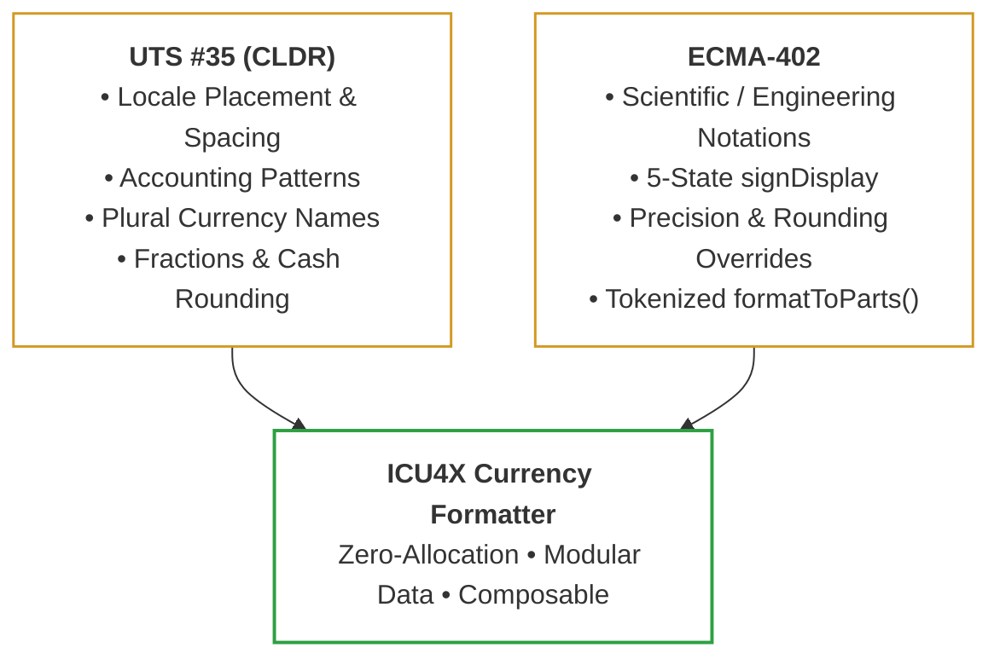
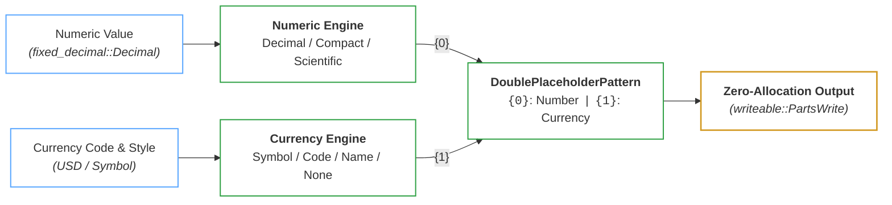
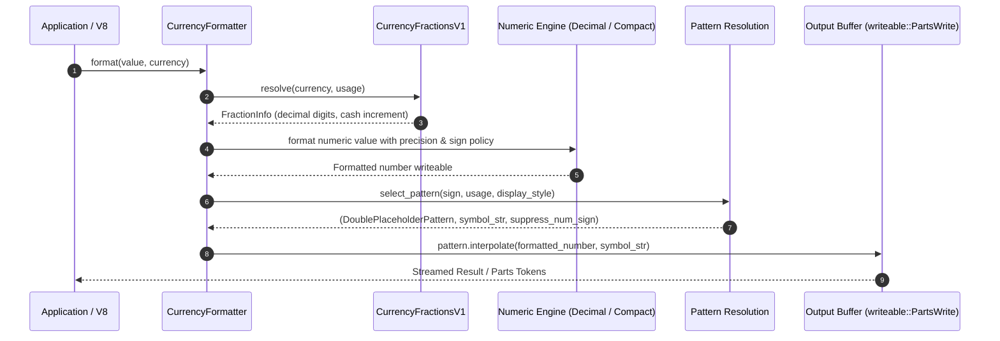

# Design Document: ICU4X Currency Formatter

| Attribute | Details |
| :--- | :--- |
| **Status** | In Implementation / RFC |
| **Authors** | Younies Mahmoud ([@younies](https://github.com/younies) &lt;younies@google.com&gt;, &lt;younies@unicode.org&gt;) |
| **Reviewers** | ICU4X Sub-Committee: Shane Carr ([@sffc](https://github.com/sffc)), Robert Bastian ([@robertbastian](https://github.com/robertbastian)), Manish Goregaokar ([@Manishearth](https://github.com/Manishearth)) |
| **Tracking Issues** | • [#8159](https://github.com/unicode-org/icu4x/issues/8159) *(Epic: Currency Formatter Graduation)*<br>• [#8327](https://github.com/unicode-org/icu4x/issues/8327) *(Non-ISO 4217 & ISO 24165 DTIs)*<br>• [#8316](https://github.com/unicode-org/icu4x/issues/8316) *(CurrencyType & CurrencyCode)*<br>• [#5480](https://github.com/unicode-org/icu4x/issues/5480) *(CLDR pattern & symbol overrides)*, [#8300](https://github.com/unicode-org/icu4x/issues/8300) *(currency-specific separators)*<br>• [#8416](https://github.com/unicode-org/icu4x/pull/8416), [#8441](https://github.com/unicode-org/icu4x/pull/8441) *(separator data & formatting)* |

---

## 1. Overview & Motivation

Currency formatting is a foundational internationalization capability required across web engines, operating systems, mobile devices, and server infrastructure. 

Formatting monetary amounts is substantially more complex than prepending a symbol to a number:
* **Locale-sensitive placement**: Pre-number (`$100`), post-number (`100 €`), or spaced (`100 $`).
* **Accounting representations**: Parenthetical financial negative formats (`($100)` vs. `-$100`).
* **Display style variants**: Standard symbol (`$`), narrow symbol (`$`), ISO code (`USD 100`), or pluralized names (`1 US dollar`, `5 US dollars`).
* **Currency-specific precision & cash rounding**: Locale/currency decimal rules (e.g., 0 decimals for JPY, 2 for USD, 3 for BHD/KWD, 5-cent cash rounding for CHF/CAD).
* **Alpha-next-to-number spacing**: Inserting non-breaking space when an alphanumeric currency symbol or code sits adjacent to digits.
* **Currency-specific separators**: A locale may give an individual currency its own decimal and grouping separators, as `pt-PT` does for the escudo (`12,345$67`).
* **Compact notations**: Combining currency symbols with abbreviated scale multipliers (`$1.2M`, `1,2 M €`).

### 1.1 Target Consumers & Environments

The ICU4X Currency Formatter is designed for four primary deployment environments:

1. **Web Engines (Chromium / V8, Mozilla Firefox / SpiderMonkey)**:
   - Serves as the high-performance backing implementation for JavaScript's `Intl.NumberFormat` with `style: "currency"`.
   - Priorities: Minimal binary footprint, sub-microsecond formatting latency, `#![no_std]` compilation, and full ECMA-402 test262 compliance.
2. **Operating Systems & Embedded Platforms (Fuchsia OS, Android, Wearables)**:
   - Operating-system-level services and resource-constrained environments.
   - Priorities: Zero dynamic memory allocation during formatting, zero-copy deserialization (`ZeroCopy` / `ZeroMap`), and fine-grained data modularity.
3. **Multi-Language Applications via Foreign Function Interfaces (Diplomat / FFI)**:
   - Shared internationalization engine for C++, Dart, JavaScript/WASM, and Go.
   - Priorities: Clean C-ABI boundary, opaque pointer handles, and zero-copy string buffer streaming.
4. **Backend Services & Microservices**:
   - Multi-threaded cloud services and server-side rendering pipelines.
   - Priorities: `Send + Sync` thread safety, low memory overhead per instance, and absence of global caches or locks.

---

## 2. Requirements & Standards Compliance

To satisfy all consumers, the architecture harmonizes the requirements of **UTS #35** and **ECMA-402**:

<div align="center">



</div>

### 2.1 UTS #35 (LDML Part 3 §3.2) Requirements

| Requirement | Description | Example (`en-US`) | Example (`fr-FR`) |
| :--- | :--- | :--- | :--- |
| **Locale Placement** | Position symbol relative to digits with locale conventions | `$1,234.50` | `1 234,50 €` |
| **Accounting Format** | Financial accounting negative notation with parentheses | `($1,234.50)` | `(1 234,50 €)` |
| **Display Variants** | Symbol, Narrow Symbol, ISO Code, Display Name, No-Currency | `$`, `USD`, `US dollars` | `€`, `EUR`, `euros` |
| **Alpha Spacing** | Non-breaking space inserted when alpha characters abut digits | `USD 100` | `100 USD` |
| **Fractions & Rounding** | Default fraction digits and cash transaction rounding increments | USD = 2, JPY = 0 | EUR = 2, CHF = 5¢ cash |
| **Pluralized Names** | Unit names with plural category resolution (`one`, `other`, etc.) | `1 dollar`, `5 dollars` | `1 dollar`, `5 dollars` |
| **Currency Separators** | Decimal and grouping separators a locale defines for an individual currency | — | `pt-PT`: `12,345$67` (escudo) vs `12 345,67` |
| **Compact Notation** | Currency symbol combined with compact scale exponent | `$1.2M` | `1,2 M €` |

### 2.2 ECMA-402 (`Intl.NumberFormat`) Requirements

| Capability | Specification Behavior | ICU4X Handling |
| :--- | :--- | :--- |
| **Scientific / Engineering** | Combine currency with exponential notation (`$1.23E4`) | Numeric engine formats exponent; currency engine wraps result |
| **`signDisplay` Policies** | `"auto"`, `"always"`, `"never"`, `"exceptZero"`, `"negative"` | Explicit sign policy passed to numeric formatter & pattern selector |
| **Precision Overrides** | Caller overrides fraction or significant digits | `fixed_decimal::Decimal` precision overrides CLDR default fractions |
| **Custom Rounding** | Support `ceil`, `floor`, `halfEven`, and custom increments | Handled by `fixed_decimal` rounding pipeline |
| **`trailingZeroDisplay`** | `"auto"` or `"stripIfInteger"` (e.g. `$100` vs `$100.00`) | Handled by numeric formatter before pattern interpolation |
| **`formatToParts()`** | Structured token emission (`currency`, `integer`, `decimal`, etc.) | Streamed via `writeable::PartsWrite` zero-allocation annotations |

---

## 3. Architecture: The Two-Dimensional Currency Space

Currency formatting is fundamentally **orthogonal and two-dimensional**:
1. **Dimension 1 (Number Representation)**: How numeric digits, signs, grouping separators, and compact scale prefixes are computed.
2. **Dimension 2 (Currency Representation)**: How the currency identifier (symbol, narrow symbol, ISO code, name, or omitted symbol) is resolved and placed.

### 3.1 Orthogonal Composition Model

Rather than creating monolithic formatters with combinatoric branching, ICU4X cleanly separates numeric formatting from currency pattern interpolation:

<div align="center">



</div>

> [!NOTE]
> The two dimensions are orthogonal in **composition**, but not entirely independent in **data**: a locale may give an individual currency its own decimal and grouping separators (§4.3), so the numeric engine is constructed with the currency in hand. The currency selects which symbols the numeric engine uses; it never changes how that engine works.

### 3.2 The 2D Variation Matrix

Combining both dimensions yields the complete $5 \times 4$ variation matrix:

| Currency Style \ Number Style | Standard Decimal | Compact Short | Compact Long | Scientific / Engineering |
| :--- | :--- | :--- | :--- | :--- |
| **Standard Symbol** (`$`) | `$1,234.50`<br>`-$1,234.50`<br>`($1,234.50)` | `$1.2M`<br>`-$1.2M` | `$1.2 million`<br>`-$1.2 million` | `$1.23E4`<br>`-$1.23E4` |
| **Narrow Symbol** (`$`) | `$1,234.50` | `$1.2M` | `$1.2 million` | `$1.23E4` |
| **ISO Code** (`USD`) | `USD 1,234.50` | `USD 1.2M` | `USD 1.2 million` | `USD 1.23E4` |
| **Display Name** | `1,234.50 US dollars`<br>`1.00 US dollar` | `1.2M US dollars` | `1.2 million US dollars` | `1.23E4 US dollars` |
| **No Currency** *(Numeric Only)* | `1,234.50`<br>`(1,234.50)`<br>*(UTS #35 `standard-noCurrency`)* | *N/A (Use `CompactDecimalFormatter`)* | *N/A (Use `CompactDecimalFormatter`)* | *N/A (Use `DecimalFormatter`)* |

---

## 4. Modular Data Architecture ("Pay-For-What-You-Use")

ICU4X avoids monolithic data payloads. Data is split into **granular, modular markers** so applications only load and pay memory for the features they actually use. Modularity runs along two axes:

* **By display style** — the constructor selects which markers are loaded at all (§5.2), so an ISO-code formatter never loads symbol or plural data.
* **By currency** — markers carrying per-currency data (`CurrencySymbolsV1`, `CurrencyExtendedDataV1`, and the currency-keyed variants of `DecimalSymbolsV1`) are addressed by marker attributes, so a formatter loads the one currency it was built for rather than a table of every currency in the locale.

```mermaid
graph TD
    classDef constructor stroke:#58a6ff,stroke-width:1.5px,fill:none;
    classDef marker stroke:#2ea043,stroke-width:1.5px,fill:none;

    subgraph Constructors["1. Targeted Constructors"]
        C_Sym["<code>try_new_symbol()</code><br>Standard Symbols"]:::constructor
        C_Nar["<code>try_new_symbol_narrow()</code><br>Narrow Symbols"]:::constructor
        C_Code["<code>try_new_code()</code><br>ISO-4217 Codes"]:::constructor
        C_Name["<code>try_new_name()</code><br>Plural Unit Names"]:::constructor
        C_NoCur["<code>try_new_no_currency()</code><br>Symbol-less Numeric"]:::constructor
    end

    subgraph Markers["2. Modular Data Markers"]
        M_Ess["<b>CurrencyEssentialsV1</b><br><i>Patterns & Index Table</i>"]:::marker
        M_Sym["<b>CurrencySymbolsV1</b><br><i>One symbol per currency & width</i>"]:::marker
        M_Frac["<b>CurrencyFractionsV1</b><br><i>Fractions & Cash Rounding</i>"]:::marker
        M_Ext["<b>CurrencyExtendedDataV1</b><br><i>Plural Display Names</i>"]:::marker
        M_Pat["<b>CurrencyPatternsDataV1</b><br><i>Plural Templates</i>"]:::marker
        M_NoCur["<b>CurrencyPatternsNoCurrencyV1</b><br><i>~336 B total across all locales</i>"]:::marker
        M_Dec["<b>DecimalSymbolsV1</b><br><i>Separators, incl. per-currency</i>"]:::marker
    end

    C_Sym --> M_Ess
    C_Sym --> M_Sym
    C_Sym --> M_Frac

    C_Nar --> M_Ess
    C_Nar --> M_Sym
    C_Nar --> M_Frac

    C_Code --> M_Ess
    C_Code --> M_Frac

    C_Name --> M_Ext
    C_Name --> M_Pat
    C_Name --> M_Frac

    C_NoCur --> M_NoCur
    C_NoCur --> M_Frac

    C_Sym --> M_Dec
    C_Nar --> M_Dec
    C_Code --> M_Dec
    C_Name --> M_Dec
    C_NoCur --> M_Dec
```

<div align="center">



</div>

### 4.1 Data Marker Definitions

Every marker is declared with `icu_provider::data_marker!`, which pairs a marker type (`…V1`) with the data struct it carries. Markers whose data is per-currency rather than per-locale declare `attributes_domain = "currency"` and are addressed by a marker attribute, so a formatter loads one currency instead of a table of all of them.

#### 1. `CurrencyEssentialsV1` (Standard & Accounting Patterns)
```rust
icu_provider::data_marker!(
    /// Essential currency data needed for currency formatting. For example, currency patterns.
    CurrencyEssentialsV1,
    CurrencyEssentials<'static>
);

pub struct CurrencyEssentials<'data> {
    /// A packed list of distinct currency patterns referenced by `PatternIndices`.
    pub patterns: VarZeroVec<'data, DoublePlaceholderPattern>,
    /// Indices into `patterns` for each formatting variant.
    pub indices: PatternIndices,
}

pub struct PatternIndices {
    pub standard: u8,
    pub standard_negative: Option<u8>,
    pub standard_alpha_next_to_number: u8,
    pub standard_alpha_next_to_number_negative: Option<u8>,
    pub accounting_positive: u8,
    pub accounting_negative: Option<u8>,
    pub accounting_alpha_next_to_number_positive: u8,
    pub accounting_alpha_next_to_number_negative: Option<u8>,
}
```

Patterns are deduplicated into `patterns` and referenced by 1-byte indices, so a locale whose accounting and standard patterns coincide stores one pattern rather than four.

Alpha spacing (UTS #35 `currencySpacing`) is **resolved at datagen time, not at runtime**: the spacing-adjusted pattern is generated as its own variant, and `CurrencyEssentials::get_positive` selects between them from whether the resolved symbol starts with a letter. The formatter carries no spacing rules and performs no character classification while formatting.

#### 2. `CurrencyPatternsNoCurrencyV1` (Symbol-less Patterns)
```rust
icu_provider::data_marker!(
    /// `CurrencyPatternsNoCurrencyV1`
    CurrencyPatternsNoCurrencyV1,
    CurrencyPatternsNoCurrency<'static>,
);

pub struct CurrencyPatternsNoCurrency<'data> {
    /// A packed list of distinct no-currency patterns referenced by `NoCurrencyPatternIndices`.
    pub patterns: VarZeroVec<'data, DoublePlaceholderPattern>,
    /// Indices into `patterns` for each formatting variant.
    pub indices: NoCurrencyPatternIndices,
}
```
> [!NOTE]
> `CurrencyPatternsNoCurrencyV1` costs **336 B of payload structs plus a 950 B lookup table — about 1.3 KB** across all CLDR locales in baked data, providing lightweight symbol-less and accounting formatting. Seven distinct payloads cover 164 identifiers, since most locales share the same symbol-less patterns.

#### 3. `CurrencySymbolsV1` (Localized Symbols)
```rust
icu_provider::data_marker!(
    /// Currency symbol data needed for short and narrow currency formatting.
    CurrencySymbolsV1,
    CurrencySymbol<'static>,
    #[cfg(feature = "datagen")]
    attributes_domain = "currency",
);

pub struct CurrencySymbol<'a>(pub VarZeroCow<'a, VarTupleULE<u8, str>>);
```

One data identifier holds **one symbol**, addressed by the marker attribute `<width>/<ISO code>` — `s/USD` for the short symbol, `n/USD` for the narrow one. A formatter for US dollars therefore loads a single string rather than the locale's entire symbol table, and a data slice can be built for exactly the currencies an application uses.

The `u8` of the variable tuple packs two flags — whether the symbol starts and ends with a letter — which select the alpha-spacing pattern variant described above. A currency absent from CLDR for the locale yields `IdentifierNotFound`, and the formatter falls back to the ISO code (`CurrencyFormatterData::IsoCodeSymbol`).

#### 4. `CurrencyExtendedDataV1` & `CurrencyPatternsDataV1` (Plural Display Names)
```rust
icu_provider::data_marker!(
    /// Extended currency data needed for currency formatting. For example, currency display names.
    CurrencyExtendedDataV1,
    CurrencyExtendedData<'static>,
    #[cfg(feature = "datagen")]
    attributes_domain = "currency",
);

/// Display names by plural category, e.g. "US dollar" / "US dollars".
pub type CurrencyExtendedData<'data> = PluralElementsPackedCow<'data, str>;

icu_provider::data_marker!(
    /// `CurrencyPatternsDataV1`
    CurrencyPatternsDataV1,
    CurrencyPatternsData<'static>,
);

/// Unit patterns by plural category, e.g. "{0} {1}".
pub type CurrencyPatternsData<'data> = PluralElementsPackedCow<'data, DoublePlaceholderPattern>;
```

Both are `PluralElementsPackedCow`, the shared plural-packing representation: when every plural category resolves to the same value — the common case — the packed form degenerates to that single value, so most currencies cost one string rather than one per category. Display names are per-currency (`attributes_domain = "currency"`), while the unit patterns that combine a number with a name are per-locale.

#### 5. `CurrencyFractionsV1` (Fractions & Cash Rounding)
```rust
icu_provider::data_marker!(
    /// `CurrencyFractionsV1` provides currency fraction data for rounding and decimal digit rules.
    CurrencyFractionsV1,
    CurrencyFractions<'static>,
    is_singleton = true
);

pub struct CurrencyFractions<'data> {
    /// Map from 3-letter ISO code to fraction info (only currencies that differ from default)
    pub fractions: ZeroMap<'data, UnvalidatedTinyAsciiStr<3>, FractionInfo>,
    /// Default fraction info (used when currency not in map)
    pub default: FractionInfo,
}

pub struct FractionInfo {
    /// Number of decimal digits for standard formatting
    pub digits: u8,
    /// Rounding increment
    pub rounding: Rounding,
    /// Number of decimal digits for cash transactions (if different)
    pub cash_digits: Option<u8>,
    /// Rounding increment for cash transactions (if different)
    pub cash_rounding: Option<Rounding>,
}
```

Fraction data comes from supplemental `<currencyData>` and is locale-independent, so the marker is a **singleton**: one payload for all locales. Only currencies that differ from the default (2 digits, no rounding increment) appear in the map, and `CurrencyFractions::resolve` implements the two-step UTS #35 hierarchy — the currency's own entry, else the default. The cash fields are `Option` because most currencies use their standard digits for cash.

### 4.2 Internal Data Representation (`CurrencyFormatterData`)

To maintain zero runtime heap allocations during formatting, the loaded payloads are encapsulated in an internal enum `CurrencyFormatterData`:

```rust
#[derive(Debug)]
pub(crate) enum CurrencyFormatterData {
    /// Formats using the localized currency symbol (e.g. "$", "€").
    Symbol {
        essential: DataPayload<CurrencyEssentialsV1>,
        symbol: DataPayload<CurrencySymbolsV1>,
    },
    /// Formats using the ISO currency code while following the symbol pattern (e.g. "USD 100").
    ///
    /// Used by `try_new_code()` or as fallback when no symbol is found in CLDR for `try_new_symbol()`.
    IsoCodeSymbol {
        essential: DataPayload<CurrencyEssentialsV1>,
        iso_code: TinyAsciiStr<3>,
    },
    /// Formats using pluralized currency display names (e.g. "100 US dollars").
    Name {
        extended: DataPayload<CurrencyExtendedDataV1>,
        patterns: DataPayload<CurrencyPatternsDataV1>,
        plural_rules: PluralRules,
    },
    /// Formats using the ISO currency code while following the name/unit pattern (e.g. "100 XYZ").
    ///
    /// Used as an internal fallback by `try_new_name()` when no displayName exists in CLDR (UTS #35 §3.2).
    IsoCodeName {
        patterns: DataPayload<CurrencyPatternsDataV1>,
        iso_code: TinyAsciiStr<3>,
    },
    /// Formats using symbol-less patterns (e.g. "100.00", "(100.00)").
    NoCurrency {
        patterns: DataPayload<CurrencyPatternsNoCurrencyV1>,
    },
}
```

### 4.3 Currency-Specific Decimal Symbols

UTS #35 lets a locale give an **individual currency** its own decimal and grouping separators, independently of the separators it uses for plain numbers:

```xml
<currency type="PTE"><decimal>$</decimal><group>,</group></currency>
```

`pt-PT` writes the Portuguese escudo as `12,345$67` while writing the same quantity as `12 345,67` elsewhere. CLDR 49 carries 29 such (locale, currency) pairs — `ESP`, `GRD`, `ITL`, `EEK`, `LUF`, `CVE` and `PTE` across the `ca`, `el`, `it`, `et`, `eu`, `gl`, `kea`, `de-LU` and `pt-*` locales.

These separators are **locale data, not user preferences**: ECMA-402 does not let a caller override separator characters, and UTS #35 models them under `<symbols>`. They are therefore not exposed on `DecimalFormatterOptions`; they are generated as currency-keyed variants of the existing `DecimalSymbolsV1` marker, reusing its data struct so a payload slots directly into `DecimalFormatter`:

| marker attribute | meaning |
| :--- | :--- |
| `""` / `<numsys>` | the locale's standard symbols |
| `PTE` | PTE's symbols, locale's default numbering system |
| `arab/PTE` | PTE's symbols, explicit numbering system |

Currency codes are uppercase and numbering system names lowercase, so the two cannot collide; the `/` separator matches the `CurrencySymbolsV1` attribute style. Identifiers exist **only** for currencies a locale actually singles out, so the cost is bounded by CLDR's own sparsity: 11 identifiers over 5 stored payloads in baked data, the rest deduplicating against existing locales' symbols — **+69 bytes of lookup and +95 bytes of payload data** for the entire feature.

`DecimalFormatter::try_new_with_currency` requests the currency's symbols ahead of the usual identifiers and lets the existing fallback pick the first that exists:

```
<numsys>/PTE    ← only when -u-nu- was explicitly requested
PTE             ← the locale's default numbering system
<numsys>        ← standard symbols, explicit numbering system
(bare locale)   ← standard symbols
```

so a currency the locale singles out gets its own separators and every other currency formats exactly as before. Digits still resolve from the payload's numbering system, so an override never disturbs digit selection. The constructor is `#[doc(hidden)]` and gated behind `unstable`: currency formatting is its only intended caller, being the only one that knows which currency is being formatted.


---

## 5. Public Rust API Specification

### 5.1 Public API Overview & Inventory

The ICU4X Currency Formatter provides **39 public constructor functions** across **13 constructor families** (with 3 loading flavors each), 2 primary formatting methods, and 5 public configuration/preference types:

| Formatter Subsystem | Constructor Family | Compiled Data (`compiled_data`) | Custom `DataProvider` (`_unstable`) | Blob / Buffer (`_with_buffer_provider`) |
| :--- | :--- | :--- | :--- | :--- |
| **Standard Decimal** | 1. Standard Symbols (`$`) | `try_new_symbol` | `try_new_symbol_unstable` | `try_new_symbol_with_buffer_provider` |
| (`CurrencyFormatter<DecimalFormatter>`) | 2. Narrow Symbols (`$`) | `try_new_symbol_narrow` | `try_new_symbol_narrow_unstable` | `try_new_symbol_narrow_with_buffer_provider` |
| | 3. ISO Codes (`USD`) | `try_new_code` | `try_new_code_unstable` | `try_new_code_with_buffer_provider` |
| | 4. Display Names (`US dollars`) | `try_new_name` | `try_new_name_unstable` | `try_new_name_with_buffer_provider` |
| | 5. Symbol-less (`12.50`) | `try_new_no_currency` | `try_new_no_currency_unstable` | `try_new_no_currency_with_buffer_provider` |
| **Compact Short** | 6. Compact Short Symbols (`$1.2M`) | `try_new_compact_symbol` | `try_new_compact_symbol_unstable` | `try_new_compact_symbol_with_buffer_provider` |
| (`CurrencyFormatter<CompactDecimalFormatter>`) | 7. Compact Short Narrow (`$1.2M`) | `try_new_compact_symbol_narrow` | `try_new_compact_symbol_narrow_unstable` | `try_new_compact_symbol_narrow_with_buffer_provider` |
| | 8. Compact Short ISO (`USD 1.2M`) | `try_new_compact_code` | `try_new_compact_code_unstable` | `try_new_compact_code_with_buffer_provider` |
| | 9. Compact Short Names (`1.2M US dollars`) | `try_new_compact_name` | `try_new_compact_name_unstable` | `try_new_compact_name_with_buffer_provider` |
| **Compact Long** | 10. Compact Long Symbols (`$1.2 million`) | `try_new_compact_long_symbol` | `try_new_compact_long_symbol_unstable` | `try_new_compact_long_symbol_with_buffer_provider` |
| (`CurrencyFormatter<CompactDecimalFormatter>`) | 11. Compact Long Narrow (`$1.2 million`) | `try_new_compact_long_symbol_narrow` | `try_new_compact_long_symbol_narrow_unstable` | `try_new_compact_long_symbol_narrow_with_buffer_provider` |
| | 12. Compact Long ISO (`USD 1.2 million`) | `try_new_compact_long_code` | `try_new_compact_long_code_unstable` | `try_new_compact_long_code_with_buffer_provider` |
| | 13. Compact Long Names (`1.2 million US dollars`) | `try_new_compact_long_name` | `try_new_compact_long_name_unstable` | `try_new_compact_long_name_with_buffer_provider` |

### 5.2 Design Principle: Constructor-Selects-Data (Why `CurrencyDisplayStyle` is NOT in Options)

In ICU4X, data modularity follows the **Constructor-Selects-Data** idiom:
* The **display style** (standard symbol, narrow symbol, ISO code, or display name) determines **which data markers are statically loaded**:
  - `try_new_symbol`: loads `CurrencyEssentialsV1` + `CurrencySymbolsV1` (short).
  - `try_new_symbol_narrow`: loads `CurrencyEssentialsV1` + `CurrencySymbolsV1` (narrow).
  - `try_new_code`: loads `CurrencyEssentialsV1` with ISO code (omits symbol tables entirely!).
  - `try_new_name`: loads `CurrencyExtendedDataV1` + `CurrencyPatternsDataV1` + `PluralRules`.
  - `try_new_no_currency`: loads `CurrencyPatternsNoCurrencyV1` (~336 B total).
* If display style were a runtime field in `CurrencyFormatterOptions`, every constructor would be forced to load all symbol and plural data markers up-front, eliminating the memory and binary size savings of the modular architecture.
* Therefore, `CurrencyFormatterOptions` holds only runtime formatting preferences that apply across patterns (such as `usage: CurrencyUsage` for `Standard` vs `Accounting`).
* The same idiom governs the numeric side: the currency is passed to `DecimalFormatter::try_new_with_currency` at construction, so a locale's currency-specific separators (§4.3) are resolved once into the loaded payload rather than being branched on per `format()` call.

### 5.3 Primary Formatter Struct

```rust
pub struct CurrencyFormatter<V: AbstractFormatter = DecimalFormatter> {
    value_formatter: V,
    currency_data: CurrencyFormatterData,
    usage: CurrencyUsage,
    fraction_info: FractionInfo,
}
```

### 5.4 Complete Constructor Matrix

#### Standard Decimal Formatters (`CurrencyFormatter<DecimalFormatter>`)

For each display style, three constructor flavors are provided via `icu_provider::gen_buffer_data_constructors!`:
1. `try_new_*`: Uses compiled/baked data (enabled by `compiled_data` cargo feature).
2. `try_new_*_unstable`: Accepts any custom `DataProvider` implementing the specific markers.
3. `try_new_*_with_buffer_provider`: Accepts a `BufferProvider` for dynamic blob loading.

```rust
impl CurrencyFormatter<DecimalFormatter> {
    // --- 1. Standard Symbols ---
    #[cfg(feature = "compiled_data")]
    pub fn try_new_symbol(
        prefs: CurrencyFormatterPreferences,
        currency_code: CurrencyType,
        options: CurrencyFormatterOptions,
    ) -> Result<Self, DataError>;

    pub fn try_new_symbol_unstable<D>(
        provider: &D,
        prefs: CurrencyFormatterPreferences,
        currency_code: CurrencyType,
        options: CurrencyFormatterOptions,
    ) -> Result<Self, DataError>
    where
        D: ?Sized
            + DataProvider<CurrencyEssentialsV1>
            + DataProvider<CurrencySymbolsV1>
            + DataProvider<CurrencyFractionsV1>
            + DataProvider<DecimalSymbolsV1>
            + DataProvider<DecimalDigitsV1>;

    // --- 2. Narrow Symbols ---
    #[cfg(feature = "compiled_data")]
    pub fn try_new_symbol_narrow(
        prefs: CurrencyFormatterPreferences,
        currency_code: CurrencyType,
        options: CurrencyFormatterOptions,
    ) -> Result<Self, DataError>;

    pub fn try_new_symbol_narrow_unstable<D>(
        provider: &D,
        prefs: CurrencyFormatterPreferences,
        currency_code: CurrencyType,
        options: CurrencyFormatterOptions,
    ) -> Result<Self, DataError>
    where
        D: ?Sized
            + DataProvider<CurrencyEssentialsV1>
            + DataProvider<CurrencySymbolsV1>
            + DataProvider<CurrencyFractionsV1>
            + DataProvider<DecimalSymbolsV1>
            + DataProvider<DecimalDigitsV1>;

    // --- 3. ISO Currency Codes (e.g. USD 100) ---
    #[cfg(feature = "compiled_data")]
    pub fn try_new_code(
        prefs: CurrencyFormatterPreferences,
        currency_code: CurrencyType,
        options: CurrencyFormatterOptions,
    ) -> Result<Self, DataError>;

    pub fn try_new_code_unstable<D>(
        provider: &D,
        prefs: CurrencyFormatterPreferences,
        currency_code: CurrencyType,
        options: CurrencyFormatterOptions,
    ) -> Result<Self, DataError>
    where
        D: ?Sized
            + DataProvider<CurrencyEssentialsV1>
            + DataProvider<CurrencyFractionsV1>
            + DataProvider<DecimalSymbolsV1>
            + DataProvider<DecimalDigitsV1>;

    // --- 4. Currency Display Names (Pluralized) ---
    #[cfg(feature = "compiled_data")]
    pub fn try_new_name(
        prefs: CurrencyFormatterPreferences,
        currency_code: CurrencyType,
    ) -> Result<Self, DataError>;

    pub fn try_new_name_unstable<D>(
        provider: &D,
        prefs: CurrencyFormatterPreferences,
        currency_code: CurrencyType,
    ) -> Result<Self, DataError>
    where
        D: ?Sized
            + DataProvider<CurrencyExtendedDataV1>
            + DataProvider<CurrencyPatternsDataV1>
            + DataProvider<CurrencyFractionsV1>
            + DataProvider<DecimalSymbolsV1>
            + DataProvider<DecimalDigitsV1>
            + DataProvider<PluralsCardinalV1>;

    // --- 5. No-Currency Numeric Formatting (~336 B Footprint) ---
    #[cfg(feature = "compiled_data")]
    pub fn try_new_no_currency(
        prefs: CurrencyFormatterPreferences,
        currency_code: CurrencyType,
        options: CurrencyFormatterOptions,
    ) -> Result<Self, DataError>;

    pub fn try_new_no_currency_unstable<D>(
        provider: &D,
        prefs: CurrencyFormatterPreferences,
        currency_code: CurrencyType,
        options: CurrencyFormatterOptions,
    ) -> Result<Self, DataError>
    where
        D: ?Sized
            + DataProvider<CurrencyPatternsNoCurrencyV1>
            + DataProvider<CurrencyFractionsV1>
            + DataProvider<DecimalSymbolsV1>
            + DataProvider<DecimalDigitsV1>;
}
```

#### Compact Decimal Formatters (`CurrencyFormatter<CompactDecimalFormatter>`)

```rust
impl CurrencyFormatter<CompactDecimalFormatter> {
    // --- Compact Short ---
    #[cfg(feature = "compiled_data")]
    pub fn try_new_compact_symbol(
        prefs: CurrencyFormatterPreferences,
        currency_code: CurrencyType,
        options: CurrencyFormatterOptions,
    ) -> Result<Self, DataError>;

    #[cfg(feature = "compiled_data")]
    pub fn try_new_compact_symbol_narrow(
        prefs: CurrencyFormatterPreferences,
        currency_code: CurrencyType,
        options: CurrencyFormatterOptions,
    ) -> Result<Self, DataError>;

    #[cfg(feature = "compiled_data")]
    pub fn try_new_compact_code(
        prefs: CurrencyFormatterPreferences,
        currency_code: CurrencyType,
        options: CurrencyFormatterOptions,
    ) -> Result<Self, DataError>;

    #[cfg(feature = "compiled_data")]
    pub fn try_new_compact_name(
        prefs: CurrencyFormatterPreferences,
        currency_code: CurrencyType,
    ) -> Result<Self, DataError>;

    // --- Compact Long ---
    #[cfg(feature = "compiled_data")]
    pub fn try_new_compact_long_symbol(
        prefs: CurrencyFormatterPreferences,
        currency_code: CurrencyType,
        options: CurrencyFormatterOptions,
    ) -> Result<Self, DataError>;

    #[cfg(feature = "compiled_data")]
    pub fn try_new_compact_long_symbol_narrow(
        prefs: CurrencyFormatterPreferences,
        currency_code: CurrencyType,
        options: CurrencyFormatterOptions,
    ) -> Result<Self, DataError>;

    #[cfg(feature = "compiled_data")]
    pub fn try_new_compact_long_code(
        prefs: CurrencyFormatterPreferences,
        currency_code: CurrencyType,
        options: CurrencyFormatterOptions,
    ) -> Result<Self, DataError>;

    #[cfg(feature = "compiled_data")]
    pub fn try_new_compact_long_name(
        prefs: CurrencyFormatterPreferences,
        currency_code: CurrencyType,
    ) -> Result<Self, DataError>;
}
```

### 5.5 Configuration Types & Preferences

```rust
/// Options for configuring currency formatting behavior.
#[derive(Copy, Clone, Debug, PartialEq, Eq, Default, Hash)]
#[non_exhaustive]
pub struct CurrencyFormatterOptions {
    /// Whether to use standard or accounting currency patterns.
    pub usage: CurrencyUsage,
}

/// Controls whether currency formatting uses standard or accounting patterns.
///
/// Corresponds to ECMA-402 `currencySign`.
#[derive(Copy, Clone, Debug, PartialEq, Eq, Default, Hash)]
#[non_exhaustive]
pub enum CurrencyUsage {
    /// Standard currency formatting (default), e.g. `-$1,234.56`.
    #[default]
    Standard,
    /// Accounting currency formatting, e.g. `($1,234.56)`.
    Accounting,
}

/// User preferences for currency formatting (e.g. numbering system).
#[derive(Copy, Clone, Debug, PartialEq, Eq, Default)]
pub struct CurrencyFormatterPreferences {
    /// Preferred numbering system override (`-u-nu`).
    pub numbering_system: Option<NumberingSystem>,
}
```

### 5.6 Formatted Output & `writeable` Tokenization

The formatter implements `writeable::Writeable`, writing directly into any string buffer or token stream without intermediate heap allocations:

```rust
pub struct FormattedCurrency<'a> {
    // Zero-allocation borrowing wrapper
}

impl<'a> writeable::Writeable for FormattedCurrency<'a> {
    fn write_to<W: core::fmt::Write + ?Sized>(&self, sink: &mut W) -> core::fmt::Result;
    fn write_to_parts<W: writeable::PartsWrite + ?Sized>(&self, sink: &mut W) -> Result<(), writeable::PartError>;
}
```

Token annotations emitted via `write_to_parts`:
* `writeable::Part::Currency`
* `writeable::Part::Integer`
* `writeable::Part::DecimalSeparator`
* `writeable::Part::Fraction`
* `writeable::Part::GroupSeparator`
* `writeable::Part::MinusSign` / `PlusSign`
* `writeable::Part::Literal`

### 5.7 Usage Examples

```rust
use icu::experimental::dimension::currency::formatter::CurrencyFormatter;
use icu::experimental::dimension::currency::options::{CurrencyFormatterOptions, CurrencyUsage};
use icu::locale::locale;
use icu::locale::preferences::extensions::unicode::keywords::currency;
use writeable::assert_writeable_eq;

let prefs = locale!("en-US").into();
let usd = currency!("USD");
let value = "1234.50".parse().unwrap();

// 1. Standard symbol formatting
let fmt = CurrencyFormatter::try_new_symbol(prefs, usd, Default::default()).unwrap();
assert_writeable_eq!(fmt.format_fixed_decimal(&value), "$1,234.50");

// 2. Accounting formatting, which parenthesises negative amounts
let accounting = CurrencyFormatter::try_new_symbol(
    prefs,
    usd,
    CurrencyFormatterOptions { usage: CurrencyUsage::Accounting, ..Default::default() },
)
.unwrap();
let negative = "-1234.50".parse().unwrap();
assert_writeable_eq!(accounting.format_fixed_decimal(&negative), "($1,234.50)");

// 3. ISO code and display name
let code = CurrencyFormatter::try_new_code(prefs, usd, Default::default()).unwrap();
assert_writeable_eq!(code.format_fixed_decimal(&value), "USD\u{a0}1,234.50");

// 4. A currency the locale gives its own separators (§4.3)
let escudo = CurrencyFormatter::try_new_symbol(
    locale!("pt-PT").into(),
    currency!("PTE"),
    Default::default(),
)
.unwrap();
let amount = "12345.67".parse().unwrap();
assert_writeable_eq!(escudo.format_fixed_decimal(&amount), "12,345$67\u{a0}\u{200b}");
```

> [!NOTE]
> Amounts are `fixed_decimal::Decimal`, normally produced by parsing a decimal string, which preserves the caller's precision rather than inheriting binary floating-point error.

## 6. Runtime Formatting Flow & Zero-Allocation Interpolation

<div align="center">



</div>

> [!NOTE]
> The numeric engine is constructed with the currency, not handed it per call: `CurrencyFormatter` builds its `DecimalFormatter` with `try_new_with_currency`, so by the time `format()` runs, the separators for that currency are already in the loaded symbols payload. Formatting itself stays a single pass with no currency branching.

### 6.1 Sign Suppression & Negative Formats
When an accounting pattern contains literal parentheses or signs (e.g. `({1}{0})`), the inner numeric engine suppresses its negative sign to prevent double negatives such as `(-$1,234.50)`.

---

## 7. ECMA-402 & JavaScript Engine Integration

| ECMA-402 `Intl.NumberFormat` Option | ICU4X Rust Constructor / Type |
| :--- | :--- |
| `currencyDisplay: "symbol"` | `CurrencyFormatter::try_new_symbol(...)` |
| `currencyDisplay: "narrowSymbol"` | `CurrencyFormatter::try_new_symbol_narrow(...)` |
| `currencyDisplay: "code"` | `CurrencyFormatter::try_new_code(...)` |
| `currencyDisplay: "name"` | `CurrencyFormatter::try_new_name(...)` |
| `currencySign: "standard"` | `CurrencyUsage::Standard` |
| `currencySign: "accounting"` | `CurrencyUsage::Accounting` |
| `currency: "USD"` | `currency!("USD")` (`CurrencyType`) |
| `notation: "standard"` | `CurrencyFormatter<DecimalFormatter>` |
| `notation: "compact"` | `CurrencyFormatter<CompactDecimalFormatter>` |
| `formatToParts()` | `writeable::Writeable::write_to_parts()` |

---

## 8. FFI & Diplomat Bindings Architecture

Currency formatting is **not yet exposed over FFI**: `ffi/capi` currently binds `DecimalFormatter` and `Decimal`, and gains a currency binding once the Rust API stabilises. The shape below follows the conventions already used there — no `ICU4X` prefix, `create_*` constructors, `DiplomatWrite` output — and is a proposal rather than a description of existing code.

```rust
#[diplomat::bridge]
#[diplomat::abi_rename = "icu4x_{0}_mv1"]
pub mod ffi {
    #[diplomat::opaque]
    pub struct CurrencyFormatter(pub icu_experimental::dimension::currency::formatter::CurrencyFormatter);

    impl CurrencyFormatter {
        /// One constructor per display style, mirroring the Rust
        /// constructor-selects-data idiom (§5.2) so that each binding loads
        /// only the data markers its style needs.
        #[diplomat::rust_link(icu::experimental::dimension::currency::formatter::CurrencyFormatter::try_new_symbol, FnInStruct)]
        pub fn create_symbol(
            locale: &Locale,
            currency_code: &DiplomatStr,
        ) -> Result<Box<CurrencyFormatter>, DataError>;

        pub fn create_code(
            locale: &Locale,
            currency_code: &DiplomatStr,
        ) -> Result<Box<CurrencyFormatter>, DataError>;

        pub fn format(&self, value: &Decimal, write: &mut DiplomatWrite);
    }
}
```

Open questions for the binding layer:
* **Currency code validation**: `&DiplomatStr` must be validated into a `CurrencyType`; invalid input needs a defined error rather than a panic.
* **Style explosion**: 13 Rust constructor families would become 13 FFI constructors. Whether bindings expose all of them, or a smaller set with an enum parameter, is a trade-off between binary size and API surface that should be settled before the bindings land.

## 9. CLDR Data Generation Pipeline

1. **Ingested Sources**:
   - `cldr-numbers-full/main/<locale>/currencies.json` (Symbols, display names, per-currency separator overrides)
   - `cldr-numbers-full/main/<locale>/numbers.json` (Currency format patterns, accounting patterns, spacing)
   - `cldr-core/supplemental/currencyData.json` (Fraction digits, cash rounding increments)
2. **Generation Rules**:
   - **Pattern deduplication**: Distinct patterns are packed once per locale and referenced by 1-byte indices; alpha-spacing variants are generated as separate patterns rather than resolved at runtime.
   - **Sparse currency data**: Per-currency markers are generated only for the currencies a locale actually defines — a symbol, a display name, or a separator override. Everything else resolves through fallback at runtime.
   - **Unvalidated currency codes**: Arbitrary 3-letter codes not in ISO 4217 gracefully format using the literal 3-letter code and default 2-digit fraction precision.
3. **Datagen Invocation**:
   ```bash
   cargo run -p icu4x-datagen --features unstable -- \
     -m CurrencyEssentialsV1 \
     -m CurrencyPatternsNoCurrencyV1 \
     -m CurrencySymbolsV1 \
     -m CurrencyFractionsV1 \
     -m DecimalSymbolsV1 \
     -l full --format baked -o provider/data/
   ```

---

## 10. Performance Targets & Stack Size Bounds

| Quality Attribute | Target Requirement | Measured / Status |
| :--- | :--- | :--- |
| **Heap Allocations** | Exactly 0 heap allocations during `format()` | By construction: `writeable` streaming, no owned buffers in the formatter. Not yet asserted by an allocation-counting test |
| **Latency** | Sub-microsecond formatting latency per item | Target; not yet benchmarked in `components/experimental/benches` |
| **No-Currency Footprint** | < 2 KB across all CLDR locales | ~1.3 KB (336 B payloads + 950 B lookup) |
| **Stack Size Bounds** | Guarded by compile-time `size_test!` | `DecimalFormatter` pinned at 96 bytes; `CurrencyFormatter` itself is not yet size-tested |
| **Defensive Fallback** | `#![no_std]` compatible, safe fallback | `PASS_THROUGH` (`{0}`) on malformed data |

> [!NOTE]
> The rows marked *not yet* are gaps this document records deliberately: they are the measurable criteria for the graduation epic ([#8159](https://github.com/unicode-org/icu4x/issues/8159)), and `components/experimental/benches` currently contains only transliterator benchmarks.


