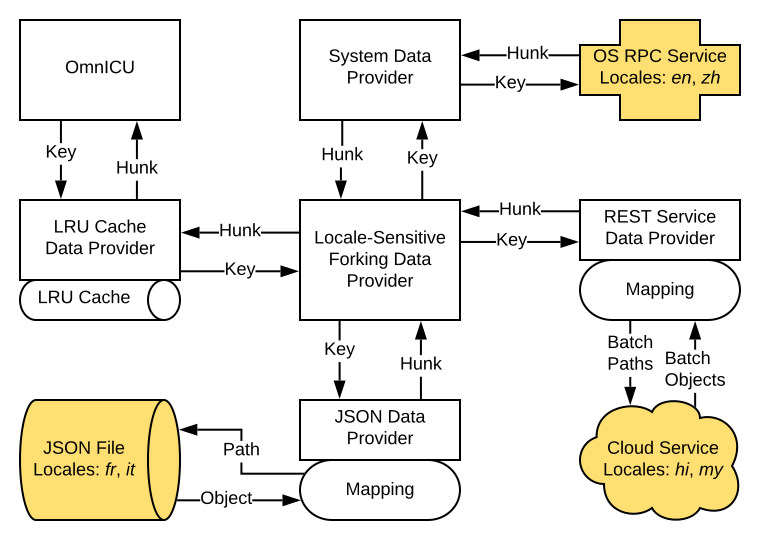

Techniques for Writing Design Docs
==================================

According to [bylaws.md](../process/bylaws.md), designs should make their way to GitHub Markdown files somewhat early in the process.  However, since Markdown is not a WYSIWYG platform like Google Docs, it takes a bit of time before you become accustomed to the practice.  This document contains tips on the workflow.

## Design Document Evolution

### Google Doc for Rapid Prototyping

A first step when writing a design doc may be to start in Google Docs.  You can share the doc with a trusted group to receive early feedback on typographical errors, mistakes, points that need clarification, and so on.  You should also be keeping an eye out for open questions, and you should explicitly enumerate open questions in your doc.

This phase is called "Rapid Prototyping" as defined by the Bylaws.

### Markdown Draft

Once you've done some basic polishing of your design doc, you should migrate it to Markdown in the ICU4X repository.  You should file issues for all open questions, and reference those open questions from your doc.  Send the Markdown file out for review in a PR, and we will discuss it in the next ICU4X-SC weekly meeting.  If the SC agrees with the design you have put forward in the doc, the PR will be considered as approved and can be merged in.

### Addressing Open Questions

Once the working draft of your design is checked in, you can address open questions using the GitHub issue tracking feature.  Once each question reaches a resolution, open a PR referencing that issue, updating the Markdown file to reflect the conclusion.  Once approved by the SC, the PR can be merged and the issue can be closed.

## Markdown Techniques

### Images

You can include images using code such as the following:

```markdown

```

Inside the `![...]` is the alt text, and inside the `(...)` is the relative path to the image file.  You should save your images in an *assets* folder in the same directory as the Markdown file.

Shane likes SVG files because they scale up and down nicely on different screen sizes and resolutions.  However, bitmaps are acceptable, too, depending on how you created the images.

Create the images using your favorite editor.  For the images in [data-pipeline.md](../design/data-pipeline.md), Shane used Lucidchart.  You can also use Inkscape, Gimp, Google Slides, Adobe Illustrator, etc.  If you have a tablet, another good option may be to draw the image on your screen with your stylus into a whiteboard program and export it as an image.

#### Previewing Images in PRs

Here is how others can view your Markdown with images in a PR:

1. In the PR, click "Files Changed" (goes to /pull/123/files)
2. Find the Markdown file you want to preview
3. Click the three dots (...) to open the menu, then click "View File" (goes to /blob/abcdef0/documents/example.md)
