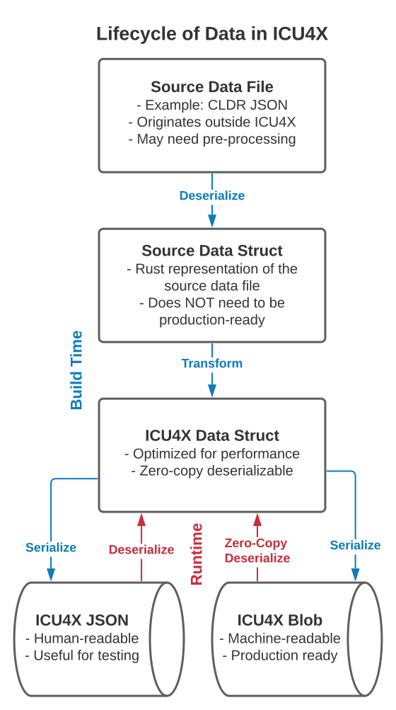

# Writing a New Data Struct

ICU4X is a heavily data-driven library. Most new features or components will require pulling in data from an external source.

This tutorial aims to help ICU4X contributors add new data to the data pipeline. It is recommended that readers review [data_pipeline.md](../design/data_pipeline.md) for additional theory behind the design decisions in the data provider.

## Lifecycle of ICU4X Data

It is important to understand the phases of life of ICU4X data as it makes its way from the data source, like CLDR, to the data struct used at runtime. The following flowchart shows the phases and how they connect:



The following steps take place at build time:

1. Source data file is obtained from an external source. Examples could include the CLDR JSON release or the Unicode Character Database.
2. The source data is parsed and transformed into a runtime data struct. This step can be expensive, because it is normally run as an offline build step.
3. The runtime data struct is stored in a way so that a provider can use it: a postcard blob, JSON directory tree, Rust module, etc.

Steps 1 and 2 are performed by the `icu_provider_source` crate, but clients can also write their own source provider. Step 3 is performed by the `icu_provider_export` crate.
The `icu4x-datagen` pulls these two crates together as a CLI.

When deserializing from the blob store, it is a design principle of ICU4X that no heap allocations will be required. We have many utilities and abstractions to help make this safe and easy.

## Code Layout

With a mental model of the lifecycle of data in ICU4X, we can discuss where to find the code that performs each step.

### Data Structs

The data struct definitions should live in the crate that uses them. By convention, the top-level module `provider` should contain the struct definitions. For example:

- `icu::decimal::provider::DecimalSymbolsV1`
- `icu::locale_canonicalizer::provider::LikelySubtagsV1`
- `icu::uniset::provider::PropertyCodePointSetV1`

In general, data structs should be annotated with `#[icu_provider::data_struct]`, and they should support *at least* `Debug`, `PartialEq`, `Clone`, `Default`, and Serde `Serialize` and `Deserialize`.

As explained in *data_pipeline.md*, the data struct should support zero-copy deserialization. The `#[icu_provider::data_struct]` annotation will enforce this for you. **See more information in [style_guide.md](https://github.com/unicode-org/icu4x/blob/main/documents/process/style_guide.md#zero-copy-in-dataprovider-structs--required),** as well as the example below in this tutorial.

Additionally, data structs should keep internal invariants to a minimum. For more information, see [data_safety.md](../design/data_safety.md).

### Data Download

The first step to introduce data into the ICU4X pipeline is to download it from an external source. This corresponds to step 1 above.

When clients use ICU4X, this is generally an automatic step. For the purpose of ICU4X test data, the tool `download-repo-sources` should automatically download data from the external source and save it in the ICU4X tree. `download-repo-sources` should not do anything other than downloading the raw source data.

To add new files to the repo, edit `tools/testdata-scripts/globs.rs.data`, and run 

```console
$ cargo make download-repo-sources
```

### Source Data Providers

"Source data providers" read from a source data file, deserialize it, and transform it to an ICU4X data struct. This corresponds to step 2 above.

To enabled generation of a new data marker `M`, add the following implementations to ICU4X's source data provider, [`SourceDataProvider`](https://unicode-org.github.io/icu4x/rustdoc/icu_provider_source/struct.SourceDataProvider.html):

- `DataProvider<M>`; this impl is the main step where data transformation takes place
- `IterableDataProviderCached<M>`, which automatically results in a cached impl of `IterableDataProvider<M>`

Source data providers implementations are often complex to write. Rules of thumb:

- Optimize for readability and maintainability. The source data providers are not used in production, so performance is not a driving concern; however, we want the transformer to be fast enough to make a good developer experience.
- If the data source is similar to an existing data source (e.g., importing new data from CLDR JSON), try to share code with existing data providers for that source.

As the last step, add the marker to the [registry](https://unicode-org.github.io/icu4x/rustdoc/icu_provider_registry/index.html).

You can now run `cargo make testdata` to test your implementation on our testing locales. This will generate JSON data in `provider/source/data/debug`, which you can use for debugging.

After you are done, add your data marker to the component's `provider::KEYS` list, and run `cargo make bakeddata` to generate compiled data for inclusion in the crate.

### Data export and runtime data providers

[`ExportDriver`](https://unicode-org.github.io/icu4x/rustdoc/icu_provider_export/struct.ExportDriver.html) reads from a source data provider and dumps it to storage. This corresponds to step 3 above. It is parameterized by a [`DataExporter`](https://unicode-org.github.io/icu4x/rustdoc/icu_provider/export/trait.DataExporter.html), which produces data for one of the high-performance runtime providers:

- [`FilesystemExporter`](https://unicode-org.github.io/icu4x/rustdoc/icu_provider_fs/export/fs_exporter/struct.FilesystemExporter.html) for [`FsDataProvider`](https://unicode-org.github.io/icu4x/rustdoc/icu_provider_fs/struct.FsDataProvider.html)
- [`BlobExporter`](https://unicode-org.github.io/icu4x/rustdoc/icu_provider_blob/export/struct.BlobExporter.html) for [`BlobDataProvider`](https://unicode-org.github.io/icu4x/rustdoc/icu_provider_blob/struct.BlobDataProvider.html)
- [`BakedExporter`](https://unicode-org.github.io/icu4x/rustdoc/icu_provider_baked/export/struct.BakedExporter.html) for a baked data provider

**Most ICU4X contributors will not need to touch data export or runtime data providers.** New implementations are only necessary when adding a new ICU4X data struct storage mechanism.

## Example

The following example shows all the pieces that make up the data pipeline for `DecimalSymbolsV1`.

### Data Struct

[*components/decimal/src/provider.rs*](https://github.com/unicode-org/icu4x/blob/main/components/decimal/src/provider.rs)

```rust
use std::borrow::Cow;
use icu_provider::prelude::*;
use icu::decimal::provider::{ AffixesV1, GroupingSizesV1 };

/// Symbols and metadata required for formatting a [`FixedDecimal`](crate::FixedDecimal).
#[icu_provider::data_struct(DecimalSymbolsV1Marker = "decimal/symbols@1")]
#[derive(Debug, PartialEq, Clone)]
#[cfg_attr(
    feature = "datagen",
    derive(serde::Serialize, databake::Bake),
    databake(path = icu_decimal::provider),
)]
#[cfg_attr(feature = "serde", derive(serde::Deserialize))]
pub struct DecimalSymbolsV1<'data> {
    /// Prefix and suffix to apply when a negative sign is needed.
    #[cfg_attr(feature = "serde", serde(borrow))]
    pub minus_sign_affixes: AffixesV1<'data>,

    /// Prefix and suffix to apply when a plus sign is needed.
    #[cfg_attr(feature = "serde", serde(borrow))]
    pub plus_sign_affixes: AffixesV1<'data>,

    /// Character used to separate the integer and fraction parts of the number.
    #[cfg_attr(feature = "serde", serde(borrow))]
    pub decimal_separator: Cow<'data, str>,

    /// Character used to separate groups in the integer part of the number.
    #[cfg_attr(feature = "serde", serde(borrow))]
    pub grouping_separator: Cow<'data, str>,

    /// Settings used to determine where to place groups in the integer part of the number.
    pub grouping_sizes: GroupingSizesV1,

    /// Digit characters for the current numbering system. In most systems, these digits are
    /// contiguous, but in some systems, such as *hanidec*, they are not contiguous.
    pub digits: [char; 10],
}
```

The above example is an abridged definition for `DecimalSymbolsV1`. Note how the lifetime parameter `'data` is passed down into all fields that may need to borrow data.

### CLDR JSON Deserialize

[*provider/source/src/cldr_serde/numbers.rs*](https://github.com/unicode-org/icu4x/blob/main/provider/source/src/cldr_serde/numbers.rs)


```rust
use icu::locale::LanguageIdentifier;
use itertools::Itertools;
use serde::de::{Deserializer, Error, MapAccess, Unexpected, Visitor};
use serde::Deserialize;
use std::collections::HashMap;
use tinystr::TinyStr8;

#[derive(PartialEq, Debug, Deserialize)]
pub struct Numbers {
    #[serde(rename = "defaultNumberingSystem")]
    pub default_numbering_system: TinyStr8,
    #[serde(rename = "minimumGroupingDigits")]
    #[serde(deserialize_with = "serde_aux::prelude::deserialize_number_from_string")]
    pub minimum_grouping_digits: u8,
}

#[derive(PartialEq, Debug, Deserialize)]
pub struct LangNumbers {
    pub numbers: Numbers,
}

#[derive(PartialEq, Debug, Deserialize)]
pub struct LangData(pub HashMap<LanguageIdentifier, LangNumbers>);

#[derive(PartialEq, Debug, Deserialize)]
pub struct Resource {
    pub main: LangData,
}
```

The above example is an abridged definition of the Serde structure corresponding to CLDR JSON. Since this Serde definition is not used at runtime, it does not need to be zero-copy.

### Transformer

[*provider/core/src/data_provider.rs*](https://github.com/unicode-org/icu4x/blob/main/provider/core/src/data_provider.rs)

```rust,compile_fail
impl DataProvider<FooV1Marker> for SourceDataProvider {
    fn load(
        &self,
        req: DataRequest,
    ) -> Result<DataResponse<FooV1Marker>, DataError> {
        // Use the data inside self and emit it as an ICU4X data struct.
        // This is the core transform operation. This step could take a lot of
        // work, such as pre-parsing patterns, re-organizing the data, etc.
        // This method will be called once per option returned by iter_locales.
    }
}

impl IterableDataProviderCached<FooV1Marker> for SourceDataProvider {
    fn iter_locales_cached(
        &self,
    ) -> Result<HashSet<DataLocale>, DataError> {
        // This should list all supported locales.
    }
}
```

### Registry

```rust,compile_fail
registry!(
    // ...
    icu::foo::provider::FooV1Marker = "foo/bar@1",
    // ...
)
```