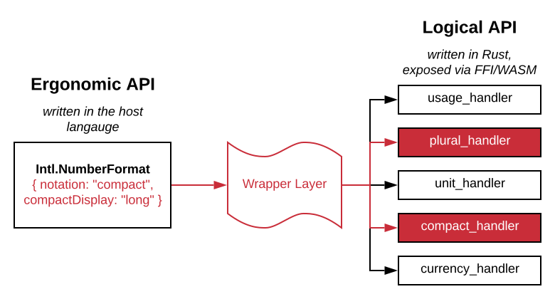

The ICU4X Wrapper Layer
=======================

A key piece of rolling out ergonomic ICU4X APIs for Rust and other target languages is the *wrapper layer*: code that sits between the client and the lower-level ICU4X libraries.  This document explains the design behind the ICU4X wrapper layer.

## Background

### Ergonomic API versus Logical API

When a programmer writes code using Intl, the code they write should demonstrate their *intent*.  They should use what I'm calling the *ergonomic API* of ICU4X.

A *logical API*, on the other hand, is one that is closely tied to specific to functional units, like currencies or measurement units.  A logical API function should require a specific hunk of data specific to the functional unit and perform a specific task.

Although ergonomic APIs correspond with what users of i18n intend to do, from an implementation standpoint, they are often quite heavy-weight, pulling in many dependencies that may not be required for all call sites.  Intl.NumberFormat is an example: it supports currency formatting, which requires a lot of code and data, but when formatting a number that's not a currency, you shouldn't need to carry all that extra code and data.

The goal of the *wrapper layer* is to provide an ergonomic API for clients, but resolve the user request into specific functional units, load the data, and pass the data to the logical API under the hood.

For example, in the above diagram, a client uses the ergonomic Intl.NumberFormat API with options to enable compact notation in long form.  The wrapper layer performs a bit of logic to figure out that this combination of options requires two functional units: plural rules and compact decimal format.  It then delegates to those two functions in the logical API.

Rule of thumb: A good "ergonomic" API is one that makes the "business logic" of the caller more clearly aligned with the task being performed.  It doesn't have to be "simple to use" (if the task if necessarily complex) but it should avoid adding more complexity than already exists in the problem at hand.  The scopes of responsibility, lifecycle, ownership, etc. should be aligned between the caller and the API.

## Key Requirements for the Wrapper Layer

### Host Language

Since the ergonomic API depends on the host language (e.g., Objective-C calling into ICU4X via an FFI), the wrapper layer should be written in each individual host language, mapping to the logical API exported by the ICU4X library.

This allows different languages to choose different styles for passing options into the library; for example, a Builder pattern could be used in Java, and an options bag could be used in JavaScript.

### Code Slicing

The wrapper layer should be suitable for tools to perform automatic dead code elimination.  By resolving options at compile time, the set of logical APIs required for a certain application can be known in time to perform static analysis; unused logical APIs can then be removed, reducing code and data size.

In languages that support function inlining, the wrapper layer should generally be inlined into the call site, such that dead code elimination can tailor the set of logical APIs to each individual call site.

Rust has great support for dead code elimination.  In languages where tooling for dead code elimination is not as strong, this should be taken into consideration when designing the ergonomic API specific to that language.  The ergonomic API might need to have a more logical flavor in order for code slicing to work as intended.

### Data Loading

In accordance with [principles.md](../design/principles.md), the core library should not perform I/O; instead, data should be passed via a dynamic DataProvider ([data-pipeline.md](../design/data_pipeline.md)).

How does this fit into the wrapper layer model?

1. The Ergonomic API receives a Data Provider.
2. The Wrapper Layer loads the data asynchronously based on the required functional units, and then passes the data to the Functional APIs.

This model decouples the data provider from the core business logic; with calls to the data provider happening in the wrapper layer, the core library does not need to make the decision of sync vs. async, etc.

### Limited Amount of Code

One of the strengths of ICU4X is that the core business logic is written once and shared by many different environments.

Since the wrapper layer needs to be implemented separately for each host language, as much business logic as possible should be moved into the logical API.  The wrapper layer should transform from the ergonomic API to the logical API and load the required data for the logical API; nothing more.

A transpilation or IDL approach could be considered as options for generating the binding logic. Main issues: [#1](https://github.com/unicode-org/icu4x/issues/1), [#2](https://github.com/unicode-org/icu4x/issues/2).
